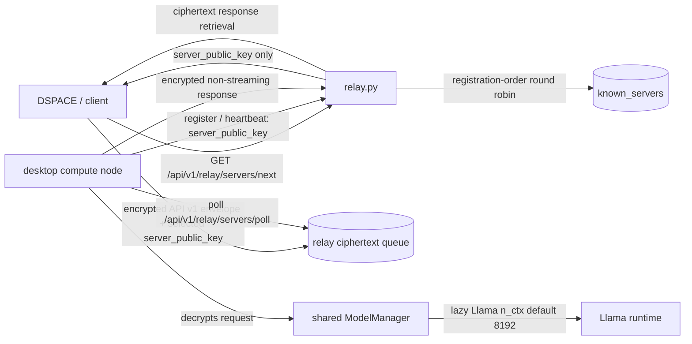
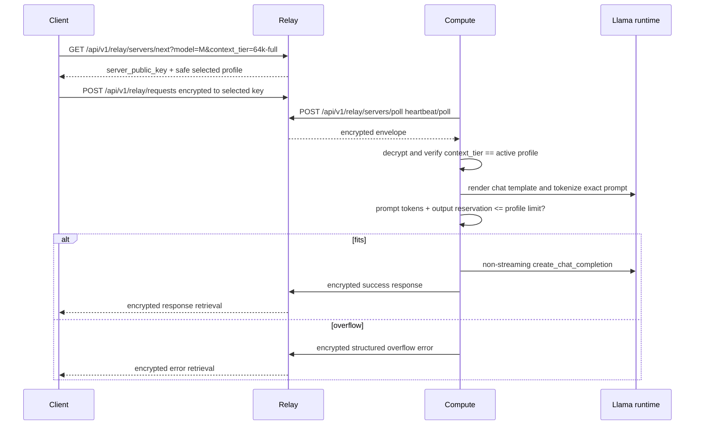
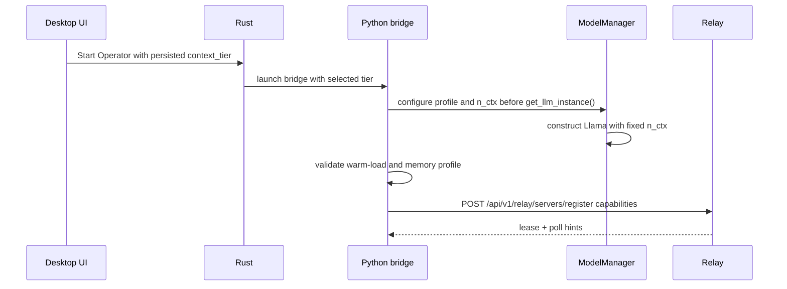
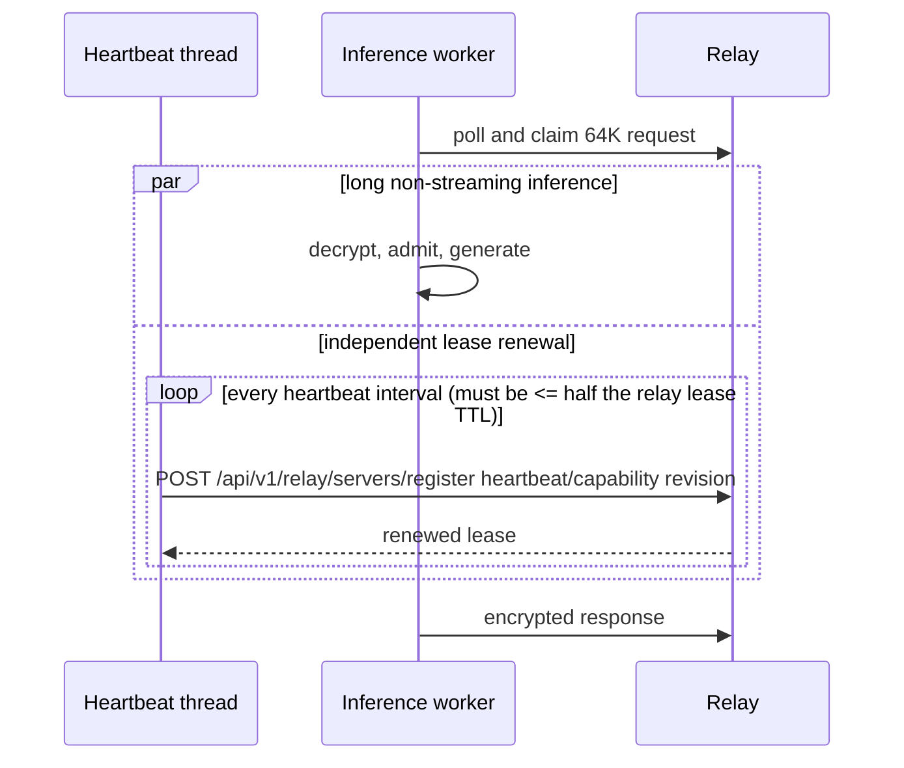
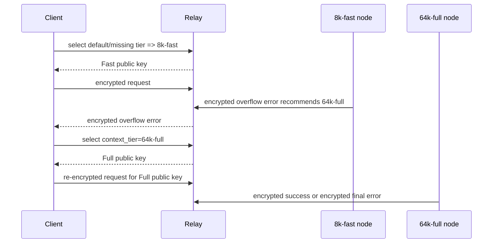
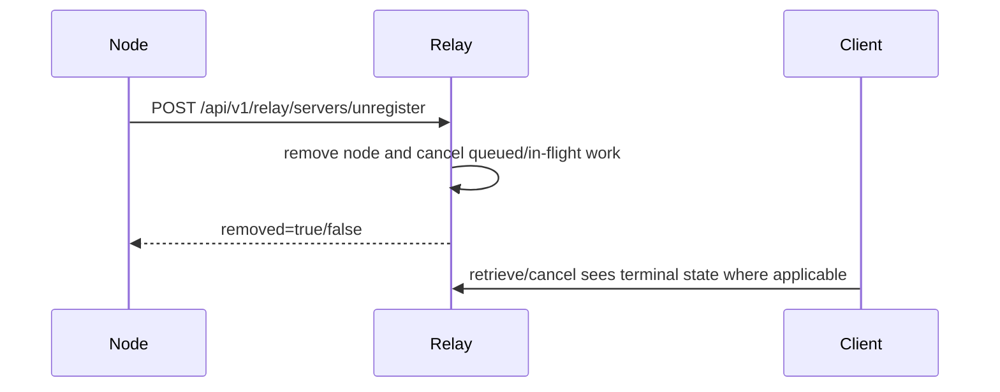

# Context-tiered compute design for API v1 relay scheduling

Status: design proposal for the API v1 migration sequence (P5). This document is
normative for planned static context tiers, desktop operator selection,
capability registration, exact admission control, and tier-aware relay
scheduling.

## Scope and non-goals

### In scope

- API v1 relay/client/compute-node architecture only.
- Static context profiles for the initial `8k-fast` and `64k-full` deployment.
- Desktop operator tier selection before runtime warm-load and relay registration.
- Privacy-safe compute-node capability registration.
- Relay scheduling that uses safe metadata only.
- Compute-side exact context admission after decrypting an API v1 request.
- Liveness behavior for long-running non-streaming API v1 inference.

### Non-goals

- No runtime code, API route, static chat, desktop UI, dependency, test, or API v2
  change is implied by this document.
- API v2 is explicitly out of scope. API v2 exists in the repository but remains
  incomplete and must not carry active runtime traffic until API v1 is launched
  and `v0.1.0` is finalized.
- API v1 remains non-streaming. Long-context support must not add streaming to
  API v1 relay/client-server inference paths.
- Deprecated relay endpoints (`/sink`, `/faucet`, `/source`, `/retrieve`, and
  `/next_server`) remain historical compatibility only and must not be extended
  for context-tier work.

## Hard invariants

1. **Relay-blind E2EE is mandatory.** Relay-owned state, logs, diagnostics, and
   payloads may contain ciphertext plus safe routing metadata only. They must not
   contain plaintext prompts, message content, tool arguments, model output, exact
   token counts derived from decrypted content, or user data.
2. **API v1 is the active runtime target.** All proposed route extensions are API
   v1 extensions.
3. **Exact context admission is compute-owned.** The relay cannot inspect the
   prompt because API v1 request bodies are encrypted to the selected compute
   node. The compute node must decrypt, render the prompt with the inference chat
   template, tokenize with the active runtime tokenizer, and fail closed on
   overflow.
4. **Runtime context is fixed at model construction.** The selected profile must
   control `n_ctx` before the `Llama` runtime is constructed. Initial design does
   not resize in place and does not rebuild the model per request.

## Current architecture baseline verified against repository HEAD

- `ModelManager` is the lazy owner of a single `Llama` runtime. The singleton
  accessor creates one global model manager, and `get_llm_instance()` initializes
  `self.llm` only when it is first needed.
- `ModelManager.get_llm_instance()` constructs `llama_cpp.Llama(...)` with
  `n_ctx=self.config.get('model.context_size', 8192)`, so the current default
  context window is 8,192 tokens and is fixed when `Llama` is constructed.
- The desktop bridge creates one shared `ComputeNodeRuntime`, then creates
  per-relay runtimes that reuse the shared runtime's `model_manager` and
  `crypto_manager`.
- The desktop bridge warms and validates the API v1 runtime before polling relay
  work, and each relay runtime shares one `model_manager`.
- The desktop bridge uses one `inference_lock` around request processing, so
  desktop operator inference is serialized even when multiple relay URLs are
  configured.
- API v1 compute-node registration currently posts little beyond
  `server_public_key`. The relay marks the node as API v1-capable and returns
  lease/poll timing hints.
- `/api/v1/relay/servers/next` delegates to the API v1 selection helper. Current
  API v1 selection logs `selection_policy=registration_order_round_robin` and
  returns the selected node public key only.
- Relay diagnostics expose safe metadata such as queue depth, but the current
  selection path does not use queue depth.
- API v1 relay requests are queued to a selected `server_public_key` as encrypted
  envelopes; relay validation rejects plaintext relay payload fields.
- Polling updates `last_ping` and tracks in-flight request TTL metadata, but the
  long-context target requires an explicit heartbeat design so a healthy 64K node
  is not considered stale while processing a long non-streaming request.
- DSPACE request shaping and tier choice happen before request encryption. The
  relay therefore only receives coarse `model` and `context_tier` requirements,
  never the exact prompt size.

## Current architecture diagram



## Proposed architecture diagram

```mermaid
flowchart LR
  D[DSPACE / client] -->|coarse model + context_tier| S[/api/v1/relay/servers/next]
  S -->|capability filter + scheduler metadata| R[relay.py]
  R -->|public key + safe selected profile metadata| D
  D -->|encrypted API v1 request repeats context_tier| Q[(relay ciphertext queue)]
  O[desktop operator UI] -->|persisted tier before Start| B[Rust desktop bridge]
  B -->|tier config| P[Python compute-node bridge]
  P -->|sets profile n_ctx before warm-load| M[ModelManager]
  M -->|warm-load validated profile| L[Llama runtime]
  P -->|privacy-safe capabilities + independent heartbeat| R
  P -->|decrypt, verify tier, exact tokenize, admit| L
  P -->|encrypted success or structured encrypted overflow| R
```

## Initial deployment profiles

The first deployment uses two physical operator policies. These are operator
assignments, not universal claims about the hardware classes.

| Profile | Total context | Initial node | Policy intent | Notes |
| --- | ---: | --- | --- | --- |
| `8k-fast` | 8,192 tokens | Mac Mini M4 Pro, 24 GB unified memory | Conservative low-latency desktop operator | The Mac may technically support larger contexts, but the initial role is intentionally conservative and latency-oriented. |
| `64k-full` | 65,536 tokens | Windows PC, RTX 4090 24 GB VRAM, 128 GB DDR5 | Full-fat long-context operator | Assumes the GPU is substantially available. Competing GPU workloads may force spill into system RAM and cause severe latency. |

## Memory-planning estimates, not admission guarantees

The planning model is Llama 3.1 8B in a quantized GGUF runtime.

- Quantized weights are approximately 5-6 GB, depending on the file and runtime
  representation.
- A rough 64K f16 KV-cache estimate for this GQA model is about 8 GB before
  other runtime buffers.
- q8 or q4 KV cache can materially reduce KV memory, when supported and validated.
- Flash attention, batch size, backend, K/Q/V offload, GPU layer offload, runtime
  scratch buffers, driver overhead, and allocator behavior alter the real
  footprint.
- These estimates must not become admission guarantees. A context profile may
  register only after the node has warm-loaded the exact runtime and completed
  profile-specific memory validation.

### Memory and latency benchmark matrix

| Profile | Backend | KV cache | Batch defaults | Warm-load validation | Benchmark prompts | Required metrics | Pass condition |
| --- | --- | --- | --- | --- | --- | --- | --- |
| `8k-fast` | Metal on initial Mac policy | Existing default initially | Existing default initially | Load exact `n_ctx=8192`; run a small non-sensitive smoke prompt | 1K, 4K, near-8K synthetic/private-safe prompts | warm-load time, prompt eval tok/s band, gen tok/s band, p50/p95 latency, peak memory band | No OOM; latency within operator policy; encrypted API v1 success |
| `64k-full` | CUDA on initial Windows policy | Existing default first; later q8/q4 trials | Existing default first; later tuned | Load exact `n_ctx=65536`; validate memory headroom under expected GPU availability | 8K, 32K, near-64K synthetic/private-safe prompts | warm-load time, prompt eval tok/s band, gen tok/s band, p50/p95 latency, peak VRAM/system RAM bands | No OOM; no severe spill under baseline; encrypted API v1 success |
| Future tuned 64K | CUDA/Metal | q8/q4 candidate | Tuned batch + flash attention candidate | Compare against baseline | Same privacy-safe suite | deltas for memory, latency, failures | Adopt only if stable and faster/safer |

Benchmarks must avoid real user content. Publish coarse bands or aggregate
operator diagnostics only; do not publish prompts or exact user-derived token
counts.

## Context profile schema

Initial implementations may keep KV cache and batching at existing runtime
defaults. The schema still needs room for later tuning.

```json
{
  "id": "64k-full",
  "display_name": "64K full context",
  "model_ids": ["llama-3.1-8b-instruct"],
  "total_context_tokens": 65536,
  "default_output_token_reservation": 1024,
  "maximum_output_tokens": 4096,
  "max_concurrency": 1,
  "kv_cache": {
    "type": "runtime_default",
    "validated": true
  },
  "offload": {
    "kqv_policy": "runtime_default",
    "gpu_layers": "runtime_default"
  },
  "batch": {
    "n_batch": "runtime_default",
    "n_ubatch": "runtime_default",
    "flash_attention": "runtime_default"
  },
  "enabled": true,
  "safe_diagnostics": {
    "backend_class": "cuda",
    "throughput_band": "long_context_baseline",
    "last_warm_load_status": "ok"
  }
}
```

Required fields:

- stable profile ID;
- display name;
- supported model IDs;
- total context tokens;
- default output-token reservation and maximum output tokens;
- max concurrency;
- KV cache type;
- K/Q/V offload policy;
- batch defaults;
- enabled flag;
- safe diagnostics fields.

Safe diagnostics must stay coarse. They may include backend class, readiness,
coarse throughput bands, configured token limits, and queue/in-flight counts.
They must not include hostname, device serial number, raw VRAM inventory,
prompt/message content, user identifiers, or exact token counts for decrypted
requests.

## Manual desktop tier selection

The initial desktop UX is intentionally static and operator-controlled:

1. Add a persisted dropdown in the desktop Tauri operator UI.
2. The dropdown is visible before **Start Operator**.
3. The dropdown is disabled while the operator is running.
4. Initial choices are `8k-fast` and `64k-full`.
5. Starting the operator passes the selected tier through Rust into the Python
   compute-node bridge and model manager.
6. The selected tier sets `n_ctx` before `Llama` construction.
7. The node warms that exact runtime and validates memory before relay
   registration.
8. Switching tiers requires **Stop Operator**, changing selection, then **Start
   Operator**.
9. No in-place resize and no per-request model reconstruction are part of the
   initial design.

## Privacy-safe capability registration

After warm-load validation, a compute node registers these API v1 capabilities:

```json
{
  "server_public_key": "base64-public-key",
  "api_version": "v1",
  "supported_model_ids": ["llama-3.1-8b-instruct"],
  "active_context_profile": {
    "id": "64k-full",
    "display_name": "64K full context",
    "total_context_tokens": 65536
  },
  "maximum_total_context_tokens": 65536,
  "maximum_output_tokens": 4096,
  "max_concurrency": 1,
  "backend_class": "cuda",
  "throughput_band": "long_context_baseline"
}
```

Allowed fields:

- server public key;
- API version;
- supported model IDs;
- active context profile;
- maximum total context tokens;
- maximum output tokens;
- max concurrency;
- backend class such as `cpu`, `cuda`, or `metal`;
- optional coarse throughput bands.

Forbidden fields:

- device serial number;
- hostname;
- raw VRAM/system RAM inventory;
- prompt data or message content;
- user data;
- exact token counts derived from decrypted requests.

## API v1 extension proposal

### Node selection

`GET /api/v1/relay/servers/next` accepts coarse query requirements:

| Query parameter | Required | Meaning |
| --- | --- | --- |
| `model` | optional initially | Coarse model ID requested by the client. |
| `context_tier` | optional | Requested tier, e.g. `8k-fast` or `64k-full`. Missing defaults to `8k-fast` for backward compatibility. |

Response:

```json
{
  "server_public_key": "base64-public-key",
  "selected_context_profile": {
    "id": "64k-full",
    "display_name": "64K full context",
    "total_context_tokens": 65536,
    "maximum_output_tokens": 4096,
    "max_concurrency": 1
  }
}
```

The selection response contains only the public key plus safe selected-profile
metadata. It must not include private hardware details or anything derived from
plaintext prompt inspection.

### Encrypted API v1 request addition

The plaintext that is encrypted to the compute node repeats the selected tier:

```json
{
  "protocol": "tokenplace_api_v1_relay_e2ee",
  "request_id": "...",
  "client_public_key": "...",
  "api_v1_request": {
    "model": "llama-3.1-8b-instruct",
    "context_tier": "64k-full",
    "messages": [],
    "options": {
      "max_tokens": 2048
    }
  }
}
```

The compute node verifies that the encrypted `context_tier` matches its active
profile. Missing tier defaults to `8k-fast` for compatibility. A mismatch fails
closed with an encrypted structured error.

### Registration extension

`POST /api/v1/relay/servers/register` adds the capability body described above.
The relay stores the safe metadata and uses it for filtering/scheduling.
Registration must occur only after warm-load and profile memory validation.
Heartbeat renewals may repeat the same capability payload or send a stable
capability revision ID plus the public key.

### Unregister extension

`POST /api/v1/relay/servers/unregister` explicitly removes a compute node from
the live API v1 candidate set. The request body contains only safe metadata:

```json
{
  "server_public_key": "base64-public-key",
  "api_version": "v1",
  "reason": "operator_stop"
}
```

Response:

```json
{
  "removed": true,
  "cancelled_queued_request_count": 0,
  "in_flight_request_state": "held_until_ttl_or_terminal_response"
}
```

On unregister, the relay must stop selecting the node immediately and cancel any
queued encrypted envelopes that have not been claimed when cancellation can be
represented without plaintext. Claimed in-flight encrypted work must either reach
a terminal encrypted response from the compute node or expire via the existing
in-flight TTL; the relay must not decrypt, inspect, or synthesize plaintext
model errors. Re-registration after unregister requires fresh warm-load and
profile validation.

## Tier-aware selection

Selection happens before encryption because the client needs a public key. The
client provides coarse `model` and `context_tier`; exact token count remains
inside the encrypted request.

Decision flow:

1. Normalize missing `context_tier` to `8k-fast`.
2. Filter live API v1 nodes by API version, enabled profile, model ID, requested
   tier capability, max concurrency availability, and lease freshness. During the
   migration window, a request that omits `context_tier` must remain eligible
   for exact `8k-fast` profiles only unless the client copies the returned
   `selected_context_profile.id` into the encrypted request before dispatch.
   This prevents an omitted-tier encrypted request from being selected onto a
   larger node and then failing closed when that node normalizes the missing
   encrypted tier back to `8k-fast`.
3. Return `503 no_registered_compute_nodes` if no live API v1 nodes exist.
4. Return a capability-specific `503 no_capable_compute_nodes` if nodes exist but
   none support the requested safe metadata.
5. Schedule among equivalent nodes without exposing prompt size.
6. Return the public key plus safe selected-profile metadata.

### Scheduler decision table

| Stage | Eligible nodes | Selection rule | Relay-visible inputs | Reason |
| --- | --- | --- | --- | --- |
| Current | Live API v1 nodes | Registration-order round robin | public key, API v1 marker | Existing behavior. |
| Step 1 | Nodes matching model + tier | Preserve round robin among equivalent nodes | registration capabilities | Minimal capability correctness. |
| Step 2 | Nodes matching model + at least requested tier, only after clients echo `selected_context_profile.id` into encrypted requests | Smallest capable tier | profile token limit, tier order | Avoid burning scarce 64K capacity on explicit or echoed-tier work without breaking omitted-tier compatibility. |
| Step 3 | Smallest capable tier set | Lowest queued + in-flight work | queue depth, in-flight count, max concurrency | Reduce avoidable latency with safe metadata. |
| Step 4 | Load-aware candidate set | Expected completion time | coarse throughput band, queue/in-flight, tier | Account for heterogeneous hardware without raw device inventory. |
| Step 5 | Policy overlay | Fairness, long-tier reservation, optional selection reservation | safe tenant-neutral counters, reservation expiry | Prevent starvation and racey over-selection. |

Relay-visible scheduling inputs remain metadata-only. The relay must never learn
exact prompt tokens, decrypted messages, or model output text.

## Dispatch and admission sequence



## Compute-side exact admission control

The compute node is authoritative because only it can decrypt the request and
use the same tokenizer/template as inference.

Algorithm:

1. Decrypt the API v1 envelope.
2. Validate protocol, client key binding, model, messages, options, and requested
   `context_tier`.
3. Default missing `context_tier` to `8k-fast`.
4. Require requested tier to match the active profile.
5. Render the prompt with the same chat template that will be used for
   `create_chat_completion`.
6. Count exact input tokens with the active `Llama` runtime tokenizer.
7. Determine requested output tokens from API v1 options, or use the profile's
   default output reservation.
8. Reject requests above the profile's max output tokens.
9. Compute `required_total_tokens = prompt_tokens + output_reservation`.
10. Admit only if the required total fits `total_context_tokens`.
11. Do not silently shrink output below the requested budget.
12. Return success or encrypted structured error. Do not expose exact counts to
    the relay.

Encrypted overflow error body:

```json
{
  "error": {
    "code": "compute_node_context_window_exceeded",
    "message": "The request does not fit the active compute-node context profile.",
    "active_context_tier": "8k-fast",
    "configured_context_tokens": 8192,
    "exact_prompt_tokens": 9000,
    "requested_output_tokens": 1024,
    "required_total_tokens": 10024,
    "recommended_next_tier": "64k-full",
    "retryable": true
  }
}
```

`recommended_next_tier` is the next larger registered profile ID when one exists.
When the active profile is already the largest defined tier, the field must be
present with `null` and `retryable` must be `false`; clients must not auto-retry
without an explicit user or policy change.

This error is encrypted to the client. The relay stores and forwards only the
ciphertext envelope and safe request metadata. Because overflow errors include
exact encrypted token counts that success responses do not normally expose, the
error retrieval path needs the same E2EE hardening, ciphertext-only relay
handling, and log redaction as the success path.

## Registration, heartbeat, overflow, retry, and unregister sequences

### Registration



### Independent heartbeat while busy



### Retry after overflow



### Unregister



## Liveness design

Long-running inference must not make the relay consider a healthy compute node
stale. A 64K non-streaming request can exceed the normal poll/lease interval. The
heartbeat interval is a testable contract: it must be less than or equal to half
of the relay lease TTL and must renew before the relay stale-node eviction
window. If the relay advertises a shorter TTL in registration hints, the compute
node must lower its heartbeat interval accordingly before accepting work.

| Option | Benefits | Costs/failure modes | Decision |
| --- | --- | --- | --- |
| Independent heartbeat thread/task | Keeps lease fresh while inference thread is busy; simple relay semantics; supports multiple relay URLs | Needs lifecycle coordination and fail-closed shutdown handling | Preferred initial design. |
| Extended busy lease | Very simple; no extra thread | A crashed busy node may remain registered too long; hard to choose one timeout for 8K and 64K | Defer except as emergency mitigation. |
| In-flight lease renewal coupled to worker | Fewer moving parts than a separate heartbeat | Still fails if worker blocks inside runtime call or cannot schedule renewal | Useful as secondary defense, not primary. |

Fail-closed behavior remains required: explicit Stop/Unregister removes the node,
stale leases eventually evict it, queued/in-flight work is cancelled where safe,
and recovery requires warm-load validation before re-registration.

## Failure modes and recovery

| Failure | Detection | Recovery | Privacy note |
| --- | --- | --- | --- |
| Profile warm-load OOM | Local warm-load validation fails before registration | Do not register; surface local operator error; allow tier change after Stop | Relay never sees failed profile details beyond absence of registration. |
| Encrypted tier/profile mismatch | Compute decrypts request and compares tier | Encrypted fail-closed error; client reselects/re-encrypts | Relay sees only ciphertext error. |
| Context overflow | Exact tokenizer admission fails | Encrypted `compute_node_context_window_exceeded`; recommend next tier when known | Exact counts remain encrypted. |
| 64K inference exceeds lease | Heartbeat thread renews lease | Continue processing; unregister only on missed independent heartbeats | Relay sees heartbeat metadata only. |
| Node crash during inference | Heartbeats stop; in-flight TTL expires | Relay evicts/cancels; client retries selection | Relay must not log plaintext. |
| GPU contention causes severe latency | Local throughput/latency bands degrade | Operator can stop 64K profile or mark disabled; scheduler can avoid degraded band later | Use coarse bands, not raw device telemetry. |
| Capability stale after profile switch | Profile switch requires Stop; unregister first | Re-register only after new warm-load validation | No mixed-profile registration. |
| Relay has capable nodes but all saturated | Queue/in-flight exceeds policy | Return retryable 503 or schedule with reservation policy in later phase | Metadata-only load signal. |

## Rollout plan

### Phase 0: DSPACE and token.place measurement

- Build privacy-safe DSPACE measurement and token.place instrumentation.
- Measure prompt sizes, output reservations, and runtime latency using synthetic
  or privacy-safe content.
- Confirm that DSPACE tier choice happens before encryption.

### Phase 1: two static physical tiers

- Add desktop persisted tier selection.
- Configure `8k-fast` and `64k-full` profiles.
- Warm-load the selected profile before registration.
- Register privacy-safe capabilities.
- Preserve backward-compatible default to `8k-fast`.

### Phase 2: capability-aware/load-aware routing

- Filter by model and context tier.
- Preserve round robin among equivalent nodes first.
- Add smallest-capable-tier selection.
- Add queue/in-flight load awareness.
- Add optional coarse throughput-aware expected completion time.

### Phase 3: long-context runtime tuning

- Validate q8/q4 KV cache options, flash attention, batch sizing, and K/Q/V
  offload policies.
- Promote tuning only after memory and latency matrices prove stability.
- Keep admission based on validated active profile, not estimates.

### Phase 4: multiple profiles or richer serving engine per physical device

- Evaluate stop/reload/re-register profile switching.
- Evaluate multiple contexts or a serving sidecar if static two-tier operation is
  too limiting.
- Preserve relay-blind E2EE and API v1 non-streaming behavior unless a future
  approved API version supersedes it.

## Rollback plan

- Disable capability filtering and return to registration-order round robin among
  API v1 nodes.
- Keep clients that omit `context_tier` on the `8k-fast` default.
- Disable the `64k-full` profile by setting `enabled=false` or stopping the
  Windows operator.
- Re-register nodes only after warm-load validation of the remaining profile.
- Do not fall back to legacy relay routes or plaintext relay paths.

## Compatibility plan

- Clients that omit `context_tier` are treated as requesting `8k-fast`.
- Compute nodes that do not advertise a profile are treated as legacy API v1
  `8k-fast` candidates only after they have warm-loaded the current 8,192-token
  default runtime.
- The encrypted request may omit `context_tier` during migration; compute nodes
  normalize missing to `8k-fast`. Relay selection must therefore keep omitted-tier
  requests on exact `8k-fast` profiles until clients are upgraded to echo the
  returned `selected_context_profile.id` into the encrypted request.
- Once the migration completes, documentation and diagnostics should encourage
  explicit tier selection, but the default remains for compatibility.

## Future runtime strategies deferred

| Strategy | Benefits | Memory implications | Complexity | Failure modes | Why deferred |
| --- | --- | --- | --- | --- | --- |
| One larger fixed context on every node | Simplest client model; fewer tiers | Every node pays large KV/runtime overhead | Low code complexity, high resource cost | Slow small prompts; OOM on smaller operators | Wastes the Mac fast tier and raises baseline resource requirements. |
| Stop/reload/re-register profile switching | Supports multiple profiles on one device | Only one loaded profile at a time | Medium lifecycle complexity | Slow switches; registration races; failed warm-load | Static first deployment is safer and reviewable. |
| Multiple high-level `Llama` instances | Fast per-request profile choice | Duplicates weights/KV/runtime buffers | High memory pressure and locking complexity | OOM, fragmentation, accidental concurrent overload | Initial devices should not carry duplicated runtimes. |
| One shared model with multiple low-level contexts | Better memory sharing in theory | Lower duplicate weights, multiple KV contexts | Requires lower-level llama.cpp integration | Subtle context isolation bugs; binding limitations | Current code owns one high-level `Llama` instance. |
| `llama-server` sidecar | Mature serving knobs and batching | Separate process memory; server-managed KV | Operational and packaging complexity | Sidecar crashes, auth/config drift, E2EE boundary mistakes | Desktop bridge currently uses in-process `llama_cpp_python`; sidecar needs separate security review. |
| Prompt/KV prefix caching | Speeds repeated prefixes | KV cache consumes memory | Cache keying and invalidation complexity | Privacy leaks if keys/content mishandled | Relay-blind privacy analysis and local-only cache design needed first. |
| Speculative decoding | Lower latency | Additional draft model memory | More models and scheduling complexity | Quality regressions, extra OOM risk | Context correctness and routing are higher priority. |

## Security and privacy analysis

- Capability registration is intentionally coarse and non-identifying.
- Exact token counts are generated only after compute-side decryption and are
  returned only in encrypted client-visible errors.
- Relay queue depth and in-flight counts are safe scheduling metadata when they
  are not tied to plaintext content or user identity.
- Throughput bands must be coarse enough to avoid revealing unique hardware
  fingerprints. Avoid raw model speed traces per user request.
- Registration must not include hostname, serial numbers, raw VRAM/RAM inventory,
  local usernames, paths that identify the operator, prompt content, response
  content, or decrypted tool arguments.
- If an E2EE path cannot preserve these constraints, it must fail closed.

## Future work aligned to long-term issue themes

- DSPACE privacy-safe benchmarking and tier estimation.
- DSPACE token estimation and coarse tier classification before encryption.
- Desktop Tauri tier selector and operator profile persistence.
- API v1 capability registration and tier-aware node selection.
- Compute-side exact context admission and independent heartbeats.
- Landing chat tier selector using the same API v1 node-selection contract.
- Capability-aware load balancing that replaces blind round robin.
- DSPACE full-fat chat auto-tier selection with bounded retry on encrypted
  overflow.
