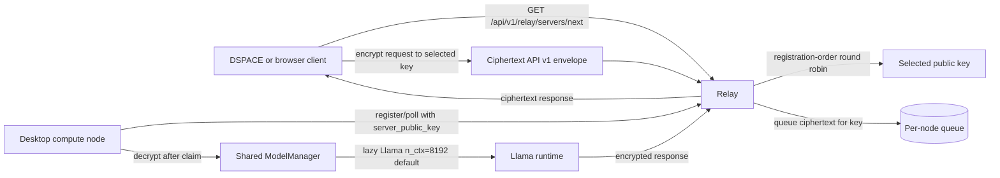
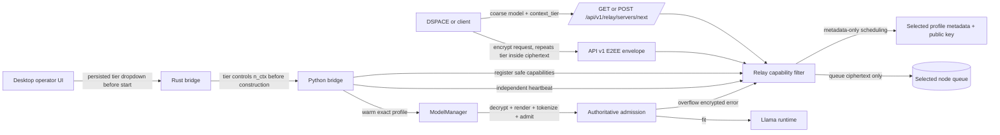
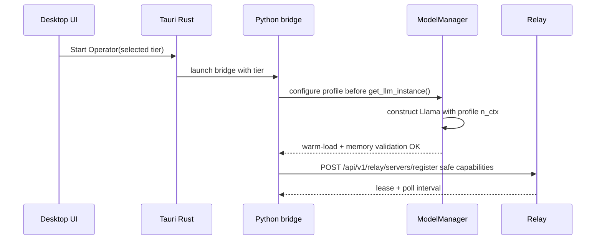
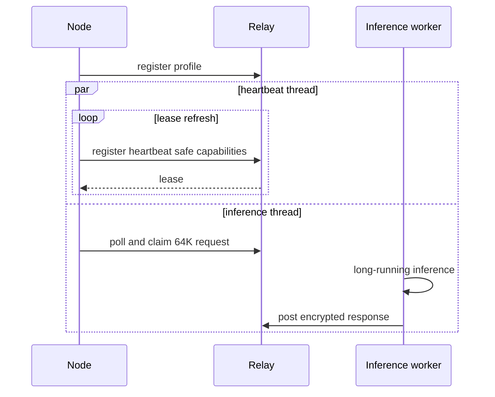
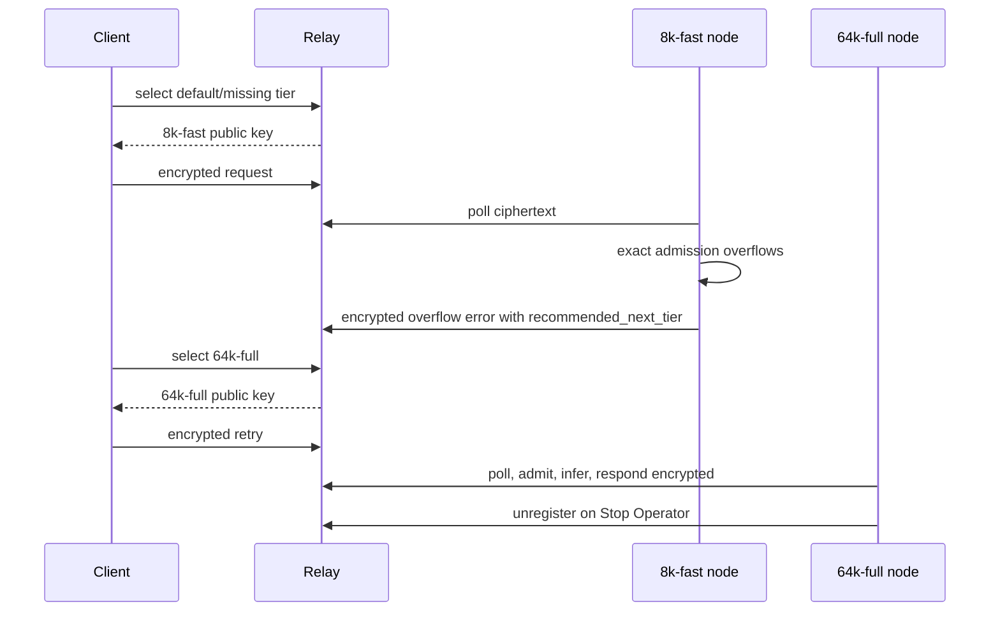

# Context-tiered compute design

Status: design proposal for API v1 after the DSPACE measurement baseline.

This document is the authoritative token.place design for static context tiers, manual desktop
operator tier selection, privacy-safe capability registration, exact compute-side context admission,
and tier-aware relay scheduling. It is documentation-only and describes API v1 only. API v2 is an
explicit non-goal until API v1 is launched and `v0.1.0` is finalized.

## Hard invariants

- Distributed relay inference remains relay-blind E2EE: the relay stores and forwards ciphertext
  envelopes plus safe routing metadata only.
- API v1 remains non-streaming. Responses are posted only after full model output generation.
- Deprecated relay routes (`/sink`, `/faucet`, `/source`, `/retrieve`, `/next_server`) are not part
  of this design.
- The relay must not see plaintext prompts, rendered chat templates, exact prompt-token counts,
  assistant output text, tool arguments, user data, hostnames, device serial numbers, or raw hardware
  inventory.
- Any path that cannot preserve E2EE and ciphertext-only relay state fails closed.

## Current architecture verified at repository HEAD

- `ModelManager` owns one lazily initialized `Llama` runtime. `self.llm` starts as `None`, and
  `get_llm_instance()` constructs it on first use under `self.llm_lock`.
- `n_ctx` is fixed at `Llama(...)` construction and currently reads
  `config.get('model.context_size', 8192)`, so the effective default is 8,192 context tokens.
- The desktop bridge creates one shared `ComputeNodeRuntime`/`ModelManager` and reuses it for
  additional relay URLs.
- The desktop bridge warms the runtime before registration: pre-registration warm-load waits for
  `get_llm_instance()` readiness and fails closed if the runtime cannot be prepared.
- A bridge-level `inference_lock` serializes inference per desktop operator, and the single shared
  model manager means there is no per-request model reconstruction today.
- API v1 compute-node registration posts only `server_public_key`; the relay stores that key, a
  lease timestamp, lease duration, and the API v1 marker.
- `GET /api/v1/relay/servers/next` selects registered API v1 nodes with registration-order
  round-robin and returns the selected `server_public_key`.
- Relay diagnostics expose safe metadata including API v1 registered compute nodes and per-node
  `queue_depth`, but current server selection does not use queue depth.
- The relay cannot inspect prompt size because API v1 request bodies are encrypted to the selected
  compute node.
- DSPACE request-size/tier selection therefore happens before client-side request encryption, while
  exact token admission must happen after compute-node decryption.
- Long-running inference currently interacts with leases, polling, and in-flight TTLs; this design
  requires independent heartbeats so a healthy 64K node does not look stale merely because its
  polling/processing thread is busy.

## Initial deployment policy

| Tier ID | Total context | Initial operator | Policy notes |
| --- | ---: | --- | --- |
| `8k-fast` | 8,192 tokens | Mac Mini M4 Pro, 24 GB unified memory | Conservative latency-oriented role. The Mac may technically support larger contexts, but initial assignment stays small and fast. |
| `64k-full` | 65,536 tokens | Windows PC, RTX 4090 24 GB VRAM, 128 GB DDR5 | Long-context role. Initial design assumes the GPU is substantially available; competing GPU workloads may spill to system RAM and cause severe latency. |

These assignments are operator policy, not universal hardware claims.

## Current architecture diagram



## Proposed architecture diagram



## Context profiles

A context profile is a local operator contract. It may register only after successful warm-load and
memory validation of that exact runtime.

```json
{
  "profile_id": "64k-full",
  "display_name": "64K full context",
  "model_ids": ["llama-3.1-8b-instruct"],
  "total_context_tokens": 65536,
  "default_output_tokens": 1024,
  "max_output_tokens": 4096,
  "max_concurrency": 1,
  "kv_cache_type": "f16",
  "kqv_offload_policy": "backend-default",
  "batch_defaults": {
    "n_batch": "runtime-default",
    "n_ubatch": "runtime-default"
  },
  "enabled": true,
  "safe_diagnostics": {
    "backend_class": "cuda",
    "throughput_band": "coarse:medium",
    "warm_load_validated": true
  }
}
```

Initial implementations may keep KV cache and batch settings at existing runtime defaults. The
schema is intentionally wider than Phase 1 so later tuning can change KV cache type, K/Q/V offload,
flash attention, or batch sizing without changing the relay contract.

## Manual desktop tier selection

- Add a persisted dropdown to the desktop Tauri operator UI before **Start Operator**.
- Initial options: `8k-fast` and `64k-full`.
- Disable the dropdown while the operator is running.
- Starting the operator passes the selected tier through Rust into the Python compute-node bridge and
  then into `ModelManager` before any model construction.
- The tier selects the context profile and controls `n_ctx` before `Llama(...)` is constructed.
- The node warm-loads and memory-validates that exact runtime before relay registration.
- Switching tier requires **Stop Operator**, changing the selection, and **Start Operator**.
- No in-place resize and no per-request model reconstruction in the initial design.

## Privacy-safe capability registration

Extend `POST /api/v1/relay/servers/register` with metadata that is safe for relay-owned state:

| Field | Required | Privacy rule |
| --- | --- | --- |
| `server_public_key` | Yes | Existing routing key. |
| `api_version` | Yes | `v1`. |
| `supported_model_ids` | Yes | Coarse model IDs only. |
| `active_context_profile` | Yes | Stable profile ID and display metadata. |
| `max_total_context_tokens` | Yes | Capacity bound, not prompt count. |
| `max_output_tokens` | Yes | Capacity bound. |
| `max_concurrency` | Yes | Scheduling metadata. |
| `backend_class` | Yes | Coarse class such as `cpu`, `cuda`, or `metal`. |
| `throughput_band` | Optional | Coarse bucket only; no raw benchmark trace. |

Forbidden registration fields: device serial number, hostname, user name, exact raw VRAM/RAM
inventory, prompt data, rendered messages, exact request token counts, user data, and plaintext
model output.

## API v1 extension proposal

### Selection request

Clients supply coarse requirements to `/api/v1/relay/servers/next`:

```json
{
  "model": "llama-3.1-8b-instruct",
  "context_tier": "64k-full"
}
```

`GET` remains acceptable for old clients. New clients should use query parameters or a `POST` shape
that carries only metadata. Missing `context_tier` is backward-compatible and defaults to `8k-fast`.
Exact prompt tokens remain encrypted and are never sent to the relay.

### Selection response

```json
{
  "server_public_key": "...",
  "selected_context_profile": {
    "profile_id": "64k-full",
    "display_name": "64K full context",
    "total_context_tokens": 65536,
    "max_output_tokens": 4096,
    "max_concurrency": 1,
    "backend_class": "cuda",
    "throughput_band": "coarse:medium"
  },
  "selection_policy": "capability_round_robin"
}
```

The selected tier is repeated inside the encrypted API v1 request. After decryption, the compute node
verifies that the requested encrypted tier matches its active profile. A mismatch fails closed with an
encrypted structured error.

## Compute-side admission control

The compute node is authoritative because it can decrypt and tokenize the actual request.

1. Decrypt the API v1 request locally.
2. Verify encrypted `context_tier` equals the active profile. Missing tier maps to `8k-fast` for
   compatibility.
3. Render the prompt with the same chat template used for inference.
4. Count exact input tokens with the active runtime tokenizer.
5. Add requested output tokens, or the profile default when omitted.
6. Require `prompt_tokens + output_reservation <= total_context_tokens`.
7. Do not silently shrink output below the requested budget.
8. On overflow, return an encrypted structured error to the client; do not expose exact counts to the
   relay.

Encrypted overflow error payload:

```json
{
  "error": {
    "code": "compute_node_context_window_exceeded",
    "active_context_tier": "8k-fast",
    "configured_context_tokens": 8192,
    "exact_prompt_tokens": 9300,
    "requested_output_tokens": 1024,
    "required_total_tokens": 10324,
    "recommended_next_tier": "64k-full",
    "retryable": true
  }
}
```

## Sequence diagrams

### Registration



### Selection and dispatch

```mermaid
sequenceDiagram
    participant Client
    participant Relay
    participant Node
    Client->>Relay: /api/v1/relay/servers/next model + context_tier
    Relay->>Relay: filter capabilities; schedule with metadata only
    Relay-->>Client: public key + selected-profile metadata
    Client->>Client: encrypt request, including selected tier
    Client->>Relay: ciphertext API v1 request
    Node->>Relay: poll
    Relay-->>Node: ciphertext request
    Node->>Node: decrypt, verify tier, exact admission, infer
    Node->>Relay: encrypted response
    Client->>Relay: retrieve encrypted response
```

### Independent heartbeat



### Overflow, retry, and unregister



## Liveness design

| Option | Benefits | Drawbacks | Decision |
| --- | --- | --- | --- |
| Independent heartbeat | Keeps lease fresh while inference runs; simple relay semantics; works with one inference lock. | Adds bridge thread/lifecycle handling. | Preferred initial design. |
| Extended busy lease | Minimal compute-node change. | Relay must guess worst-case 64K duration; stale failures linger. | Defer. |
| In-flight lease renewal | Tied to request lifecycle and can carry useful metadata. | More stateful; easier to get wrong around cancellation/retry. | Consider after independent heartbeat. |

Unregister remains fail-closed: Stop Operator attempts explicit unregister; relay eviction cancels or
expires queued/in-flight work; recovery requires warm-load validation before re-registration.

## Scheduler evolution

| Phase | Filter | Rank among candidates | Relay-visible inputs |
| --- | --- | --- | --- |
| 1 | API v1 + model + active profile supports requested tier | Preserve round-robin among equivalent nodes | Public key, profile ID, model IDs, tier capacity. |
| 2 | Same | Smallest capable tier, then round-robin | Same metadata. |
| 3 | Same | Lowest load by queued + in-flight work | Queue depth and in-flight counts only. |
| 4 | Same | Expected completion time + fairness + long-tier reservation | Coarse throughput band, queue depth, in-flight counts, optional reservation tokens. |

The relay never ranks by plaintext prompt size or exact token count.

## Memory-planning notes

Quantized Llama 3.1 8B weights are approximately 5-6 GB depending on file and runtime
representation. A planning estimate for a 64K f16 KV cache for this GQA model is roughly 8 GB before
other buffers. q8 or q4 KV cache may reduce memory materially. Flash attention, batch sizing,
backend, K/Q/V offload, and runtime buffers alter the real footprint. These are estimates, not
admission guarantees; a profile registers only after successful warm-load and validation.

### Benchmark matrix

| Dimension | `8k-fast` | `64k-full` | Notes |
| --- | --- | --- | --- |
| Warm-load time | Measure p50/p95 | Measure p50/p95 | Before registration. |
| Admission tokenization latency | Measure by prompt buckets | Measure by prompt buckets | Compute-local only. |
| First-token-equivalent latency | Non-streaming proxy metric | Non-streaming proxy metric | Do not add API v1 streaming. |
| End-to-end encrypted completion latency | 512/2K/6K input buckets | 8K/16K/32K/60K buckets | Relay sees timing metadata only. |
| Peak process memory | Operator-local metric | Operator-local metric | Not registered raw. |
| GPU availability/fallback | Metal/CPU class | CUDA spill/fallback class | Coarse diagnostics only. |

## Runtime strategies deferred

| Strategy | Benefits | Memory implications | Complexity/failure modes | Why deferred |
| --- | --- | --- | --- | --- |
| One larger fixed context on every node | Simple client model; fewer retries. | Penalizes small nodes and latency; high KV reserve everywhere. | More OOM risk; slower startup. | Violates initial two-tier operator policy. |
| Stop/reload/re-register profile switching | Reuses current one-runtime model. | One profile resident at a time. | Slow switch; registration churn; failed reload recovery. | Later operator convenience, not needed for Phase 1. |
| Multiple high-level `Llama` instances | Fast tier switching. | Duplicates weights/KV/runtime buffers. | High memory pressure; lock/routing complexity. | Too risky for 24 GB class devices initially. |
| One shared model with multiple low-level contexts | Better memory sharing. | Potentially lower weight duplication, separate KV. | Requires lower-level llama.cpp lifecycle ownership. | Larger runtime refactor. |
| `llama-server` sidecar | Mature serving features and metrics. | External process memory; separate config. | Sidecar lifecycle, auth, E2EE adapter complexity. | Defer until API v1 relay is stable. |
| Prompt/KV prefix caching | Big wins for repeated prefixes. | KV cache residency grows. | Cache privacy, invalidation, tenant isolation. | Needs privacy design and measurements. |
| Speculative decoding | Latency gains. | Additional draft model/runtime memory. | More moving parts; output parity issues. | Not required for context admission. |

## Rollout phases

- **Phase 0: DSPACE and token.place measurement.** Measure prompt sizes, tokenization, latency, and
  memory without leaking prompt content to relay-owned surfaces.
- **Phase 1: two static physical tiers.** Add desktop dropdown, profile-controlled `n_ctx`, warm-load
  validation, safe capability registration, and compute-side admission.
- **Phase 2: capability-aware/load-aware routing.** Add relay filtering, smallest capable tier, and
  load-aware scheduling using queue/in-flight metadata.
- **Phase 3: long-context runtime tuning.** Tune KV cache type, flash attention, batch settings,
  K/Q/V offload, and memory headroom based on operator-local benchmarks.
- **Phase 4: multiple profiles or richer serving engine per physical device.** Revisit profile
  switching, multiple contexts, sidecars, prefix caching, and speculative decoding.

## Failure modes and recovery

| Failure | Detection | Recovery |
| --- | --- | --- |
| Warm-load OOM or validation failure | Before registration | Do not register; surface local operator error; allow lower tier selection. |
| Selected encrypted tier does not match active profile | Compute-side validation | Encrypted fail-closed error; no plaintext relay exposure. |
| Prompt overflows active profile | Exact compute-side token count | Encrypted `compute_node_context_window_exceeded`; client may retry higher tier. |
| 64K inference exceeds lease duration | Independent heartbeat continues | Relay keeps node registered while healthy. |
| Node stops during queued/in-flight work | Unregister or stale eviction | Cancel/expire work with safe terminal metadata; client retries selection. |
| GPU becomes unavailable or spills badly | Operator-local diagnostics/latency | Stop, select safer profile, or re-warm after GPU is available. |
| Relay has only 8K nodes for 64K request | Capability filter finds none | Metadata-only `no_capable_compute_nodes` response; no prompt details. |

## Rollback and compatibility

- Clients that omit `context_tier` default to `8k-fast`.
- Relays without capability support keep current registration-order round-robin behavior.
- Compute nodes without profile support behave as `8k-fast` only and must still perform existing
  fail-closed E2EE validation.
- Rollback path: disable capability filtering, stop 64K operators, keep 8K profile registrations,
  and retain compute-side overflow errors for safety.

## Security and privacy analysis

Capability registration and scheduling metadata reveal coarse capacity classes, not request content or
user identity. Exact token counts, rendered templates, messages, prompts, and model output exist only
inside the selected compute node after decryption. Overflow diagnostics with exact counts are encrypted
for the client and are never stored in relay diagnostics. Relay logs should fingerprint public keys, not
log full keys where avoidable, and must not log encrypted payload bodies either.

## Future work

- DSPACE full-fat chat auto-tier selection using privacy-safe prompt estimates before encryption.
- Token estimation calibration against compute-side exact tokenizer counts, reported only to clients or
  local measurement logs.
- Tier-aware retry UX that explains overflow without exposing content to relay operators.
- Load-aware relay scheduling with long-tier reservation so 64K capacity is not consumed by small jobs
  when 8K nodes are available.
- Richer profile serving engines once API v1 E2EE behavior and static tiers are stable.
