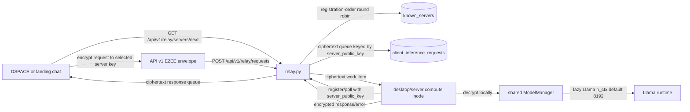
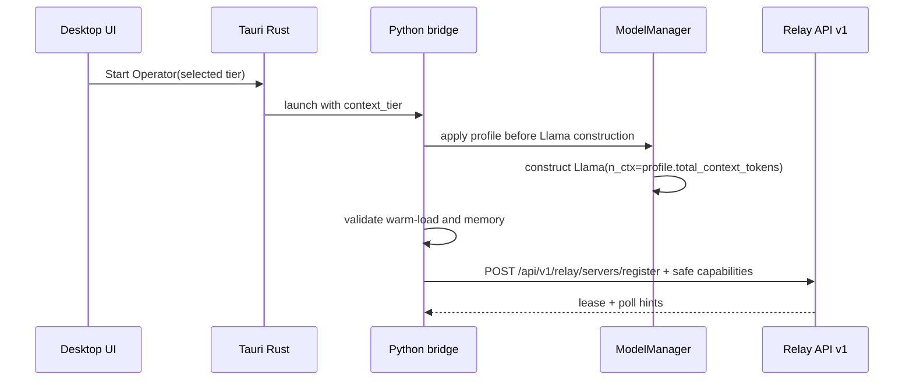
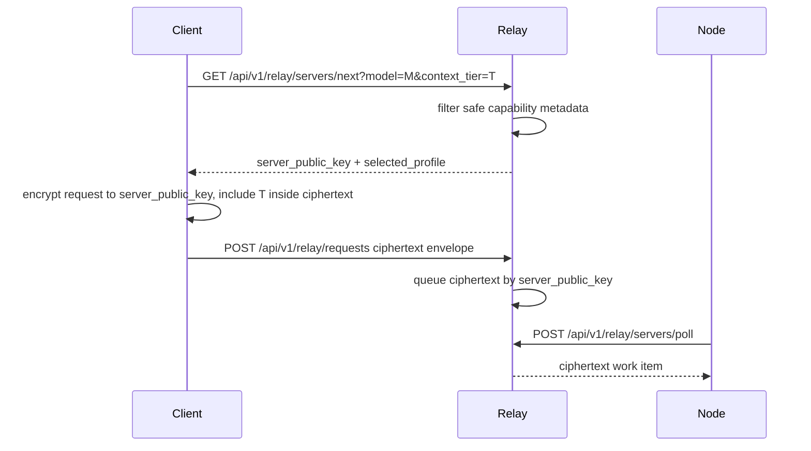
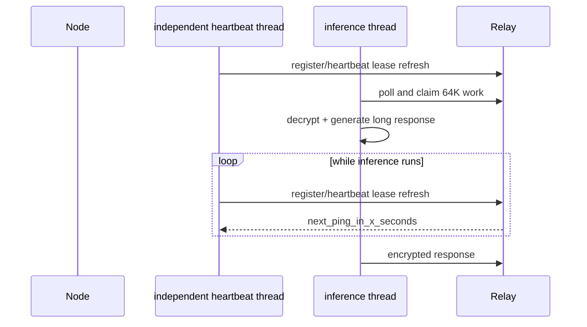
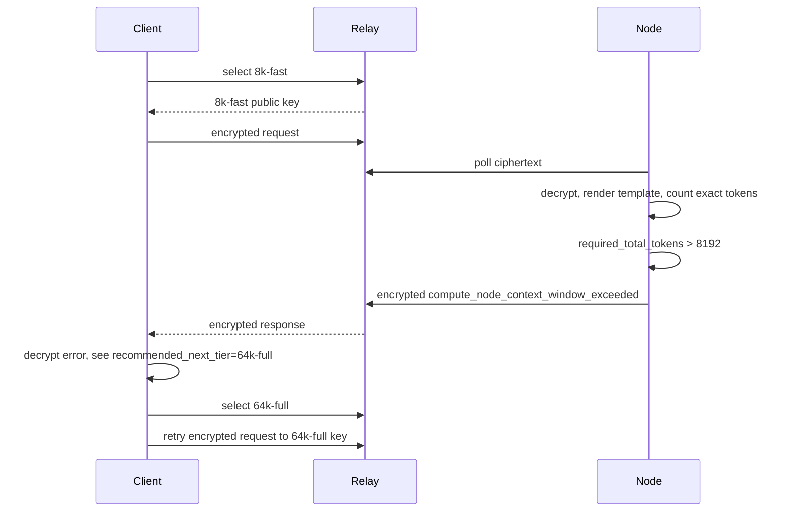
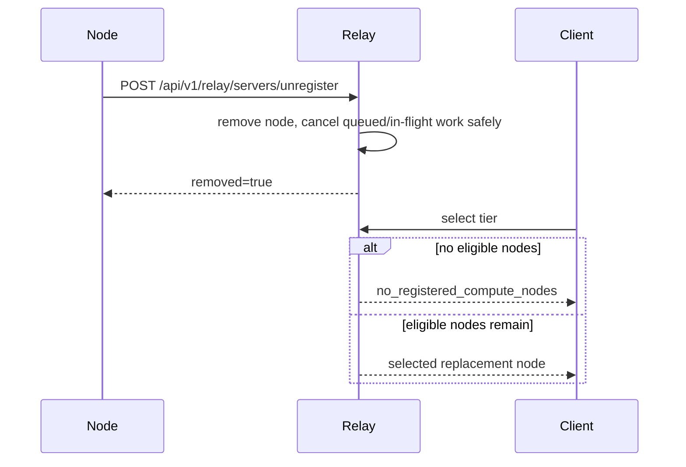

# Context-tiered compute design for API v1

This document is the authoritative token.place design for static context tiers, desktop operator
tier selection, privacy-safe capability registration, exact compute-side admission control, and
tier-aware relay scheduling.

It is a design document only. It does not change runtime behavior.

## Scope and non-goals

### In scope

- API v1 relay/client/compute-node architecture only.
- Static context profiles for `8k-fast` and `64k-full`.
- Desktop operator selection before runtime start.
- Privacy-safe API v1 capability registration.
- Relay scheduling that uses only safe metadata.
- Compute-side authoritative context-window admission after decryption.
- Independent liveness heartbeats for long-running inference.

### Non-goals

- **API v2 is explicitly out of scope.** API v2 exists but is incomplete and must not receive
  runtime traffic for this design.
- No API v1 streaming. API v1 remains non-streaming: responses are returned only after generation
  finishes.
- No deprecated legacy relay route expansion. `/sink`, `/faucet`, `/source`, `/retrieve`, and
  `/next_server` remain historical compatibility surfaces and are not extended.
- No plaintext relay scheduling. The relay never learns exact prompt size, prompt text, assistant
  output, tool arguments, or user data.
- No in-place context resize or per-request model reconstruction in the initial implementation.

## Hard security invariant

Distributed relay inference remains relay-blind E2EE:

```text
client plaintext -> encrypt to selected compute node public key -> relay ciphertext queue
compute node decrypts locally -> local inference -> encrypt response to client public key
relay ciphertext response queue -> client decrypts locally
```

Relay-owned state, logs, diagnostics, queue payloads, and scheduling inputs may contain only
ciphertext envelopes and safe routing metadata. The relay must fail closed if a proposed path would
require plaintext prompt/message/response inspection.

## Repository HEAD baseline verified for this design

The following current-state facts were checked against repository HEAD before drafting this design:

| Area | Current behavior | Reference |
| --- | --- | --- |
| Compute entrypoint | `server.py` creates one `ComputeNodeRuntime` and preserves `relay_client` compatibility. | `server.py` |
| Shared runtime | `ComputeNodeRuntime` uses `get_model_manager()` when no manager is injected. | `utils/compute_node_runtime.py` |
| Model manager ownership | `ModelManager` stores one lazily initialized `self.llm`, guarded by `self.llm_lock`. | `utils/llm/model_manager.py` |
| Context default | `Llama(...)` is constructed with `n_ctx=self.config.get('model.context_size', 8192)`. | `utils/llm/model_manager.py` |
| Desktop bridge | The desktop bridge imports and uses the same shared model manager/runtime path. | `desktop-tauri/src-tauri/python/compute_node_bridge.py` |
| Warm before registration | `ComputeNodeRuntime.ensure_api_v1_runtime_ready()` instantiates the runtime before API v1 polling/registration. | `utils/compute_node_runtime.py` |
| Serialization | The shared `llm_lock` protects runtime construction and completion calls, so one desktop operator serializes inference through one manager. | `utils/llm/model_manager.py` |
| Registration payload | API v1 registration currently sends `server_public_key` and receives lease/poll hints; registration stores little beyond public key, API v1 marker, and heartbeat lease. | `utils/networking/relay_client.py`, `relay.py` |
| Selection | `/api/v1/relay/servers/next` selects API v1 nodes by registration-order round robin. | `relay.py` |
| Diagnostics | `/relay/diagnostics` includes per-node `queue_depth`; current selection does not use it. | `relay.py` |
| Relay blindness | `/api/v1/relay/requests` accepts ciphertext envelope fields and rejects plaintext or unexpected relay fields. | `relay.py` |
| DSPACE timing | DSPACE tier selection happens client-side before request encryption, so exact token count remains unavailable to the relay. | design premise from P4/P5 sequence |
| Long inference risk | Current liveness is coupled to registration/poll heartbeat leases; long 64K inference must not make healthy nodes appear stale. | `relay.py`, `utils/networking/relay_client.py` |

## Current architecture



Current limitations:

- Nodes do not advertise context-window capabilities.
- Selection cannot distinguish fast 8K nodes from full 64K nodes.
- The relay cannot inspect exact prompt size because request bodies are encrypted to the compute
  node selected before dispatch.
- Queue depth is known diagnostically but not used for scheduling.
- Long-running inference can compete with the same loop responsible for refreshing liveness.

## Proposed architecture

```mermaid
flowchart LR
  U[Desktop operator UI] -->|select persisted tier before Start| T[8k-fast or 64k-full]
  T -->|Rust command args/env| B[Python compute-node bridge]
  B -->|configure context profile before construction| MM[ModelManager]
  MM -->|warm exact n_ctx runtime| LL[Llama runtime]
  B -->|register capabilities after warm-load validation| R[relay.py]

  D[DSPACE / landing chat] -->|coarse model + context_tier| S[/api/v1/relay/servers/next]
  S -->|capability filter + scheduler| R
  R -->|server_public_key + safe selected_profile metadata| D
  D -->|encrypted API v1 request repeats selected tier| Q[/api/v1/relay/requests]
  Q -->|ciphertext only| R
  R -->|ciphertext queue| B
  B -->|decrypt, verify requested tier, exact token admission| LL
  LL -->|non-streaming output or encrypted overflow error| R
  R -->|ciphertext response| D
```

## Initial deployment profiles

| Profile | Total context tokens | Initial physical operator | Policy intent | Caveats |
| --- | ---: | --- | --- | --- |
| `8k-fast` | 8,192 | Mac Mini M4 Pro with 24 GB unified memory | Conservative, latency-oriented default for short DSPACE turns and landing chat | The Mac may technically support larger contexts; the initial role is intentionally conservative. |
| `64k-full` | 65,536 | Windows PC with RTX 4090 24 GB VRAM and 128 GB DDR5 | Full-fat DSPACE chat and long-context synthesis | This is an operator policy, not a universal hardware claim. Competing GPU workloads may spill into system RAM and cause severe latency; initial design assumes the GPU is substantially available. |

Assignments are deployment policy, not hardware guarantees. A profile can register only after
successful warm-load and memory validation for that exact runtime configuration.

## Memory planning estimates

These numbers are planning aids, not admission guarantees.

- Quantized Llama 3.1 8B weights are approximately 5-6 GB, depending on file and runtime
  representation.
- A 64K f16 KV cache planning estimate for this GQA model is roughly 8 GB before other buffers.
- q8 or q4 KV cache may reduce memory materially.
- Flash attention, batch sizing, backend, K/Q/V offload, llama.cpp build options, GPU memory
  fragmentation, runtime buffers, and active desktop workloads all change the real footprint.
- Registration must therefore be gated on actual warm-load plus memory validation, not on static
  estimates.

### Benchmark matrix

| Profile | Host policy | Model artifact | KV type | K/Q/V offload | Batch defaults | Warm-load memory | 1K prompt latency | 8K admission | 64K admission | Notes |
| --- | --- | --- | --- | --- | --- | --- | --- | --- | --- | --- |
| `8k-fast` | Mac Mini M4 Pro 24 GB | Llama 3.1 8B quantized | default initially | Metal/auto policy | existing defaults | measure | measure | pass/fail exact | reject with encrypted overflow | latency-oriented baseline |
| `64k-full` | RTX 4090 24 GB + 128 GB DDR5 | Llama 3.1 8B quantized | default, q8, q4 candidates | CUDA full or tuned hybrid | existing defaults, then tuned | measure | measure | pass | pass/fail exact | watch VRAM pressure and system-RAM spill |
| future | any validated operator | registered model IDs | profile-specific | profile-specific | profile-specific | measure | measure | profile-specific | profile-specific | enabled only after validation |

## Context profile schema

A context profile is the unit of operator policy, registration, selection, and admission.

```json
{
  "profile_id": "64k-full",
  "display_name": "64K full context",
  "model_ids": ["meta-llama-3.1-8b-instruct"],
  "total_context_tokens": 65536,
  "default_output_tokens": 1024,
  "max_output_tokens": 4096,
  "max_concurrency": 1,
  "kv_cache_type": "default",
  "kqv_offload_policy": "auto",
  "batch_defaults": {
    "n_batch": null,
    "n_ubatch": null,
    "flash_attention": null
  },
  "enabled": true,
  "safe_diagnostics": {
    "backend_class": "CUDA",
    "throughput_band": "medium",
    "runtime_ready": true,
    "last_validation_status": "passed"
  }
}
```

Field rules:

- `profile_id` is stable and protocol-visible. Initial IDs are `8k-fast` and `64k-full`.
- `display_name` is safe UI text.
- `model_ids` are coarse model identifiers clients may request.
- `total_context_tokens` is the configured `n_ctx` total window.
- `default_output_tokens` is reserved when the client omits an explicit output budget.
- `max_output_tokens` caps accepted output reservations.
- `max_concurrency` is initially `1` because each desktop operator has one shared model manager
  and serialized inference lock.
- `kv_cache_type`, `kqv_offload_policy`, and `batch_defaults` may start as existing defaults but
  reserve schema space for later tuning.
- `enabled=false` prevents registration and selection.
- `safe_diagnostics` must not include device serial number, hostname, raw VRAM inventory, prompt
  data, user data, or exact per-request token counts.

## Desktop operator tier selection

Initial desktop behavior:

1. The Tauri operator UI shows a persisted dropdown before **Start Operator**.
2. Options are `8k-fast` and `64k-full`.
3. The dropdown is disabled while the operator is running.
4. Starting the operator passes the selected tier through Rust into the Python compute-node bridge.
5. The bridge applies the profile to the model manager before `Llama` construction.
6. The tier controls `n_ctx`; changing tier requires Stop Operator, selection change, Start
   Operator.
7. The node warms the exact runtime and validates memory before registering with any relay.
8. No in-place resize and no per-request model reconstruction in the initial design.

## Privacy-safe capability registration

Registration extends the existing API v1 compute-node heartbeat/register route:

`POST /api/v1/relay/servers/register`

Proposed safe registration payload:

```json
{
  "server_public_key": "base64-rsa-public-key",
  "api_version": "v1",
  "supported_model_ids": ["meta-llama-3.1-8b-instruct"],
  "active_context_profile": {
    "profile_id": "64k-full",
    "display_name": "64K full context",
    "total_context_tokens": 65536,
    "default_output_tokens": 1024,
    "max_output_tokens": 4096,
    "max_concurrency": 1,
    "kv_cache_type": "default",
    "kqv_offload_policy": "auto",
    "batch_defaults": {"n_batch": null, "n_ubatch": null, "flash_attention": null},
    "enabled": true
  },
  "backend_class": "CUDA",
  "throughput_band": "medium"
}
```

Allowed relay-visible fields:

- server public key;
- API version;
- supported model IDs;
- active context profile ID and safe profile limits;
- maximum total context tokens;
- maximum output tokens;
- max concurrency;
- backend class such as `CPU`, `CUDA`, or `Metal`;
- optional coarse throughput bands.

Forbidden fields:

- device serial number;
- hostname;
- user account name;
- raw VRAM/RAM inventory;
- exact prompt data or user data;
- plaintext messages, responses, tool arguments, or model output;
- fine-grained per-request token counts.

The relay stores only the safe capability metadata needed for selection and diagnostics.

## API v1 extension proposal

### Selection request

`GET /api/v1/relay/servers/next?model=meta-llama-3.1-8b-instruct&context_tier=64k-full`

Equivalent JSON `POST` selection may be considered later if URL length or structured filters become
necessary, but the initial extension can remain query-based.

Client-supplied fields:

| Field | Required | Meaning |
| --- | --- | --- |
| `model` | optional initially | Coarse model ID/alias. |
| `context_tier` | optional | Requested tier ID. Missing defaults to `8k-fast` for compatibility. |

The exact token count remains encrypted and is not supplied to the relay.

### Selection response

```json
{
  "server_public_key": "base64-rsa-public-key",
  "selected_profile": {
    "profile_id": "64k-full",
    "display_name": "64K full context",
    "total_context_tokens": 65536,
    "default_output_tokens": 1024,
    "max_output_tokens": 4096,
    "max_concurrency": 1
  }
}
```

The selected-profile metadata is safe because it describes operator capacity, not user content.

### Encrypted request payload

The API v1 encrypted plaintext sent by the client to the selected compute node repeats the tier:

```json
{
  "protocol": "tokenplace_api_v1_relay_e2ee",
  "version": 1,
  "request_id": "uuid",
  "client_public_key": "base64-rsa-public-key",
  "api_v1_request": {
    "model": "meta-llama-3.1-8b-instruct",
    "context_tier": "64k-full",
    "messages": [],
    "max_tokens": 1024
  }
}
```

The compute node verifies that encrypted `context_tier` equals its active profile. Missing tier is
accepted as `8k-fast` for backward compatibility. A mismatch fails closed with an encrypted
structured error.

## Tier-aware selection

Selection proceeds in increasingly capable phases.

| Phase | Required relay inputs | Decision | Tie-breaker | Privacy status |
| --- | --- | --- | --- | --- |
| Current | registered API v1 keys | registration-order round robin | registration order | safe |
| 1 | model + requested tier + profile metadata | filter eligible nodes, preserve round robin among equivalents | registration order | safe |
| 2 | profile total context tokens | smallest capable tier | round robin | safe |
| 3 | queue depth + in-flight count | lowest load among capable nodes | round robin | safe |
| 4 | throughput band + queue/in-flight + reservations | expected completion time, fairness, long-tier reservation | reservation expiry | safe |

Relay-visible scheduling inputs remain metadata-only: profile ID, context capacity, coarse model ID,
backend class, throughput band, queue depth, in-flight count, lease freshness, and reservation state.

## Compute-side exact admission

The compute node is authoritative because only it can decrypt the request.

Admission algorithm:

1. Decrypt the API v1 request locally.
2. Normalize missing `context_tier` to `8k-fast`.
3. Verify `context_tier == active_profile.profile_id`.
4. Render the prompt with the same chat template used for inference.
5. Count exact input tokens with the active runtime tokenizer.
6. Determine output reservation: requested output tokens if provided, otherwise
   `default_output_tokens`.
7. Reject requested output tokens above `max_output_tokens`.
8. Compute `required_total_tokens = prompt_tokens + output_reservation`.
9. Require `required_total_tokens <= active_profile.total_context_tokens`.
10. Do not silently shrink output below the requested budget.
11. On overflow, submit an encrypted structured error to the client; do not expose exact counts to
    the relay.

Encrypted overflow error shape:

```json
{
  "error": {
    "code": "compute_node_context_window_exceeded",
    "active_context_tier": "8k-fast",
    "configured_context_tokens": 8192,
    "exact_prompt_tokens": 9100,
    "requested_output_tokens": 1024,
    "required_total_tokens": 10124,
    "recommended_next_tier": "64k-full",
    "retryable": true
  }
}
```

The relay sees only an encrypted response envelope. Clients may decrypt the error and retry by
asking selection for the recommended tier when known.

## Sequence diagrams

### Registration



### Selection and dispatch



### Heartbeat during long inference



### Overflow and retry



### Unregister and fail-closed recovery



## Liveness design

Problem: a 64K request may run long enough that a polling/processing loop cannot refresh its lease,
causing the relay to consider a healthy node stale.

| Option | Benefits | Drawbacks | Decision |
| --- | --- | --- | --- |
| Independent heartbeat thread | Simple mental model; liveness decoupled from inference duration; works with serialized inference | One extra loop; must stop cleanly on operator shutdown | **Preferred initial design** |
| Extended busy lease | Minimal new threading | Hard to size; stale crashed busy nodes linger longer | Defer |
| In-flight lease renewal | Precise and request-scoped | More protocol state and edge cases | Defer |

Initial design: run registration heartbeat independently while inference is running. Keep fail-closed
unregister and recovery behavior: explicit unregister removes the node and cancels queued work;
stale nodes are evicted; clients receive safe relay errors or encrypted compute-node errors.

## Runtime strategy comparison

| Strategy | Benefits | Memory implications | Complexity | Failure modes | Why deferred |
| --- | --- | --- | --- | --- | --- |
| One larger fixed context on every node | Simple client model; fewer tiers | Forces all operators to pay 64K KV/buffer cost | Low | Slow small requests; low-memory nodes fail warm-load | Wastes Mac latency tier and excludes smaller operators |
| Stop/reload/re-register profile switching | Uses one process and one profile at a time | Only active profile consumes KV/runtime memory | Medium | Slow switches; dropped registrations; user confusion | Acceptable later, but initial UI uses manual Stop/Start only |
| Multiple high-level `Llama` instances | Fast tier switching | Duplicate weights/KV/runtime buffers; severe memory pressure | Medium-high | OOM, fragmentation, backend contention | Too risky for 24 GB devices initially |
| One shared model with multiple low-level contexts | Potentially efficient concurrent contexts | Lower weight duplication, multiple KV contexts | High | llama.cpp binding complexity, lifecycle bugs | Requires deeper runtime integration |
| `llama-server` sidecar | Mature serving features and possible parallelism | Separate process memory; server config tuning | Medium | Sidecar crash/restart, auth, local API exposure | Candidate after static tiers stabilize |
| Prompt/KV prefix caching | Faster repeated DSPACE prefixes | Cache consumes memory and must be scoped | High | Cross-user leakage if keyed incorrectly; stale cache | Requires rigorous privacy design |
| Speculative decoding | Lower latency | Extra draft model memory | High | Quality mismatch, more moving parts | Premature before baseline long-context metrics |

## Failure modes and recovery

| Failure | Detection | Recovery | Relay privacy impact |
| --- | --- | --- | --- |
| Profile warm-load fails | Bridge/model manager validation error before registration | Do not register; show operator error; allow tier change/retry | None |
| Memory validation passes then workload pressure causes OOM | Runtime exception or process exit | Submit encrypted fail-closed error if possible; unregister on shutdown; relay evicts stale node | Relay sees only metadata/staleness |
| Client omits tier | Selection defaults to `8k-fast`; encrypted request missing tier normalizes to `8k-fast` | Backward-compatible path | Safe |
| Client asks unknown tier | Relay returns no eligible node or validation error | Client may retry with supported tier | Safe |
| Encrypted tier mismatches registered profile | Compute-node validation fails | Encrypted structured error; no plaintext relay data | Safe |
| Prompt exceeds selected context | Compute-side exact admission fails | Encrypted `compute_node_context_window_exceeded`; client may retry next tier | Safe |
| Long inference blocks polling loop | Independent heartbeat continues | Registration remains fresh | Safe |
| Operator stops | Bridge unregisters; relay cancels queued/in-flight requests | Clients see safe cancellation/no-node responses | Safe |
| Node crashes mid-inference | Heartbeat stops; relay evicts after lease/TTL | Pending request expires/cancels; client retries | Safe |
| Queue depth grows on 64K tier | Relay diagnostics and scheduler metadata | Later phases route by load/Ect/fairness | Safe |

## Rollout plan

### Phase 0: DSPACE and token.place measurement

- Measure DSPACE prompt sizes before encryption.
- Measure token.place warm-load memory, admission counts, queue latency, and inference latency.
- Keep measurements privacy-safe: no prompt text, no user data, no relay plaintext.

### Phase 1: two static physical tiers

- Add static profiles `8k-fast` and `64k-full`.
- Add desktop tier dropdown and profile persistence.
- Configure `n_ctx` before model construction.
- Warm-load and validate before registration.
- Extend registration with safe capability metadata.
- Default missing tier to `8k-fast`.

### Phase 2: capability-aware/load-aware routing

- Filter by requested model and tier.
- Preserve round robin among equivalent nodes.
- Select smallest capable tier.
- Add queued/in-flight load awareness.
- Keep relay scheduling metadata-only.

### Phase 3: long-context runtime tuning

- Benchmark KV cache type, batch sizes, flash attention, and K/Q/V offload.
- Tune `64k-full` for Windows RTX 4090 policy host.
- Record latency and memory regressions per profile.

### Phase 4: multiple profiles or richer serving engine per physical device

- Evaluate stop/reload/re-register switching.
- Evaluate `llama-server` sidecar or lower-level multi-context serving.
- Consider prefix caching and speculative decoding only after privacy and reliability review.

## Rollback plan

- Disable `64k-full` profile registration by setting `enabled=false` or not exposing it in the
  desktop selector.
- Keep clients that omit tier on `8k-fast`.
- Relay scheduler can fall back to registration-order round robin over API v1 nodes.
- Compute nodes can unregister and restart with `8k-fast`.
- Do not roll back to legacy relay endpoints or plaintext routing.

## Compatibility plan

- Missing `context_tier` in selection defaults to `8k-fast`.
- Missing encrypted `context_tier` in the request defaults to `8k-fast`.
- Existing clients continue using `/api/v1/relay/servers/next` without query parameters.
- Selection responses add `selected_profile` as an optional field; clients that ignore it continue
  using `server_public_key`.
- Compute-side overflow errors are encrypted and structured; older clients may display a generic
  decrypted error while newer clients use `recommended_next_tier` for bounded retry.

## Security and privacy analysis

- Capability registration describes compute capacity, not user content.
- Exact token counts are produced only after compute-node decryption and are returned only inside
  encrypted responses.
- Relay diagnostics may show queue depth, in-flight count, profile ID, and coarse backend class;
  they must not show prompt size or plaintext.
- Throughput bands are coarse to reduce fingerprinting risk.
- Hostnames, serial numbers, raw VRAM inventory, user identifiers, and prompt-derived telemetry are
  forbidden.
- Prompt/KV caching is future work because it requires strict cache scoping and leakage review.
- Any mismatch or unsupported capability fails closed rather than routing to plaintext or API v2.

## Future work

- Privacy-safe DSPACE/token.place benchmark dashboards with no prompt or response content.
- DSPACE token estimation and tier preclassification before encryption.
- Desktop operator profile UX for `8k-fast`, `64k-full`, and later custom validated profiles.
- API v1 capability registration hardening and schema validation.
- Exact admission tests that verify chat-template token accounting matches inference.
- Load-aware scheduling with queue depth, in-flight work, coarse throughput bands, fairness, and
  long-tier reservation.
- Runtime tuning for 64K contexts: KV quantization, flash attention, batch sizing, and offload.
- Optional richer serving engine evaluation after API v1 launch stability.
