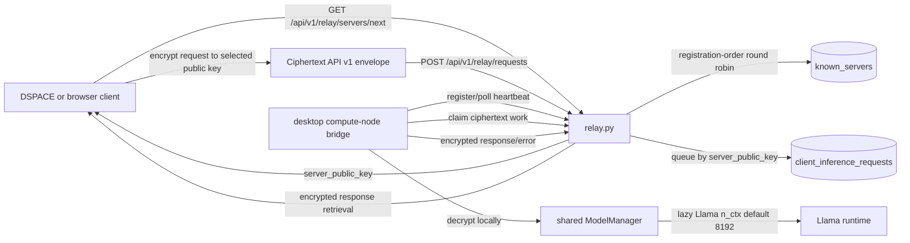
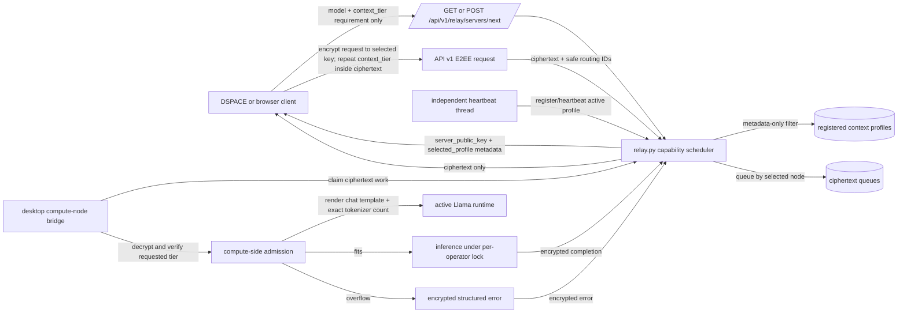
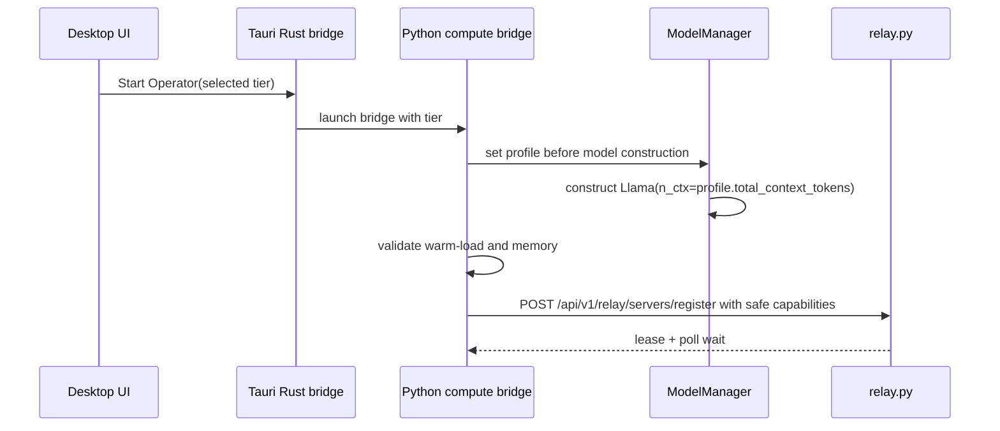
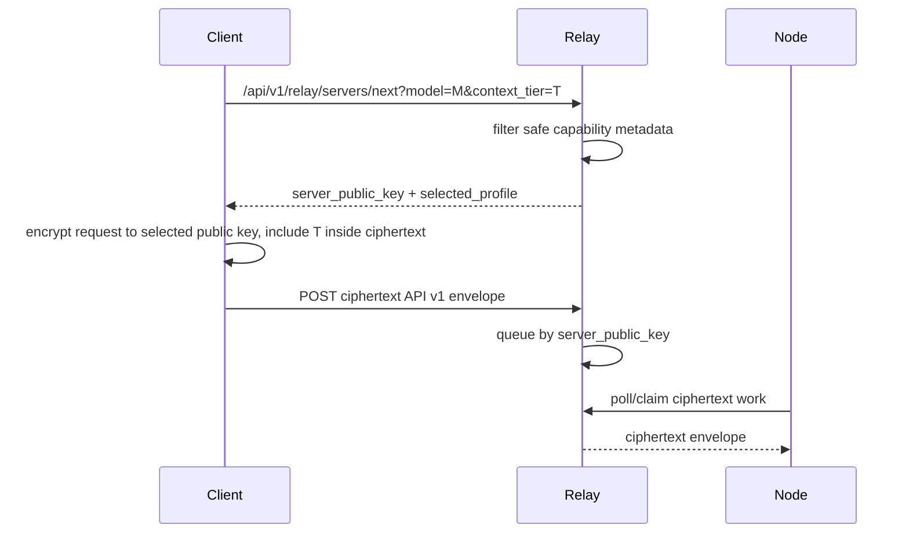
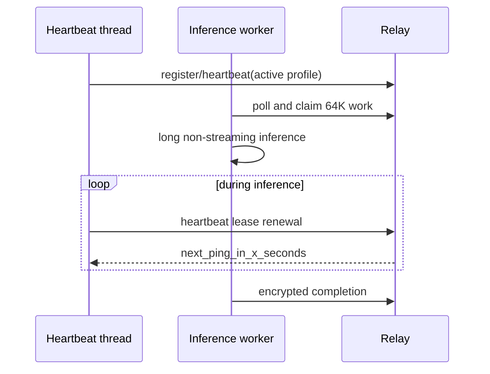
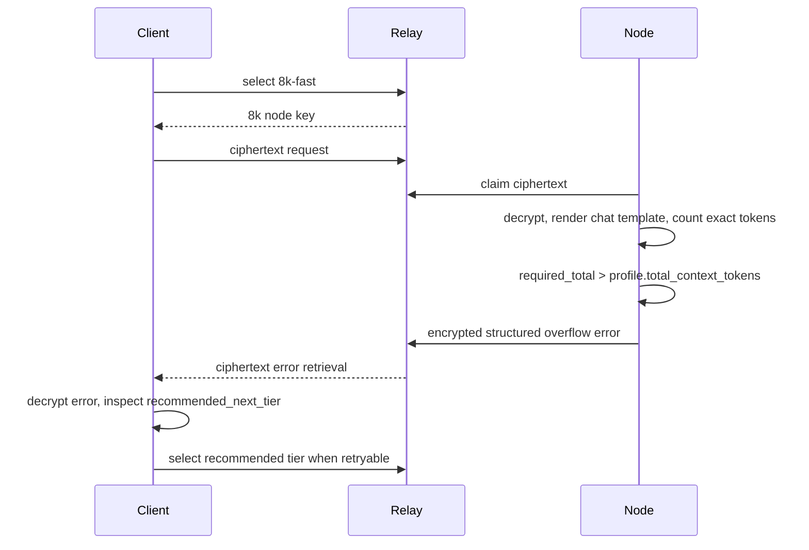
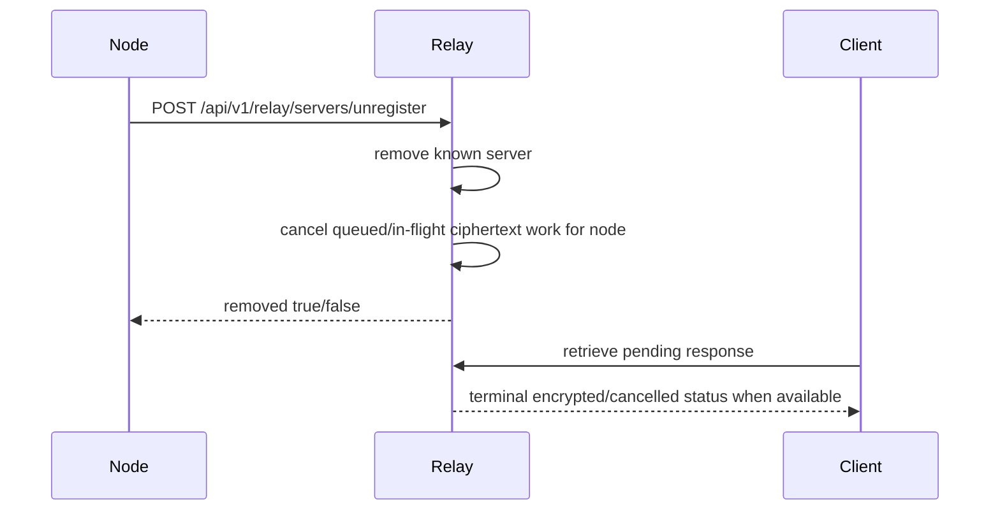

# Context-tiered compute design for API v1 E2EE relay scheduling

Status: design proposal for the P5 roadmap sequence. This document is authoritative for static
context tiers, desktop operator selection, capability registration, exact admission control, and
tier-aware relay scheduling in token.place API v1.

## Scope and non-goals

### In scope

- API v1 only.
- Static context profiles for desktop compute operators.
- Privacy-safe capability registration from compute nodes to relay.
- Tier-aware node selection that preserves relay-blind E2EE.
- Compute-side exact context admission after decrypting an API v1 request.
- Registration liveness that remains healthy while long inference runs.
- Scheduler evolution from capability filtering to load/throughput-aware routing.

### Non-goals

- No runtime code, route, static chat, desktop UI, test, dependency, or API v2 changes in this
  document change.
- No API v1 streaming. API v1 remains non-streaming.
- No deprecated legacy relay endpoint expansion. `/sink`, `/faucet`, `/source`, `/retrieve`, and
  `/next_server` remain out of active production routing.
- No API v2 routing. API v2 exists in the repository, is incomplete, and must not be used for this
  design until API v1 is launched and `v0.1.0` is finalized.

## Hard invariant: relay-blind E2EE

Distributed relay inference must remain relay-blind end-to-end encrypted:

- Relay-owned request/response state contains ciphertext envelopes only, plus safe routing metadata.
- Relay logs and diagnostics must not include plaintext prompts, responses, tool arguments, model
  output text, exact token counts, or user data.
- The relay cannot inspect prompt size because the API v1 request body is encrypted to the selected
  compute node.
- If any path cannot preserve E2EE, it must fail closed rather than expose plaintext or fall back to
  a legacy/plaintext route.

## Current architecture checked against repository HEAD

The design below depends on the following current facts:

| Area | Current behavior | Repository anchor |
| --- | --- | --- |
| Model runtime ownership | `ModelManager` owns a single `self.llm` runtime plus `self.llm_lock`; the runtime is lazily initialized by `get_llm_instance()`. | `utils/llm/model_manager.py` |
| Fixed context | `Llama(...)` receives `n_ctx=self.config.get('model.context_size', 8192)`. Once constructed, the context window is fixed for that runtime. | `utils/llm/model_manager.py` |
| Desktop warm-load | The Tauri bridge waits for `runtime.ensure_api_v1_runtime_ready()` before API v1 relay registration/polling is considered ready. | `desktop-tauri/src-tauri/python/compute_node_bridge.py` |
| Serialized inference | The bridge uses one shared runtime/model manager and an `inference_lock` around relay request processing, serializing inference per desktop operator. | `desktop-tauri/src-tauri/python/compute_node_bridge.py` |
| Minimal registration | API v1 compute-node registration currently sends only `server_public_key`; relay stores the public key, API v1 marker, and lease heartbeat metadata. | `utils/networking/relay_client.py`, `relay.py` |
| Node selection | `/api/v1/relay/servers/next` selects API v1 nodes using registration-order round robin. | `relay.py` |
| Diagnostics vs scheduling | Relay diagnostics expose `queue_depth`, but current selection does not use it. | `relay.py` |
| Encrypted dispatch | API v1 request dispatch queues ciphertext envelopes keyed by `server_public_key`. | `relay.py` |
| DSPACE timing | DSPACE selection happens before request encryption, so tier requirements can be chosen client-side before ciphertext is produced. | External DSPACE integration contract |
| Admission authority | Because exact prompt content is encrypted to the compute node, only the compute node can perform authoritative token admission after decryption. | E2EE invariant |
| Long-running inference risk | A 64K inference must not cause a healthy node to go stale merely because its polling/processing thread is busy. | Current lease/poll coupling in bridge/relay |

## Current architecture diagram



## Proposed architecture diagram



## Initial static tiers

| Tier ID | Total context tokens | Initial operator policy | Purpose | Notes |
| --- | ---: | --- | --- | --- |
| `8k-fast` | 8,192 | Mac Mini M4 Pro with 24 GB unified memory | Conservative latency-oriented default tier. | The Mac may technically support larger contexts, but its initial role is intentionally conservative. |
| `64k-full` | 65,536 | Windows PC with RTX 4090 24 GB VRAM and 128 GB DDR5 | Long-context/full-fat requests. | Assignment assumes the GPU is substantially available. Competing GPU workloads may spill into system RAM and cause severe latency. |

These assignments are operator policy for the initial deployment, not universal hardware claims.

## Memory-planning notes

The following values are planning estimates only; they must not become admission guarantees.
Admission is based on profile configuration and successful runtime validation, not theoretical
memory arithmetic.

| Component / tuning axis | Planning estimate or effect | Admission implication |
| --- | --- | --- |
| Quantized Llama 3.1 8B weights | Approximately 5-6 GB depending on file and runtime representation. | Weight size alone is insufficient to prove a tier fits. |
| 64K f16 KV cache for this GQA model | Roughly 8 GB before other buffers. | Useful for sizing, not a guarantee. |
| q8/q4 KV cache | May materially reduce KV memory. | Requires explicit profile/runtime validation. |
| Flash attention | Can alter memory and latency. | Record in profile diagnostics when enabled. |
| Batch sizing | Changes throughput, latency, and memory pressure. | Keep defaults initially; schema supports later tuning. |
| Backend and K/Q/V offload | CPU/CUDA/Metal and offload policy affect footprint. | Register only privacy-safe backend class and policy labels. |
| Runtime buffers | Additional allocations vary by llama.cpp version/backend. | Warm-load and memory validation gate registration. |

A context profile may register only after the compute node successfully warm-loads and validates the
exact runtime/profile combination it will serve.

## Desktop operator tier selection

The desktop Tauri operator UI should expose a persisted context-tier dropdown with these initial
options:

- `8k-fast`
- `64k-full`

Behavior:

1. The dropdown is available before **Start Operator**.
2. The dropdown is disabled while the operator is running.
3. Starting the operator passes the selected tier through Rust into the Python compute-node bridge
   and `ModelManager`.
4. The tier controls `n_ctx` before model construction.
5. The node warm-loads that exact runtime before relay registration.
6. Switching tier requires **Stop Operator**, selection change, then **Start Operator**.
7. There is no in-place resize and no per-request model reconstruction in the initial design.

This matches the current single shared model-manager architecture and avoids hidden latency spikes or
memory churn during a request.

## Context-profile schema

Initial implementations may keep KV cache and batching at existing runtime defaults, but the schema
must leave room for later tuning.

```json
{
  "profile_id": "64k-full",
  "display_name": "64K full context",
  "model_ids": ["llama-3.1-8b-instruct"],
  "total_context_tokens": 65536,
  "default_output_token_reservation": 1024,
  "maximum_output_tokens": 4096,
  "max_concurrency": 1,
  "kv_cache_type": "runtime-default",
  "kqv_offload_policy": "runtime-default",
  "batch_defaults": {
    "n_batch": "runtime-default",
    "n_ubatch": "runtime-default",
    "flash_attention": "runtime-default"
  },
  "enabled": true,
  "safe_diagnostics": {
    "backend_class": "cuda",
    "throughput_band": "medium",
    "validated_at_unix": 1782086400,
    "validation_method": "warm_load_and_memory_probe"
  }
}
```

Field requirements:

| Field | Requirement |
| --- | --- |
| `profile_id` | Stable ID such as `8k-fast` or `64k-full`; safe to expose to clients/relay. |
| `display_name` | Human-readable label. |
| `model_ids` | Coarse model IDs supported by this runtime. |
| `total_context_tokens` | Total input plus output reservation budget. |
| `default_output_token_reservation` | Used when client omits an output budget. |
| `maximum_output_tokens` | Upper bound the profile accepts. |
| `max_concurrency` | Initial desktop profiles should be `1` because inference is serialized. |
| `kv_cache_type` | `runtime-default`, `f16`, `q8`, `q4`, etc. |
| `kqv_offload_policy` | `runtime-default`, `cpu`, `gpu`, `hybrid`, etc. |
| `batch_defaults` | Coarse defaults only; no device-identifying data. |
| `enabled` | False profiles must not register or be selected. |
| `safe_diagnostics` | Metadata-only diagnostics, never hostname/serial/raw VRAM/user data. |

## Privacy-safe capability registration

API v1 compute-node registration should be extended so a node advertises only safe capabilities:

```json
{
  "server_public_key": "base64-rsa-public-key",
  "api_version": "v1",
  "supported_model_ids": ["llama-3.1-8b-instruct"],
  "active_context_profile": {
    "profile_id": "8k-fast",
    "display_name": "8K fast",
    "total_context_tokens": 8192,
    "default_output_token_reservation": 512,
    "maximum_output_tokens": 2048,
    "max_concurrency": 1,
    "kv_cache_type": "runtime-default",
    "kqv_offload_policy": "runtime-default",
    "batch_defaults": {"n_batch": "runtime-default"},
    "enabled": true
  },
  "maximum_total_context_tokens": 8192,
  "maximum_output_tokens": 2048,
  "max_concurrency": 1,
  "backend_class": "metal",
  "throughput_band": "low"
}
```

Allowed relay-visible fields:

- server public key;
- API version;
- supported model IDs;
- active context profile;
- maximum total context tokens;
- maximum output tokens;
- max concurrency;
- backend class such as `cpu`, `cuda`, or `metal`;
- optional coarse throughput bands.

Forbidden relay-visible fields:

- device serial number;
- hostname;
- raw VRAM/RAM inventory;
- detailed GPU model identifiers when they identify a person/operator unnecessarily;
- prompt data, response data, tokenized content, user data, or exact request token counts.

## API v1 extension proposal

### Node selection request

Clients supply coarse requirements before encryption:

```http
GET /api/v1/relay/servers/next?model=llama-3.1-8b-instruct&context_tier=64k-full
```

A future POST form can carry the same safe metadata if query strings become too limited:

```json
{
  "model": "llama-3.1-8b-instruct",
  "context_tier": "64k-full"
}
```

No exact token count is sent to the relay.

### Node selection response

```json
{
  "server_public_key": "base64-rsa-public-key",
  "selected_profile": {
    "profile_id": "64k-full",
    "display_name": "64K full context",
    "total_context_tokens": 65536,
    "maximum_output_tokens": 4096,
    "default_output_token_reservation": 1024,
    "model_ids": ["llama-3.1-8b-instruct"]
  }
}
```

### Encrypted request body

The client repeats the selected tier inside the encrypted API v1 request body:

```json
{
  "model": "llama-3.1-8b-instruct",
  "context_tier": "64k-full",
  "messages": [{"role": "user", "content": "..."}],
  "max_tokens": 2048
}
```

The relay sees only the ciphertext envelope. The compute node verifies that encrypted
`context_tier` matches its active profile. Missing tier remains backward-compatible and defaults to
`8k-fast`.

## Tier-aware selection

Selection stages:

1. Validate requested `model` and `context_tier` as safe metadata.
2. Treat missing `context_tier` as `8k-fast` for compatibility.
3. Filter registered API v1 nodes by enabled active profile, supported model ID, and profile tier.
4. Return the selected node public key plus safe selected-profile metadata.
5. Preserve round-robin among equivalent nodes for the first implementation.

### Scheduler decision table

| Phase | Filter | Tie-breaker | Relay-visible inputs | Deferred concerns |
| --- | --- | --- | --- | --- |
| Initial capability filtering | API v1, model ID, active tier/profile enabled. | Existing registration-order round robin among equivalent nodes. | Public key, profile ID, model IDs, context size class. | Load and speed ignored. |
| Smallest-capable tier | Choose the smallest profile that satisfies requested tier. | Round robin among same tier. | Requested tier and profile metadata. | Long-tier capacity protection begins but remains simple. |
| Lowest load | Prefer lower queued + in-flight work within capable tier. | Round robin/fairness for equal load. | Queue depth and in-flight counts only. | Throughput differences ignored. |
| Expected completion time | Estimate time from load and coarse throughput bands. | Fairness caps and starvation prevention. | Coarse throughput band, queued/in-flight counts, tier. | Requires calibration and reservation semantics. |
| Advanced reservations | Optional selection reservation token with expiry. | Fairness, long-tier reservation, retry-aware placement. | Reservation ID and expiry, never plaintext. | More state and failure modes. |

## Sequence diagrams

### Registration



### Selection and dispatch



### Heartbeat while inference runs



### Overflow and retry



### Unregister



## Compute-side exact admission

The compute node is the only authority for exact context admission:

1. Decrypt the API v1 request locally.
2. Resolve missing `context_tier` to `8k-fast`.
3. Verify the encrypted requested tier matches the active profile.
4. Render the prompt with the same chat template used for inference.
5. Count exact input tokens using the active runtime tokenizer.
6. Add requested output tokens, or the profile default reservation when omitted.
7. Reject requests above `maximum_output_tokens`.
8. Require `prompt_tokens + output_reservation <= total_context_tokens`.
9. Do not silently shrink output below the requested budget.
10. Run inference only after admission passes.

Encrypted structured overflow error:

```json
{
  "error": {
    "code": "compute_node_context_window_exceeded",
    "message": "Requested prompt and output budget exceed the active context profile.",
    "active_context_tier": "8k-fast",
    "configured_context_tokens": 8192,
    "exact_prompt_tokens": 9216,
    "requested_output_tokens": 1024,
    "required_total_tokens": 10240,
    "recommended_next_tier": "64k-full",
    "retryable": true
  }
}
```

This error is encrypted to the client. The relay stores and forwards only the encrypted envelope and
safe request identifiers; it must not log or diagnose exact counts.

## Liveness design

Long-running requests require liveness that is independent from inference processing.

| Option | Benefits | Drawbacks | Decision |
| --- | --- | --- | --- |
| Independent heartbeat thread | Keeps registration fresh while polling/inference is busy; easy to reason about; matches non-streaming long jobs. | Adds one background loop and synchronization with unregister/shutdown. | Preferred initial design. |
| Extended busy lease | Minimal new concurrency. | Relay must infer how long a request may run; stale failures remain coarse; bad leases keep dead nodes visible longer. | Defer. |
| In-flight lease renewal from worker | Tied to actual work; less idle chatter. | Worker may be blocked in native inference and unable to renew. | Defer. |

Fail-closed behavior remains required: if warm-load, validation, heartbeat authentication, or
runtime health fails, unregister or stop advertising the profile and recover by re-warm-loading and
re-registering.

## Scheduler evolution

1. **Capability filtering while preserving round robin**: safest first step; prevents 64K requests
   from being sent to 8K-only nodes.
2. **Smallest-capable-tier selection**: routes 8K requests to 8K nodes when possible, preserving
   scarce 64K capacity.
3. **Lowest load**: use queued and in-flight counts to avoid obviously busy nodes.
4. **Throughput-aware expected completion time**: combine load with coarse throughput bands.
5. **Fairness and long-tier reservation**: prevent starvation and reserve long-context capacity.
6. **Optional selection reservations**: reduce races between selection and dispatch, with short TTLs.

All relay-visible scheduling inputs remain metadata-only.

## Phase plan

| Phase | Goal | Deliverables |
| --- | --- | --- |
| Phase 0: DSPACE and token.place measurement | Establish privacy-safe baseline measurements. | DSPACE measurement doc, token.place queue/runtime measurement, no plaintext relay exposure. |
| Phase 1: two static physical tiers | Launch `8k-fast` and `64k-full` as operator-selected profiles. | Desktop selector, profile-driven `n_ctx`, warm-load validation, capability registration. |
| Phase 2: capability-aware/load-aware routing | Avoid mismatched tiers and reduce busy-node placement. | Tier-aware selection, queue/in-flight metadata, smallest-capable and lowest-load scheduler steps. |
| Phase 3: long-context runtime tuning | Improve 64K reliability and latency. | KV cache tuning, batch tuning, flash attention experiments, backend/offload validation. |
| Phase 4: multiple profiles or richer serving engine per physical device | Support richer runtime strategies after static tiers are proven. | Profile switching or multi-context serving design, stronger reservation/fairness model. |

## Future runtime strategies

| Strategy | Benefits | Memory implications | Complexity | Failure modes | Why deferred |
| --- | --- | --- | --- | --- | --- |
| One larger fixed context on every node | Simple client behavior; fewer tiers. | Forces all nodes to pay higher KV/buffer cost. | Low. | Slower 8K path, more OOM risk, wastes scarce memory. | Initial Mac role is latency-oriented and conservative. |
| Stop/reload/re-register profile switching | Reuses one process/device for multiple tiers. | Only one profile resident at a time. | Medium. | Long reloads, failed re-registration, user confusion. | Static operator selection is safer for launch. |
| Multiple high-level `Llama` instances | Fast switching between profiles. | Duplicates weights/KV/runtime buffers; high RAM/VRAM pressure. | Medium-high. | OOM, fragmented GPU memory, inconsistent runtime health. | Initial hardware is better served by one active profile. |
| One shared model with multiple low-level contexts | Avoids duplicate weights while supporting different contexts. | Potentially lower than multiple high-level instances, but KV remains per context. | High; may require lower-level llama.cpp bindings. | Binding mismatch, concurrency bugs, hard recovery. | Too risky before API v1 launch. |
| `llama-server` sidecar | Mature serving features, possible batching/cache features. | External process owns memory; can expose server-level tuning. | Medium-high integration and packaging work. | Sidecar lifecycle, auth, local plaintext boundaries. | Desktop bridge currently owns direct runtime lifecycle. |
| Prompt/KV prefix caching | Speeds repeated long prompts. | Stores reusable KV entries; can grow memory usage. | Medium-high. | Privacy leaks if cache keys/content mishandled; stale cache. | Needs privacy design and measurement first. |
| Speculative decoding | Lower latency for supported model pairs. | Requires draft model memory and scheduling. | High. | Bad draft fit, extra failure surface. | Optimize correctness/tier admission before decoding speedups. |

## Memory and latency benchmark matrix

Benchmarks must be privacy-safe and should record metadata only. Do not store prompts or outputs.

| Tier | Hardware policy | Backend | KV cache | Context used | Output reservation | Metrics | Pass criteria |
| --- | --- | --- | --- | ---: | ---: | --- | --- |
| `8k-fast` | Mac Mini M4 Pro 24 GB | Metal | runtime default | 2K / 4K / 8K | 512 / 1024 | warm-load time, first token latency surrogate, full completion time, memory high-water mark | Stable warm-load and no fallback when Metal expected. |
| `64k-full` | RTX 4090 24 GB + 128 GB DDR5 | CUDA | runtime default | 8K / 32K / 64K | 1024 / 2048 / 4096 | warm-load time, admission accuracy, full completion time, queue wait, GPU/system spill signal | 64K profile validates with GPU substantially available. |
| `64k-full` tuned | RTX 4090 policy node | CUDA | q8/q4 candidate | 32K / 64K | 2048 / 4096 | memory footprint delta, quality smoke, latency delta | Demonstrates material memory benefit without unacceptable regressions. |
| fallback/recovery | either node | expected backend unavailable | runtime default | profile max smoke | default | fail-closed registration, recovery time | Node does not advertise invalid profile. |

## Security and privacy analysis

| Risk | Mitigation |
| --- | --- |
| Relay learns prompt size. | Exact token counts remain compute-side and are only returned inside encrypted errors. |
| Relay learns hardware identity. | Registration uses backend class and coarse throughput bands only; no hostname, serial, raw VRAM, or detailed inventory. |
| Client lies about tier outside ciphertext. | Compute verifies encrypted tier against active profile after decryption. |
| Selection/dispatch race sends request to changed profile. | Compute fail-closes on encrypted tier mismatch; future reservation tokens can reduce races. |
| 64K request pins a node and expires registration. | Independent heartbeat renews lease during inference. |
| Overflow silently truncates output. | Admission rejects instead of shrinking below requested output budget. |
| Legacy/plaintext fallback reappears. | API v1 E2EE routes only; fail closed if E2EE cannot be preserved. |

## Failure modes and recovery

| Failure | Detection | Recovery |
| --- | --- | --- |
| Profile warm-load fails | Runtime init or memory validation error. | Do not register; surface operator error; allow Stop/Start after remediation. |
| Heartbeat fails | Missed lease or auth/network error. | Unregister/fail closed locally; retry registration only after runtime remains healthy. |
| Node dies while queued work exists | Relay stale eviction/unregister. | Cancel queued/in-flight entries with terminal status; client retries selection. |
| Tier mismatch after decrypt | Encrypted request tier differs from active profile. | Encrypted fail-closed error; client reselects. |
| Context overflow | Exact admission exceeds profile. | Encrypted `compute_node_context_window_exceeded` with recommended tier when known. |
| Windows GPU contention spills memory | Benchmark/diagnostics indicate severe latency or validation failure. | Stop advertising `64k-full` until GPU availability is restored; possibly register lower profile later. |
| Scheduler has no capable node | Capability filter empty. | Return safe relay error such as no capable registered compute node; client may retry later. |
| Unregister during in-flight work | Operator stop or stale detection. | Cancel queued/in-flight relay state; do not expose plaintext. |

## Rollout and rollback plan

### Rollout

1. Land this design document.
2. Add privacy-safe measurements for DSPACE and token.place.
3. Add profile definitions and desktop selector behind static options.
4. Pass selected profile into bridge/model manager before construction.
5. Warm-load and validate profile before registration.
6. Extend API v1 registration with safe capability metadata.
7. Extend selection with `model` and `context_tier`, defaulting missing tier to `8k-fast`.
8. Add compute-side exact admission and encrypted overflow errors.
9. Split heartbeat from inference processing.
10. Evolve scheduler by phases.

### Rollback

- Disable `64k-full` profile registration first; keep `8k-fast` compatibility path.
- Revert scheduler to capability-filtered round robin if load estimates misbehave.
- Revert clients to omitting `context_tier`; relay and compute default to `8k-fast`.
- Unregister nodes whose validation fails; never keep a stale or unvalidated capability visible.

## Compatibility plan for clients that omit a tier

- Selection treats omitted `context_tier` as `8k-fast`.
- Encrypted request handling treats omitted `context_tier` as `8k-fast`.
- Selected-profile metadata may still be returned so newer clients can display the effective tier.
- Overflow errors remain encrypted; older clients that cannot interpret the structured code still see a
  generic encrypted error response after decryption.

## Future work themes

- DSPACE automatic tier estimation using privacy-safe local token estimation before encryption.
- DSPACE retry policy that uses encrypted overflow errors and bounded retry to a recommended tier.
- Capability-aware load balancing beyond round robin.
- Independent heartbeat and richer in-flight accounting.
- Long-context runtime tuning for KV cache type, flash attention, batching, and offload policy.
- Optional reservation tokens to close selection/dispatch races.
- Multiple profiles per physical device only after static tiers are proven.
- Privacy-safe benchmark dashboards that avoid prompt, output, hostname, and device-serial data.
