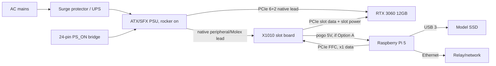
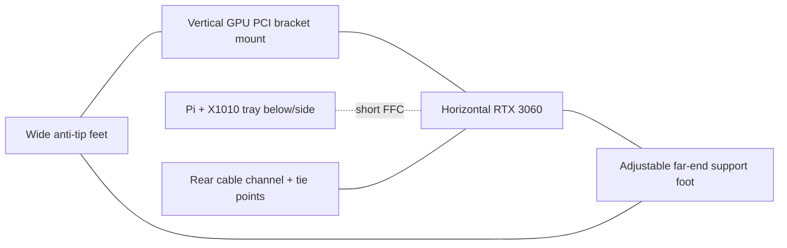

# Raspberry Pi 5 + RTX 3060 compute-node design

_Last verified: 2026-07-12._

## 1. Status and scope

This is a **design proposal** for an optional token.place API v1 compute node built from a Raspberry Pi 5 8GB and an NVIDIA GeForce RTX 3060 12GB. It is **unimplemented**, **experimental**, and not production-qualified. The intended role is a low-power or overflow **compute** node; it is **not** a proposal to run the relay on the GPU node.

Non-goals for this PR:

- No runtime, Docker, Compose, CI, systemd, CAD/OpenSCAD/STL, API, model-default, or dependency changes.
- No change to API v1 behavior, relay-blind E2EE, model defaults, API v2, DSPACE, or the Tauri UI.
- No claim that token.place has tested this hardware.

Required invariants:

- The project name remains lowercase **token.place**.
- API v1 remains non-streaming.
- Relay-owned state remains relay-blind E2EE: ciphertext only plus safe routing metadata.
- Logs and diagnostics must never contain plaintext prompts, responses, tool arguments, decrypted envelopes, model output, or private keys.
- The node must advertise only model and context capabilities it has actually validated on this exact hardware, driver, container, model, and runtime stack.

## 2. Executive recommendation

**Verdict:** the Pi 5 + RTX 3060 12GB node is plausible as a proof of concept or experimental overflow node for Qwen3 8B API v1 inference, but it should not be treated as a production compute node until CUDA on BCM2712 becomes upstream-supported or the full pinned stack survives cold-cycle and soak testing.

- **Expected token-generation viability:** likely viable if all model layers and KV cache remain on the RTX 3060. Community RTX 3060 results and Pi/desktop comparisons suggest decode should be close to an x86 RTX 3060 for small batches.
- **Power savings:** meaningful but modest under load because the GPU dominates. The referenced RTX 3060 Pi comparison measured about 195.4W for the Pi configuration versus about 224W for the x86 desktop for Llama 2 7B Q4_K_M inference.
- **Hardware complexity:** high for a Pi project: external ATX/SFX power, PCIe adapter chain, GPU support, thermal validation, and safe power sequencing.
- **Linux ARM64/CUDA maturity:** experimental on Raspberry Pi 5/CM5 BCM2712. The required NVIDIA open-kernel-module work was still an open PR on 2026-07-12.
- **Unattended-operation risk:** moderate to high until repeated AC-loss cycles, driver/module persistence, container readiness, and relay registration cleanup are proven.
- **Recommended classification:** proof of concept first; experimental overflow only after validation; not production.
- **When x86 is better:** choose an ordinary x86 motherboard if maintainability, upstream driver support, predictable boot, easier CUDA images, large host RAM, conventional PCIe x16 mechanics, or lower operator burden matter more than compactness.

| Attribute | Raspberry Pi 5 + RTX 3060 12GB | Reused x86 desktop + RTX 3060 12GB |
| --- | --- | --- |
| Decode speed | Estimate: close to x86 when fully offloaded; target 45-50 tok/s for Qwen3 8B Q4_K_M at short/moderate context. | Community desktop Qwen3 8B Q4_K_M result around 49 tok/s; direct Llama 2 7B RTX 3060 benchmark measured 61.53 tok/s. |
| Prompt processing | Expected 10-12% behind x86 in the direct RTX 3060 Vulkan comparison; PCIe x1 matters most here. | Faster prompt processing because CPU, memory, and PCIe are stronger. |
| Idle/load power | Lower host overhead; cited whole-system Llama 2 7B load was about 195.4W. Idle must be measured. | Higher host overhead; cited whole-system Llama 2 7B load was about 224W. Idle depends on reused PC. |
| Setup cost | Low board cost, but adapters, PSU, stand, SSD, and validation tools add up. | Often lowest if a desktop already exists; otherwise higher motherboard/CPU/RAM/case cost. |
| Driver maturity | Experimental out-of-tree ARM path. | Ordinary NVIDIA Linux CUDA path. |
| Maintainability | Kernel/driver pinning, module rebuilds, custom mechanics. | Conventional upgrades, packages, diagnostics, and support. |
| Cold-boot reliability | Must be proven across 20-50 AC-loss cycles. | Usually better with standard ATX platform and supported drivers. |

## 3. Workload and capability target

### Current token.place state audited in this repository

- Repository-root `server.py` is the canonical compute-node entrypoint. `docs/AGENTS.md`, `docs/REPO_MAP.md`, and `server/server_app.py` all describe `server/server_app.py` as a compatibility shim delegating to root `server.py`.
- `utils/compute_node_runtime.py` is the shared compute-node runtime used by `server.py` and planned desktop bridge code.
- The root `Dockerfile` is relay-specific: it copies `relay.py`, installs relay requirements, exposes port 5010, and uses `docker/relay/entrypoint.sh`.
- `.github/workflows/ci-image.yml` builds and publishes multi-architecture **relay** images (`linux/amd64,linux/arm64`), not a CUDA compute-node image.
- `docker/Dockerfile.server` appears stale relative to the canonical runtime: it installs `requirements.txt`, exposes 5000, and runs `python -m server.main`, while there is no inspected canonical `server.main` path for the root `server.py` entrypoint.
- `config/requirements_server.txt` pins `llama_cpp_python==0.3.32`.
- The desktop GPU install planner selects CUDA for Windows, Metal for macOS, and a generic CPU plan for Linux; it does not provide a Linux ARM64 CUDA plan.
- The Tauri application is not needed on a headless Pi. The proposed node should reuse the canonical/shared Python compute runtime in a container.

### Intended node capability

Initial capability target:

- Model file: `Qwen3-8B-Q4_K_M.gguf` from the Qwen3 GGUF family.
- GPU: **RTX 3060 12GB**, not the less desirable 8GB RTX 3060 variants or 3060 Ti 8GB cards. The 12GB VRAM budget is the reason this design is plausible.
- Full model-layer GPU offload (`n_gpu_layers` high enough to place all layers on CUDA).
- KV cache on GPU when CUDA offload is active; fail closed if K/V silently fall back to CPU for the advertised tier.
- One active inference slot initially.
- `mmap` enabled for model file loading.
- No `mlock` on the 8GB host unless measurements prove it is safe; host RAM must remain available for Docker, page cache, driver, and Python build/runtime overhead.
- USB 3 SSD model storage because the Pi's exposed PCIe lane is consumed by the GPU.
- Initial advertised context tier: **`8k-fast` only**. Do not advertise `64k-full` until measured VRAM use, prompt/decode stability, and capability registration prove it fits with headroom.

### Approximate memory budget

Qwen3 8B architecture used for KV estimates: 36 layers, hidden size 4096, 32 attention heads, 8 KV heads, head dimension 128. KV bytes/token for f16 K and f16 V is:

`36 layers × 2 (K,V) × 8 KV heads × 128 head_dim × 2 bytes = 147,456 bytes/token ≈ 144 KiB/token`.

| Item | Approximate size | Notes |
| --- | ---: | --- |
| GGUF weights (`Qwen3-8B-Q4_K_M.gguf`) | about 4.7-5.0 GiB | Q4_K_M 8B weights plus metadata; verify exact file size after download. |
| CUDA/runtime buffers | about 0.8-1.8 GiB estimate | Depends on llama.cpp version, graph buffers, batch, flash-attention, allocator behavior, and backend. |
| 8K f16 KV cache | about 1.125 GiB | 144 KiB/token × 8192 tokens. |
| 64K f16 KV cache | about 9.0 GiB | 144 KiB/token × 65536 tokens; likely too tight with weights and buffers in 12GB VRAM. |
| 64K q8 KV cache | about 4.5 GiB | Only if pinned runtime supports `type_k`/`type_v` q8 and output quality/performance are accepted. |
| 64K q4 KV cache | about 2.25 GiB | Only if pinned runtime supports q4 KV and validation accepts quality/stability tradeoffs. |

Conclusion: `8k-fast` should fit on RTX 3060 12GB with headroom if full offload works. `64k-full` with f16 KV likely exceeds practical VRAM once weights and buffers are included. `64k-full` with q8/q4 KV might fit on paper, but token.place must not register that tier until the exact pinned `llama_cpp_python` build supports the options and the hardware passes warm-load, benchmark, and soak tests.

Capability registration must include the effective model, context tier, `n_ctx`, backend, KV precision, and readiness result. If CUDA was requested but CPU fallback occurs, the node must not register.

## 4. Performance and power evidence

| Evidence | Host/GPU/backend | Workload | Result | Classification |
| --- | --- | --- | --- | --- |
| [Pi RTX 3060 benchmark](https://github.com/geerlingguy/ai-benchmarks/issues/40#issuecomment-3619397060) | Pi CM5 16GB, RTX 3060 12GB, Vulkan | Llama 2 7B Q4_K_M `tg128` | 60.21 tok/s; 195.4W | Direct community measurement, not token.place. |
| [Matching x86 RTX 3060 benchmark](https://github.com/geerlingguy/ai-benchmarks/issues/40#issuecomment-3619399420) | Core Ultra 265K desktop, RTX 3060 12GB, Vulkan | Llama 2 7B Q4_K_M `tg128` | 61.53 tok/s; 224W | Direct paired community measurement. |
| Same pair | Same | Llama 2 7B prompt processing | Pi pp512 1719.25 t/s vs x86 1945.69 t/s; Pi pp4096 1304.51 t/s vs x86 1446.03 t/s | Prompt processing about 10-12% slower on Pi. |
| [CUDA Pi-vs-x86 comparison](https://github.com/geerlingguy/ai-benchmarks/issues/46#issuecomment-3672239842) | Pi CM5 16GB vs Core Ultra desktop, RTX 2080 Ti, CUDA | Llama 2 13B Q4_K_M `tg128` | Pi 59.45 tok/s, x86 60.51 tok/s | Direct CUDA comparison, different GPU/model. |
| [Qiita community result](https://qiita.com/devgamesan/items/9b774786f653b2b911cc) | Desktop RTX 3060 | Qwen3 8B Q4_K_M | Around 49 tok/s | Separate community benchmark; not a Pi result. |
| This design estimate | Pi 5 8GB, RTX 3060 12GB, CUDA | Qwen3 8B Q4_K_M short/moderate context | About 45-50 tok/s | Estimate until measured. |
| This design estimate | Pi 5 8GB, RTX 3060 12GB, CUDA | Qwen3 8B Q4_K_M near filled 8K context | About 38-45 tok/s | Estimate until measured. |

Disclosures:

- The direct RTX 3060 test used a 16GB CM5 and Vulkan, while this proposal uses an 8GB Pi 5 and CUDA.
- CUDA-on-Pi was demonstrated separately with an RTX 2080 Ti, not the RTX 3060 benchmark above.
- CM5 and Pi 5 share BCM2712 and a similar single-lane PCIe root complex, but they are not literally the same tested host.
- PCIe x1 mostly affects model loading and prompt processing once weights and KV cache remain resident in VRAM.
- Partial CPU offload would change the performance conclusion substantially and should fail the CUDA capability target.

## 5. Hardware topology alternatives

### Option A: direct X1010 topology

- Raspberry Pi 5 PCIe FFC to Geekworm/SupTronics X1010 v1.1.
- Open-ended physical x4 slot accepts an x16 GPU; electrical link is PCIe x1.
- RTX 3060 is mounted and supported independently; it must not cantilever from the X1010 PCB.
- X1010 powered from a native PSU four-pin peripheral/Molex lead.
- Pi powered through X1010 pogo pins.
- GPU powered through its native PCIe 6+2-pin lead.
- Permanent ATX PS_ON bridge provides deterministic AC-restoration behavior.

Advantages: fewest parts, roughly $30 adapter, included short FFC cables, one PSU can power Pi and GPU, simultaneous power restoration.

Risks: GPU mechanical load must bypass the X1010; X1010 docs market GPU support but do not publish a formal 75W slot-current certification; connector and board temperatures require stress testing; the Pi must not also receive USB-C, PoE, or other 5V power.

### Option B: powered OCuLink dock

- Pi PCIe-to-M.2 HAT.
- M.2 M-key-to-OCuLink adapter.
- Short high-quality OCuLink cable.
- Powered eGPU dock such as JMT or Minisforum DEG1.
- ATX/SFX PSU supplies slot and supplemental GPU power.
- Separate supported Pi power source.

Advantages: better GPU mechanical support, conventional powered x16 slot, less reliance on the X1010 slot-power path.

Tradeoffs: about $145-170 of adapter/dock hardware before PSU, more signal connections, more complicated sequencing, and usually two Pi/GPU power paths.

Recommendation:

- **Prototype:** Option A if the operator can instrument temperatures and build a non-load-bearing GPU support immediately. It is simpler and cheaper.
- **Unattended node:** Option B or a purpose-built metal/open-frame mount is safer unless X1010 slot-power and thermal behavior are validated under sustained inference.

Additional constraints:

- The RTX 3060 consumes the Pi's only exposed PCIe lane.
- The AI HAT+ 2 is not part of this design and should not be proposed on the same lane.
- PoE+ must not double-power a Pi already powered by X1010 pogo pins.
- PCIe Gen 2 is the bring-up default.
- `dtparam=pciex1_gen=3` is optional only after stability testing because Raspberry Pi documentation says Gen 3 is not certified.

## 6. Bill of materials

Prices are volatile street-price estimates checked on 2026-07-12. Recheck before purchase.

| Category | Part or example | Required/optional | Qty | Interface/connectors | Power requirement | Approx. current price | Price-check date | Source | Notes and compatibility risks |
| --- | --- | --- | ---: | --- | --- | ---: | --- | --- | --- |
| SBC | Raspberry Pi 5 8GB | Required | 1 | 40-pin, USB 3, GbE, PCIe FFC | 5V up to 5A class supply path | $95 | 2026-07-12 | [Raspberry Pi price-rise post](https://www.raspberrypi.com/news/1gb-raspberry-pi-5-now-available-at-45-and-memory-driven-price-rises/) | 8GB host RAM constrains builds and `mlock`. |
| GPU | Used RTX 3060 **12GB** | Required | 1 | PCIe x16 mechanical, 6/8-pin AIB-dependent | NVIDIA reference board power around 170W | $245-350 used | 2026-07-12 | [BestValueGPU](https://bestvaluegpu.com/history/new-and-used-rtx-3060-price-history-and-specs/), [eBay examples](https://www.ebay.com/shop/rtx-3060?_nkw=rtx+3060) | Must be 12GB; inspect fans, power sockets, length, prior mining wear. |
| Direct PCIe adapter | Geekworm/SupTronics X1010 v1.1 | Required for Option A | 1 | Pi PCIe FFC to open-ended x4 slot | Native 4-pin peripheral input, powers Pi via pogo pins | about $30 | 2026-07-12 | [X1010 docs](https://wiki.geekworm.com/X1010), [Central Computer listing](https://www.centralcomputer.com/geekworm-x1010-pcie-ffc-to-standard-pcie-x4-slot-expansion-board-for-raspberry-pi-5.html) | Slot-current certification remains uncertain; stress-test thermals. |
| OCuLink chain | Pi M.2 HAT + M.2-to-OCuLink + cable + powered dock | Alternative | 1 set | PCIe FFC, M.2 M-key, OCuLink, x16 slot | Dock/PSU powers slot; Pi separately powered | $145-170 | 2026-07-12 | Live exact source TBD | Better mechanics; more links/sequencing risk. |
| PSU | Quality 450-550W ATX/SFX, recommend 550W | Required | 1 | 24-pin ATX, CPU/GPU PCIe leads, peripheral lead | 120/240VAC input; 12V GPU/slot | $50-80 | 2026-07-12 | [Corsair CX550 example](https://www.corsair.com/us/en/p/psu/cp-9020277-na/cx-series-cx550-550-watt-80-plus-bronze-atx-power-supply-cp-9020277-na) | Verify exact AIB GPU connector count; never mix modular cables. |
| GPU power cable | Native PSU PCIe 6+2 lead | Required | 1+ | PSU-native to GPU | Carries supplemental GPU power | Included/TBD | 2026-07-12 | PSU vendor | No SATA/Molex-to-GPU adapters. |
| Peripheral lead | Native PSU four-pin peripheral/Molex lead | Required for X1010 | 1 | PSU-native peripheral to X1010 | Powers X1010/Pi slot path | Included/TBD | 2026-07-12 | PSU vendor | No SATA-to-Molex adapter. |
| PS_ON bridge | Proper 24-pin ATX starter/bridge plug | Required for Option A | 1 | 24-pin ATX | Signal only | $5-10 | 2026-07-12 | Retail varies | Use a purpose-made bridge, not a paperclip. |
| Cooling | Raspberry Pi Active Cooler | Required | 1 | Pi fan header | Pi 5 fan power | $5-10 | 2026-07-12 | [Raspberry Pi product family](https://www.raspberrypi.com/products/raspberry-pi-5/) | Keep airflow clear in stand. |
| Storage | USB 3 SSD, 256GB+ | Required | 1 | USB 3 | USB bus powered or powered enclosure | $25-60 | 2026-07-12 | Retail varies | Model storage via USB because PCIe lane is GPU. |
| Boot fallback | High-endurance microSD | Optional | 1 | microSD | Pi slot | $8-20 | 2026-07-12 | Retail varies | Useful rescue/known-good image. |
| Networking | Ethernet cable | Required | 1 | RJ45 | N/A | $3-10 | 2026-07-12 | Retail varies | Prefer wired network. |
| Protection | Surge protector or UPS | Recommended | 1 | AC | Sized for ~250-350W node | $15-120 | 2026-07-12 | Retail varies | UPS helps avoid media corruption. |
| GPU support | Metal bracket/open-frame support or printed stand hardware | Required | 1 | PCI bracket screws, support foot | N/A | $10-40 | 2026-07-12 | Retail varies | GPU load must not sit on X1010/Pi. |
| Fasteners | M2.5/M3 screws, standoffs, heat-set inserts, vibration feet | Required for stand | set | Mechanical | N/A | $10-25 | 2026-07-12 | Retail varies | Use heat-set inserts for serviced joints. |
| PCIe FFC | Short FFC supplied with adapter, e.g. 37mm | Required | 1 | Pi PCIe FFC | Signal only | Included | 2026-07-12 | Adapter vendor | Bend radius and length constrain layout. |
| Validation | Thermal probes / wall-power meter | Optional | 1 | Sensor leads / AC outlet | N/A | $15-40 each | 2026-07-12 | Retail varies | Strongly recommended for first build. |

Subtotals:

- Required Option A subtotal excluding already-owned Pi/GPU: about **$158-275**.
- Estimated Option A total including Pi and representative used RTX 3060: about **$498-720**.
- OCuLink alternative adds roughly **$115-140** over X1010, for about **$613-860** total with Pi/GPU.
- Volatile/TBD: used GPU, exact PSU, OCuLink dock, GPU support hardware, thermal instruments, and exact X1010 street price.

## 7. Electrical and safety design



Electrical constraints:

- NVIDIA lists RTX 3060 graphics card power around 170W; exact AIB cards may differ.
- Up to 75W may be supplied through the PCIe slot; remaining GPU power is through native PCIe leads.
- Pi/X1010 draw is small relative to the GPU, but the PSU should have connector availability and 12V margin; 550W is recommended over bare-minimum 450W.
- Check exact AIB connector requirements before buying a PSU.
- Do not use SATA-to-Molex, SATA-to-GPU, or Molex-to-GPU adapters.
- Never mix modular PSU cables between PSU models.
- Do not connect USB-C or PoE while X1010 pogo pins power the Pi.
- Do not expose or improvise mains wiring.
- A 3D-printed structure is not electrical insulation and is not a certified PSU enclosure.
- Provide strain relief and keep cables out of GPU fans.
- Test slot connector, PCB, PSU lead, and GPU power-connector temperatures under sustained inference.

AC-loss recovery design:

1. PSU rocker remains on.
2. Proper permanent PS_ON bridge starts the PSU when AC returns.
3. Pi firmware boots automatically.
4. X1010 settings such as `POWER_OFF_ON_HALT=1` and `PSU_MAX_CURRENT=5000` should be evaluated against current X1010 documentation before relying on them.
5. For a two-supply OCuLink topology, GPU-before-Pi sequencing must be tested rather than assumed.

## 8. Potential 3D-printed stand

No CAD files are created in this PR. A future stand should be open-air and modular:

- Rigid GPU bracket interface using the card's metal PCIe bracket.
- Secondary adjustable support under the far end of the GPU.
- Separate Pi/X1010 tray with no structural load on the X1010 slot or Pi PCB.
- Clear Active Cooler airflow.
- Target at least **25mm clearance beneath GPU intake fans** unless the exact card's cooler requires more.
- Cable-routing channels and tie points for PCIe power, peripheral lead, Ethernet, USB, and FFC.
- Respect short FFC and 37mm-length constraints; avoid tight folds.
- Maintain access to Ethernet, USB, microSD, X1010 power switch, GPU power sockets, and display ports.
- Optional PSU mounting plate may hold the PSU's certified enclosure; do not print a substitute PSU enclosure.
- Low center of gravity with anti-tip feet.
- Prefer PETG, ASA, or another temperature-tolerant material over low-temperature PLA near GPU/PSU heat.
- Use heat-set inserts for repeatedly serviced joints.
- Split large parts to fit a 256×256mm printer bed.

Conceptual side layout:



| Dimension | Status | Value / requirement |
| --- | --- | --- |
| Pi 5 board | Verified from product class, still check mounting holes | Standard Raspberry Pi 5 footprint; use M2.5. |
| X1010 FFC cable | Adapter-specific | Often supplied short cable; target design around 37mm if that is the selected kit. |
| GPU length | MEASURE BEFORE PRINTING | Exact AIB card varies widely. |
| GPU height/thickness | MEASURE BEFORE PRINTING | 2-slot, 2.5-slot, and compact cards differ. |
| PCI bracket screw spacing | MEASURE BEFORE PRINTING | Use exact bracket and case-standard reference. |
| GPU power socket clearance | MEASURE BEFORE PRINTING | Top/side socket location varies by AIB. |
| GPU fan intake clearance | Design target | Minimum 25mm clear; increase if fan turbulence or temperature demands. |
| PSU footprint | MEASURE BEFORE PRINTING | ATX and SFX differ. |

Suggested future OpenSCAD parameters:

- `gpu_length_mm`, `gpu_height_mm`, `gpu_thickness_slots`, `gpu_bracket_offset_mm`
- `pi_tray_x_mm`, `pi_tray_y_mm`, `pi_standoff_height_mm`
- `x1010_slot_centerline_mm`, `ffc_exit_angle_deg`, `ffc_clearance_mm`
- `fan_clearance_mm`, `support_foot_x_mm`, `support_foot_height_mm`
- `psu_mount_type`, `base_width_mm`, `anti_tip_foot_depth_mm`

Proposed future CAD layout, not created now:

```text
docs/design/cad/raspberry-pi-5-rtx-3060-stand/
  README.md
  params.scad
  base.scad
  gpu_bracket.scad
  pi_x1010_tray.scad
  support_foot.scad
  cable_guides.scad
  exports/  # generated STL files, ignored unless intentionally released
```

Unknown dimensions must be marked `MEASURE BEFORE PRINTING`, not guessed.

## 9. Host operating system and NVIDIA ARM64 compatibility

Known working but experimental host path, based on community reports and walkthroughs:

- Raspberry Pi OS 13 Trixie Lite or currently verified equivalent.
- 64-bit ARM userspace.
- 4K-page kernel selected with `kernel=kernel8.img`; the default 16K-page kernel was incompatible in the known recipe.
- NVIDIA ARM64 userspace around driver 580.95.05.
- Community `non-coherent-arm-fixes` open-kernel-module branch.
- CUDA ARM64/SBSA toolkit around the known-good CUDA 13.0 stack.
- NVIDIA Container Toolkit on ARM64.
- Optional PCIe Gen 3 only after Gen 2 stability.

Status verified 2026-07-12:

- NVIDIA PR [#972](https://github.com/NVIDIA/open-gpu-kernel-modules/pull/972), “Fixes for non-standard Arm SoC PCIe integrations,” is **open**, from `mariobalanica:non-coherent-arm-fixes` into `NVIDIA:main`.
- The PR text identifies lack of I/O cache coherency and write-combined MMIO/VRAM BAR issues, and notes that 580.95.05 ARM userspace was the usable version at that time.
- Jeff Geerling's walkthrough documents a Raspberry Pi OS Trixie path with 4K kernel selection and NVIDIA/CUDA setup on Pi-class ARM hardware.

Why upstream NVIDIA support is problematic on BCM2712:

- BCM2712 does not provide the normal I/O cache coherency assumptions expected by many PCIe GPU stacks.
- Write-combined MMIO/VRAM BAR behavior is problematic on non-standard ARM SoCs.
- The required patch is still unmerged and non-standard.
- Kernel modules must be rebuilt against the running Pi kernel.
- Kernel, firmware, or driver updates can break the stack.
- The full host stack must be pinned for reproducibility.
- This is not currently an ordinary production-supported CUDA host.

## 10. Container and token.place software design

The proposed deployment is a headless compute-node container, not the Tauri GUI.

### Host responsibilities

- Patched 4K-page kernel and pinned firmware/kernel policy.
- NVIDIA kernel modules and GPU enumeration.
- NVIDIA Container Toolkit.
- Docker daemon and Compose/systemd orchestration.
- USB SSD model/config mounts.
- AC-loss recovery and host watchdog.

### Container responsibilities

- ARM64 CUDA userspace matched to host driver compatibility.
- token.place canonical/shared compute runtime.
- Source-built CUDA-enabled `llama-cpp-python` at the repository-pinned version.
- Model configuration and read-only bind-mounted GGUF.
- Relay registration/polling.
- Health/readiness checks.
- Privacy-safe logs.

Official NVIDIA CUDA container images are published for ARM64/SBSA, and NVIDIA Container Toolkit documents supported Linux distributions/architectures. However, an official prebuilt ARM64 CUDA wheel for this repository's pinned `llama_cpp_python==0.3.32` may not exist. PR [abetlen/llama-cpp-python#2039](https://github.com/abetlen/llama-cpp-python/pull/2039), “ARM Runners support CUDA SBSA,” was **open** on 2026-07-12. The likely implementation path is a source build with verified flags such as `CMAKE_ARGS=-DGGML_CUDA=on FORCE_CMAKE=1`, but future work must validate flags against the exact pinned llama.cpp/llama-cpp-python build rather than assuming success.

| Repository path | Current behavior | Proposed future change | Why needed | Tests/validation required |
| --- | --- | --- | --- | --- |
| `docker/Dockerfile.server` | Stale-looking server image runs `python -m server.main`. | Do not patch here blindly; either update to canonical `server.py` or leave historical and add dedicated compute Dockerfile. | Avoid conflating stale server image with canonical compute node. | Build/run smoke against `server.py` mock mode. |
| `docker/Dockerfile.compute-node-cuda-arm64` | Does not exist. | Add dedicated ARM64 CUDA compute image based on NVIDIA CUDA ARM64 image. | Keeps relay image separate from CUDA compute image. | Native ARM64/self-hosted build, CUDA import, `nvidia-smi`, llama backend probe. |
| `docker-compose.yml` or dedicated compute Compose file | Existing Compose references `docker/Dockerfile.server`. | Add dedicated compute-node Compose with GPU reservation or document `docker run --gpus all`. | Headless deployment, restart policy, mounts. | Compose config validation on host; hardware smoke on Pi. |
| `config/requirements_server.txt` | Pins `llama_cpp_python==0.3.32`. | Preserve pin; add build instructions/constraints for CUDA ARM64 if needed. | Reproducible runtime and Qwen behavior. | Verify pinned source build. |
| `server.py` | Canonical compute-node entrypoint. | Keep as entrypoint; add CUDA-required startup gating if needed. | Avoid Tauri dependency on headless Pi. | Mock and real CUDA startup tests. |
| `utils/compute_node_runtime.py` | Shared runtime, safe diagnostics, readiness handling. | Ensure registration waits for CUDA/model readiness and cleans up on failure. | Prevent relay scheduling unsupported nodes. | Unit tests with fake backend/readiness states. |
| `utils/llm/model_manager.py` | Builds llama runtime kwargs, Qwen 8K/64K policies, backend probes. | Add explicit CUDA-required/no-CPU-fallback diagnostics and capability metadata if missing. | Fail closed when CUDA requested. | Tests for backend mismatch and capability registration. |
| `desktop-tauri/src-tauri/python/desktop_gpu_packaging.py` | Windows CUDA, macOS Metal, Linux CPU plan. | Share backend-selection concepts only if helpful; do not make Tauri required. | Avoid duplicated CUDA flag policy. | Unit tests for Linux ARM64 CUDA plan if introduced. |
| `desktop-tauri/src-tauri/python/desktop_runtime_setup.py` | Desktop bootstrap/probing, generic Linux CPU path. | Reuse probing ideas if generic enough; keep headless host separate. | Hardware diagnostics consistency. | Probe tests and no Tauri import requirement. |
| GPU/backend diagnostics | Existing probes detect CUDA/Metal/CPU in places. | Add safe `nvidia-smi`, deviceQuery, llama backend, layer/KV offload evidence. | Operator acceptance and fail-closed behavior. | Sanitized diagnostics tests. |
| Capability registration | Current runtime has context-tier metadata and readiness checks. | Advertise `8k-fast` only until exact tier validated. | Prevent unsupported scheduling. | Relay registration unit/integration tests. |
| `tests/` | Existing mock/runtime tests. | Add CUDA-required unit tests with mocks; hardware tests gated. | CI coverage without GPU. | Unit tests in GitHub; hardware smoke on self-hosted Pi. |
| Future compute-image CI workflow | None. | Add separate `linux/arm64` compute image workflow; maybe self-hosted ARM64 GPU runner. | QEMU builds will be slow and cannot validate GPU. | Manifest inspection, native build, hardware smoke. |

Design details:

- Publish a separate `linux/arm64` compute image manifest; do not confuse it with the existing multi-arch relay image.
- Target Ampere/RTX 3060 CUDA capability (`sm_86`) when build flags make that explicit, but verify llama.cpp's supported option names at implementation time.
- Run with `docker run --gpus all` or Compose device reservations through NVIDIA Container Toolkit.
- Bind-mount GGUF read-only from USB SSD.
- Store persistent node config/keys outside the image with restrictive permissions.
- Run non-root in the container where practical; GPU device access may require group/runtime adjustments.
- Use image-build caching; prefer native ARM64 or self-hosted builds over slow QEMU for source-built CUDA dependencies.
- Validate driver/toolkit compatibility with `nvidia-smi`, CUDA `deviceQuery`, and llama.cpp backend probes.
- If CUDA was requested and the runtime silently falls back to CPU, startup must fail and the node must not register.

## 11. Automatic startup and recovery

Zero-interaction boot lifecycle:

```mermaid
sequenceDiagram
  participant AC as AC power
  participant PSU as PSU/GPU
  participant Pi as Raspberry Pi OS
  participant Docker as Docker/systemd
  participant C as Compute container
  participant Relay as Relay
  AC->>PSU: Power returns; rocker on; PS_ON bridge active
  PSU->>Pi: X1010 or separate Pi power becomes available
  Pi->>Pi: Firmware/kernel boot
  Pi->>Docker: Docker + NVIDIA runtime initialize
  Docker->>Docker: Host preflight lspci/nvidia-smi
  Docker->>C: Start compute container
  C->>C: CUDA probe + Qwen3 warm-load
  C->>Relay: Register only after readiness
  C-->>Docker: Health/readiness status
```

Layering recommendation:

- Use a **systemd unit wrapping Docker Compose** for dependency ordering, startup timeouts, and host preflight.
- Use Docker `restart: unless-stopped` for simple application-process failures after a clean start.
- Use a separate bounded host watchdog for missing GPU enumeration, with exponential backoff and reboot only as an explicit last resort.

Avoid restart loops:

- Host preflight checks `lspci`, `nvidia-smi`, driver version, model mount, and free disk before starting Compose.
- Startup timeout should cover slow source-built image pulls and Qwen warm-load, but not loop forever.
- Health means process is alive; readiness means CUDA backend and model are warmed and capability registration is safe.
- Registration cleanup must unregister or expire sessions on container stop/failure.
- Logs must include only safe backend/status codes and never plaintext, decrypted envelopes, model output, or private keys.
- Kernel/driver updates are pinned and manual; update only from a known-good image with rollback.
- Keep a known-good microSD/USB image for corrupted boot media recovery.

## 12. Validation and acceptance plan

### Hardware bring-up

- Start at PCIe Gen 2.
- Confirm `lspci` sees the RTX 3060.
- Confirm all 12GB VRAM through `nvidia-smi`.
- Run CUDA `deviceQuery`.
- Inspect `dmesg` for PCIe AER and NVRM errors.
- Validate PSU, slot connector, peripheral lead, GPU connector, X1010 PCB, and adapter temperatures.

### Native inference

- Build and run llama.cpp / llama-cpp-python with CUDA.
- Confirm all model layers and KV cache are GPU-offloaded.
- Run Qwen3 8B Q4_K_M benchmarks.
- Record prompt-processing and token-generation rates at empty, moderate, and near-filled 8K context.
- Ensure no CPU fallback.

### Container validation

- Run through NVIDIA Container Toolkit.
- Verify model mount, runtime backend, API v1 behavior, and safe diagnostics.
- Confirm only supported model/context capabilities are registered.

### Resilience

- Run at least 20-50 cold AC-loss recovery cycles.
- Repeat Docker restarts and host reboots.
- Test Gen 3 only after Gen 2 baseline is stable.
- Run sustained inference/thermal soak.
- Test network loss and relay reconnection.
- Verify driver/module presence after reboot.
- Recover from failed model warm-load without unsafe registration.

Go/no-go criteria:

- Qwen3 8B Q4_K_M decode: propose minimum **35 tok/s at 8K target conditions** and **45 tok/s short-context target** before calling it useful overflow capacity.
- Zero CPU fallback when CUDA is required.
- No recurring PCIe AER or NVRM errors under soak.
- Safe measured connector/PCB/cable temperatures; exact thresholds should follow component ratings or conservative operator policy.
- Reliable automatic registration after boot and cleanup after failure.
- Zero plaintext leakage in relay-owned or node diagnostic logs.

## 13. Risks, unresolved questions, and recommendation

| Risk | Likelihood | Impact | Mitigation | Residual risk |
| --- | --- | --- | --- | --- |
| Unmerged/out-of-tree NVIDIA driver patch | High | High | Pin known-good branch/driver; track PR #972; keep rollback image. | High until upstream. |
| Kernel update breakage | High | High | Hold kernel/firmware packages; update only in validation window. | Medium-high. |
| ARM64 CUDA dependency builds | Medium | High | Source-build pinned version; cache wheels; prefer native ARM64. | Medium. |
| PCIe Gen 3 signal integrity | Medium | Medium | Bring up Gen 2; enable Gen 3 only after soak. | Medium. |
| X1010 slot-power uncertainty | Medium | High | Temperature/current stress tests; consider OCuLink dock. | Medium-high. |
| Mechanical GPU support | High | High | Independent bracket and far-end support; no PCB load. | Medium. |
| Power sequencing | Medium | High | Test AC cycles; use one PSU for Option A or controlled sequencing for Option B. | Medium. |
| 8GB host RAM during build/startup | Medium | Medium | Build image elsewhere; avoid `mlock`; add swap only cautiously. | Medium. |
| 64K-context VRAM feasibility | High | Medium | Advertise 8K only; test q8/q4 KV separately. | Medium. |
| Container publishing/testing | Medium | Medium | Separate compute-image CI and hardware smoke. | Medium. |
| Long-term maintenance burden | High | Medium | Document exact stack and update cadence. | High. |
| Hardware availability/used GPU condition | Medium | Medium | Buy returnable card; inspect thermals/fans/VRAM. | Medium. |

Recommended prototype topology: **Option A X1010** with instrumentation and independent GPU support, because it is simplest and cheapest for first evidence gathering.

Recommended unattended topology: **Option B powered OCuLink dock or an equivalent mechanically robust open-frame solution**, unless the X1010 path passes slot-power, thermal, and cold-cycle qualification.

Why x86 is still safer:

- Upstream NVIDIA drivers and CUDA packages are ordinary.
- PCIe x16 mechanics and power delivery are conventional.
- More host RAM reduces build/runtime pressure.
- Cold-boot behavior is less exotic.
- Future maintainers are more likely to understand and repair it.

Staged implementation sequence for future Codex prompts:

1. Hardware bring-up.
2. Patched NVIDIA/CUDA host proof.
3. Native Qwen3 benchmark.
4. ARM64 CUDA compute image.
5. token.place integration.
6. Boot/watchdog hardening.
7. Cold-cycle qualification.
8. Optional OpenSCAD stand.

Unresolved/TBD until physical measurements or live hardware testing:

- Exact RTX 3060 AIB dimensions, slot thickness, connector count, fan clearance, and power socket location.
- Exact X1010 connector/PCB temperatures under sustained inference.
- Exact idle power.
- Exact Qwen3 8B Q4_K_M decode/prompt rates on Pi 5 8GB + RTX 3060 12GB + CUDA.
- Whether pinned `llama_cpp_python==0.3.32` supports the desired q8/q4 KV options on ARM64 CUDA.
- Whether `64k-full` can fit in 12GB VRAM with enough runtime headroom and acceptable quality.
