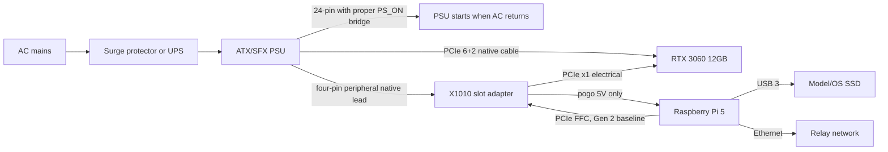
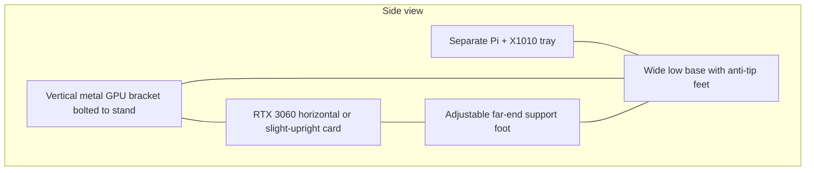

# Raspberry Pi 5 + RTX 3060 compute-node design proposal

Last verified: 2026-07-12. This document is design-only and does not claim that token.place has tested this hardware.

## 1. Status and scope

This is an unimplemented, experimental design proposal for an optional low-power or overflow API v1 compute node built from a Raspberry Pi 5 8GB and an NVIDIA GeForce RTX 3060 **12GB**. It is not production-qualified and is not a proposal to run the relay on the GPU node.

Out of scope for this PR: runtime code, Dockerfiles, CI, systemd units, CAD/OpenSCAD/STL assets, API behavior, model defaults, dependency pins, API v2, DSPACE, and Tauri UI changes.

Required token.place invariants remain unchanged:

- API v1 remains non-streaming: responses are returned after full model output generation.
- Relay-owned state remains relay-blind E2EE: ciphertext plus safe routing metadata only.
- Logs and diagnostics must never contain plaintext prompts, responses, tool arguments, decrypted envelopes, model output, or private keys.
- The node must advertise only model and context capabilities it has actually validated.
- If CUDA, E2EE, model warm-load, or capability checks cannot be verified, the node fails closed instead of silently registering.

Current repository state verified before writing:

| Area | Verified current implementation |
| --- | --- |
| Canonical compute entrypoint | Repository-root `server.py` is the canonical compute-node entrypoint; it creates `ComputeNodeRuntime` and starts relay polling. |
| Compatibility shim | `server/server_app.py` is a compatibility shim that delegates legacy imports and patch points to root `server.py`. |
| Shared runtime | `utils/compute_node_runtime.py` owns shared registration, polling, relay URL resolution, safe diagnostics, and lifecycle behavior. |
| Model runtime | `utils/llm/model_manager.py` constructs llama-cpp-python with `n_gpu_layers`, `n_ctx`, Qwen3 non-thinking handling, Qwen 64K YaRN checks, and optional K/V cache profile probing. |
| Model profile | Qwen3 8B Q4_K_M is the current profile target: `Qwen3-8B-Q4_K_M.gguf`, native 32,768 tokens, default 8,192 tokens, and static `8k-fast`/`64k-full` tiers. |
| Server requirements | `config/requirements_server.txt` pins `llama_cpp_python==0.3.32`. |
| Relay image | The root `Dockerfile` and `.github/workflows/ci-image.yml` build/publish a multi-architecture GHCR **relay** image, not a CUDA compute-node image. |
| Stale server Dockerfile risk | `docker/Dockerfile.server` currently invokes `python -m server.main`, which is not the canonical root `server.py` entrypoint and should be treated as stale until fixed in a future implementation PR. |
| Desktop GPU planner | `desktop-tauri/src-tauri/python/desktop_gpu_packaging.py` handles Windows CUDA and macOS Metal; Linux falls through to a generic CPU plan, not Linux ARM64 CUDA. |
| Headless Pi UI stance | The Tauri app is not needed on the Pi. The preferred design is a headless container reusing the canonical/shared Python compute runtime. |

## 2. Executive recommendation

Verdict: technically plausible for token generation, but too immature for a production node today. Treat the Pi 5 + RTX 3060 as an experimental overflow node or proof of concept until the NVIDIA ARM64 kernel path, cold-boot recovery, thermal/electrical safety, and token.place CUDA capability registration are validated on the exact hardware.

The strongest case for the design is lower whole-system power while preserving nearly desktop RTX 3060 decode speed when the full model and KV cache stay resident in VRAM, based on community Pi-versus-x86 RTX 3060 measurements ([Pi result](https://github.com/geerlingguy/ai-benchmarks/issues/40#issuecomment-3619397060), [x86 result](https://github.com/geerlingguy/ai-benchmarks/issues/40#issuecomment-3619399420), [power discussion](https://www.jeffgeerling.com/blog/2025/big-gpus-dont-need-big-pcs/)). The weakest case is operational maturity: BCM2712 CUDA requires an out-of-tree NVIDIA open-kernel-module branch, and `NVIDIA/open-gpu-kernel-modules#972` was verified **open**, unmerged, and last updated 2026-04-04 when rechecked on 2026-07-12 ([PR](https://github.com/NVIDIA/open-gpu-kernel-modules/pull/972)); the physical PCIe/power topology is also much less conventional than an x86 motherboard.

A conventional x86 motherboard remains the better choice when production reliability, standard NVIDIA driver support, easier CUDA images/builds, serviceability, multiple PCIe lanes, or lower operator time are more important than shaving tens of watts from the host platform.

| Dimension | Raspberry Pi 5 + RTX 3060 12GB | Reused x86 desktop + RTX 3060 12GB |
| --- | --- | --- |
| Decode speed | Expected near desktop if fully offloaded; estimate 45-50 tok/s Qwen3 8B at short/moderate context from Pi RTX 3060 and CUDA comparisons ([RTX 3060 Pi](https://github.com/geerlingguy/ai-benchmarks/issues/40#issuecomment-3619397060), [CUDA comparison](https://github.com/geerlingguy/ai-benchmarks/issues/46#issuecomment-3672239842)). | Known community Qwen3 8B Q4_K_M result around 49 tok/s ([Qiita](https://qiita.com/devgamesan/items/9b774786f653b2b911cc)); Llama 2 RTX 3060 comparison showed 61.53 tok/s ([x86 result](https://github.com/geerlingguy/ai-benchmarks/issues/40#issuecomment-3619399420)). |
| Prompt processing | PCIe x1 and ARM host likely slower; benchmark delta was roughly 10-12% in one RTX 3060 comparison ([discussion](https://www.jeffgeerling.com/blog/2025/big-gpus-dont-need-big-pcs/)). | Faster host CPU, memory, and PCIe; better for long prompts and reloads. |
| Idle/load power | Inference comparison reported about 195.4W whole-system draw for Pi configuration ([power discussion](https://www.jeffgeerling.com/blog/2025/big-gpus-dont-need-big-pcs/)). | Same comparison reported about 224W; idle is likely much higher on many desktops ([power discussion](https://www.jeffgeerling.com/blog/2025/big-gpus-dont-need-big-pcs/)). |
| Setup cost | Low if Pi/GPU are already owned; adapters, PSU, storage, support hardware still add real cost. | Often lowest if an old desktop already has PSU, case, cooling, and PCIe slot. |
| Driver maturity | Experimental ARM64 CUDA on BCM2712 with patched modules and pinned stack. | Ordinary NVIDIA Linux/Windows CUDA path. |
| Maintainability | High-maintenance kernel/driver/toolkit pinning; custom mechanical and power validation. | Standard OS updates, easier replacement parts, simpler runbooks. |
| Cold-boot reliability | Must prove GPU enumeration, module load, Docker GPU runtime, and registration across 20-50 AC-loss cycles. | More predictable PCIe enumeration and PSU sequencing. |

## 3. Workload and capability target

Initial workload target: one active API v1 inference slot serving Qwen3 8B Q4_K_M from `Qwen3-8B-Q4_K_M.gguf` with full model-layer GPU offload on an RTX 3060 **12GB**. The 12GB card is materially different from less desirable 8GB variants: 8GB leaves little room for Qwen3 8B weights, CUDA runtime buffers, and long-context KV cache.

Current token.place model facts:

- `utils/llm/model_profiles.py` identifies Qwen3 8B as 8.2B parameters, Q4_K_M, `Qwen/Qwen3-8B-GGUF`, `Qwen3-8B-Q4_K_M.gguf`, native context 32,768, default context 8,192, and supported static tiers `8k-fast` and `64k-full`.
- `utils/config_schema.py` maps the default model config from that profile, including context size and Qwen chat-template policy.
- `utils/llm/model_manager.py` passes `n_gpu_layers`, `n_ctx`, and Qwen-specific YaRN/KV kwargs only after runtime capability probing.

Recommended initial capability advertisement: `8k-fast` only. Do not advertise `64k-full` until the exact Pi/GPU/container stack proves it can warm-load, fully offload, and serve near-filled long contexts without CPU fallback, VRAM exhaustion, recurring NVRM or PCIe Advanced Error Reporting errors, or unsafe temperatures.

Runtime target:

- Full model-layer GPU offload: `n_gpu_layers=-1` after CUDA backend verification.
- KV cache: GPU-offloaded K/Q/V when supported and verified.
- One active inference slot initially; no batching/concurrency tuning until the baseline is stable.
- `mmap` enabled for model loading where supported.
- No `mlock` on the 8GB Pi host unless physical measurements prove it is safe; avoid pinning too much RAM during container build/startup.
- USB 3 SSD for OS/model storage because the Pi's exposed PCIe lane is occupied by the GPU.

Approximate memory budget:

| Item | Estimate | Basis and caveat |
| --- | ---: | --- |
| GGUF weights | about 4.7-5.0 GiB | Qwen3 8B Q4_K_M community/Hugging Face artifact class ([model card](https://huggingface.co/Qwen/Qwen3-8B-GGUF)); verify exact file size before deployment. |
| Runtime/CUDA/graph buffers | about 0.8-2.0 GiB | Workload-dependent; must be measured with `nvidia-smi` and llama.cpp backend logs. |
| 8K KV cache, f16 K/V | about 1.125 GiB | Architecture calculation: 36 layers × 2 K/V tensors × 8 KV heads × 128 dimensions × 2 bytes = **147,456 bytes/token**; × 8,192 tokens = 1,207,959,552 bytes, or 1.125 GiB. |
| 64K KV cache, f16 K/V | about 9.0 GiB | Same architecture calculation × 65,536 tokens = 9.0 GiB; leaves insufficient room for weights and runtime buffers on an RTX 3060 12GB. |
| 64K KV cache, q8 K/V | about 4.5 GiB | Half the f16 architecture estimate; may fit with weights and buffers, but requires validation on the exact runtime. |
| 64K KV cache, q4 K/V | about 2.25 GiB | Quarter the f16 architecture estimate; may fit with weights and buffers, but requires successful warm-load and soak validation. |
| 8K total, f16 K/V | about 6.6-8.1 GiB | Estimated from 4.7-5.0 GiB weights, 0.8-2.0 GiB runtime/CUDA/graph buffers, and 1.125 GiB KV cache; validate allocator overhead and fragmentation on the exact stack. |

Architecture-based KV-cache sizing above is separate from the current `_qwen_64k_memory_estimate()` diagnostic in `utils/llm/model_manager.py`. That diagnostic conservatively uses 524,288 bytes/token for f16, 262,144 bytes/token for q8, and 131,072 bytes/token for q4; those constants are not derived from the Qwen3 8B dimensions above and produce 32 GiB, 16 GiB, and 8 GiB estimates at 64K. Do not change that runtime code in this design follow-up. Reconciling the conservative diagnostic with measured llama.cpp allocation on the exact stack is future work, and the initial recommendation remains to advertise only `8k-fast`.

Capability registration must prevent the relay from scheduling unsupported context tiers. A Pi node that has only validated `8k-fast` must reject or avoid `64k-full` work even if the model profile lists `64k-full` as a general token.place tier.

## 4. Performance and power evidence

| Evidence | Result | Classification |
| --- | --- | --- |
| RTX 3060 Llama 2 7B Q4_K_M on Pi CM5 | 60.21 tok/s decode | Community direct measurement; 16GB CM5; Vulkan path ([Pi result](https://github.com/geerlingguy/ai-benchmarks/issues/40#issuecomment-3619397060)). |
| Matching RTX 3060 Llama 2 7B Q4_K_M on x86 | 61.53 tok/s decode | Community direct measurement; about 2.1% faster than Pi in that decode comparison ([x86 result](https://github.com/geerlingguy/ai-benchmarks/issues/40#issuecomment-3619399420)). |
| Prompt-processing delta | Pi roughly 10-12% slower | Community comparison; affects long prompts and reload-heavy workloads more than steady decode. |
| Whole-system inference draw | Pi configuration about 195.4W; desktop about 224W | Community measurement/discussion; not token.place hardware. |
| Direct CUDA comparison using RTX 2080 Ti | Pi 59.45 tok/s; x86 60.51 tok/s | Community CUDA comparison with a different NVIDIA GPU ([ai-benchmarks #46](https://github.com/geerlingguy/ai-benchmarks/issues/46#issuecomment-3672239842)). |
| Desktop RTX 3060 Qwen3 8B Q4_K_M | Around 49 tok/s | Separate Qiita community benchmark; not the Pi host ([Qiita](https://qiita.com/devgamesan/items/9b774786f653b2b911cc)). |
| Estimated Pi Qwen3 short/moderate context | About 45-50 tok/s | Extrapolation until measured on proposed node. |
| Estimated Pi Qwen3 near-filled 8K | About 38-45 tok/s | Extrapolation; KV/cache pressure and prompt length may reduce speed. |

Disclosure and limits:

- The direct RTX 3060 Pi comparison used a 16GB Compute Module 5 and Vulkan, while the proposed node is an 8GB Raspberry Pi 5.
- CUDA-on-Pi was demonstrated separately with another NVIDIA GPU; do not treat the Vulkan RTX 3060 result as direct CUDA proof for this exact node.
- CM5 and Pi 5 share BCM2712 and a similar single-lane PCIe root complex, but they are not literally the same host.
- PCIe x1 mostly affects model loading and prompt processing once weights and KV cache remain resident in VRAM.
- Partial CPU offload would change the performance conclusion substantially and is not an acceptable hidden fallback for a CUDA-advertised node.

## 5. Hardware topology alternatives

### Option A: direct X1010 topology

Topology: Raspberry Pi 5 PCIe FFC to Geekworm/SupTronics X1010 v1.1 ([wiki](https://wiki.geekworm.com/X1010)), open-ended physical x4 slot accepting an x16 GPU ([open-ended-slot discussion](https://github.com/geerlingguy/raspberry-pi-pcie-devices/issues/613)), electrical PCIe x1, independently supported RTX 3060, X1010 powered from a native PSU four-pin peripheral/Molex lead, Pi powered through X1010 pogo pins, GPU powered through native PCIe 6+2-pin lead, and a proper permanent ATX PS_ON bridge for AC-restoration behavior.

Advantages:

- Fewest parts.
- Adapter is approximately $30 and includes short FFC cables.
- One PSU can power Pi and GPU.
- Deterministic simultaneous power restoration when AC returns.

Risks:

- The GPU must not hang mechanically from the X1010 PCB.
- X1010 documentation markets GPU support but does not publish a formal 75W PCIe-slot current certification.
- Slot connector, board, and PSU-lead temperatures require stress testing.
- The Pi must not also receive USB-C, PoE, or other 5V power.

Prototype recommendation: use Option A if the goal is the smallest/cheapest proof and the builder can instrument temperatures, add rigid GPU support, and accept the slot-power uncertainty.

### Option B: powered OCuLink dock

Topology: Pi PCIe-to-M.2 HAT, M.2 M-key-to-OCuLink adapter, short high-quality OCuLink cable, powered eGPU dock such as Minisforum DEG1 ([listing](https://store.minisforum.com/products/minisforum-egpu-dock)) or JMT, ATX/SFX PSU supplying slot and supplemental GPU power, and a separate supported Pi power source.

Advantages:

- Better mechanical GPU support.
- More conventional powered x16 slot.
- Less reliance on the X1010's slot-power path.

Tradeoffs:

- Approximately $145-170 of adapter/dock hardware before the PSU.
- More signal connections and more failure points.
- More complicated power sequencing.
- Usually two Pi/GPU power paths.

Unattended-node recommendation: prefer Option B after prototype proof if the powered dock demonstrably handles the selected AIB card, because mechanical support and slot-power confidence matter more than adapter cost for unattended operation. However, do not hide uncertainty: GPU-before-Pi sequencing and reconnect behavior must be qualified.

Additional topology constraints:

- The RTX 3060 consumes the Pi's only exposed PCIe lane.
- The AI HAT+ 2 is not part of this design and should not be proposed on the same lane.
- PoE+ must not double-power a Pi already powered by X1010 pogo pins.
- PCIe Gen 2 is the bring-up default.
- `dtparam=pciex1_gen=3` is optional only after stability testing; Raspberry Pi documents Gen 3 as an unsupported/uncertified setting ([documentation](https://www.raspberrypi.com/documentation/computers/raspberry-pi.html#pcie-gen-30)).

## 6. Bill of materials

Prices are volatile and were spot-checked on 2026-07-12. Use current street prices, not MSRP, before purchase.

| Category | Part or example | Required/optional | Qty | Interface/connectors | Power requirement | Approx. current price | Price-check date | Source | Notes and compatibility risks |
| --- | --- | ---: | ---: | --- | --- | ---: | --- | --- | --- |
| Host | Raspberry Pi 5 8GB | Required | 1 | 40-pin, USB 3, GbE, PCIe FFC | 5V, high-current; through X1010 pogo pins in Option A or official PSU in Option B | $175 | 2026-07-12 | [PiShop.us Raspberry Pi 5/8GB](https://www.pishop.us/product/raspberry-pi-5-8gb/) and [PiShop.us boards category](https://www.pishop.us/product-category/raspberry-pi/raspberry-pi-5/raspberry-pi-5-boards/) | Volatile DRAM pricing; PiShop.us listed Raspberry Pi 5/8GB at $175.00 on the recheck date. |
| GPU | Used NVIDIA GeForce RTX 3060 12GB | Required | 1 | PCIe x16 edge, usually 1×8-pin; exact AIB varies | Reference board power around 170W ([NVIDIA family specs](https://www.nvidia.com/en-us/geforce/graphics-cards/30-series/rtx-3060-3060ti/)) | $245-300 used | 2026-07-12 | TBD — recheck before purchase | Must be 12GB, not 8GB; inspect fans, connectors, and mining wear. |
| Direct adapter | Geekworm/SupTronics X1010 v1.1 | Option A required | 1 | Pi PCIe FFC to open-ended x4 slot | Native four-pin peripheral/Molex input; powers Pi via pogo pins | $28-30 | 2026-07-12 | [Geekworm X1010 wiki](https://wiki.geekworm.com/X1010), [Central Computer listing](https://www.centralcomputer.com/geekworm-x1010-pcie-ffc-to-standard-pcie-x4-slot-expansion-board-for-raspberry-pi-5.html) | Do not load GPU mechanically from PCB; slot-power certification unclear. |
| OCuLink dock | Minisforum DEG1 or JMT powered dock | Option B required | 1 | OCuLink to powered x16 slot | ATX/SFX PSU | $109-140 | 2026-07-12 | [Minisforum DEG1 listing](https://store.minisforum.com/products/minisforum-egpu-dock) | Add M.2 HAT, OCuLink adapter, cable; validate sequencing. |
| Pi M.2 HAT | PCIe-to-M.2 M-key HAT | Option B required | 1 | Pi FFC to M.2 M-key | Pi-side power only | TBD — recheck before purchase | 2026-07-12 | TBD | Must expose PCIe, not USB. |
| M.2 to OCuLink | M-key to OCuLink adapter + cable | Option B required | 1 | M.2 M-key, OCuLink | Passive/low power | TBD — recheck before purchase | 2026-07-12 | TBD | Use short, known-good cable; signal quality matters. |
| PSU | Quality 450-550W ATX/SFX, recommend 550W | Required | 1 | 24-pin ATX, PCIe 6+2, peripheral lead if Option A | AC mains; enough 12V headroom | $60-90 new | 2026-07-12 | TBD — recheck before purchase | Prefer 550W for connector availability and margin. |
| GPU power cable | Native PCIe lead for exact PSU/card | Required | 1 | 6+2-pin PCIe | Up to card-specific supplemental draw | Included with PSU | 2026-07-12 | TBD — recheck before purchase | No SATA/Molex-to-GPU adapters; never mix modular cables. |
| X1010 power lead | Native four-pin peripheral lead | Option A required | 1 | PSU peripheral/Molex to X1010 | Slot/Pi power path | Included with PSU | 2026-07-12 | TBD — recheck before purchase | Must be native PSU cable, not SATA adapter. |
| PS_ON bridge | Proper 24-pin ATX jumper/bridge | Required for single-PSU unattended AC restore | 1 | 24-pin ATX | Low-voltage control | $5-10 | 2026-07-12 | TBD — recheck before purchase | Use molded bridge, not a paperclip. |
| CPU cooling | Raspberry Pi Active Cooler | Required | 1 | Pi fan header | Pi 5V fan | $5-10 | 2026-07-12 | TBD — recheck before purchase | Preserve airflow in stand. |
| Storage | USB 3 SSD, 256GB+ | Required | 1 | USB 3 | USB-powered or powered enclosure | $25-50 | 2026-07-12 | TBD — recheck before purchase | Model storage via USB because PCIe lane is GPU. High-endurance microSD is fallback. |
| Networking | Ethernet cable | Required | 1 | RJ45 GbE | None | $3-10 | 2026-07-12 | TBD — recheck before purchase | Prefer wired networking for unattended node. |
| Surge/UPS | Surge protector or small UPS | Optional but recommended | 1 | AC | Node load plus margin | $20-100 | 2026-07-12 | TBD — recheck before purchase | UPS improves AC-loss testing/recovery. |
| GPU support | Bracket/stand/anti-sag support | Required | 1 | Mechanical | None | $10-30 | 2026-07-12 | TBD — recheck before purchase | No load on X1010 slot or Pi PCB. |
| Fasteners | M2.5/M3 screws, standoffs, heat-set inserts, vibration feet | Required for custom stand | Assorted | Mechanical | None | $10-25 | 2026-07-12 | TBD — recheck before purchase | Exact sizes depend on selected card/adapter. |
| FFC cable | Short PCIe FFC supplied with adapter | Required | 1 | Pi PCIe FFC | Signal only | Included | 2026-07-12 | [Geekworm X1010 wiki](https://wiki.geekworm.com/X1010), [Central Computer listing](https://www.centralcomputer.com/geekworm-x1010-pcie-ffc-to-standard-pcie-x4-slot-expansion-board-for-raspberry-pi-5.html) | 37mm-class supplied cables constrain stand geometry. |
| Measurement | Thermal probes or wall-power meter | Optional validation | 1 | Probe/clamp/outlet | Battery/AC | $15-40 | 2026-07-12 | TBD — recheck before purchase | Needed for connector/PCB/PSU-lead validation. |

Estimated subtotals:

- Required Option A subtotal excluding already-owned Pi/GPU: about $156-245 (X1010, PSU, PS_ON bridge, cooler, USB SSD, Ethernet, support hardware, fasteners; excluding optional UPS/meter).
- Estimated Option A total including representative used RTX 3060 and $175 Pi: about $576-720.
- OCuLink alternative subtotal excluding Pi/GPU: about $275-415 plus any unverified M.2/OCuLink adapter prices; recheck before purchase.
- Volatile/TBD items: used RTX 3060 condition/market price, M.2-to-OCuLink chain, exact AIB power connector requirements.

## 7. Electrical and safety design

Electrical constraints:

- Reference RTX 3060 board power is around 170W; up to 75W may be supplied through the PCIe slot and the remainder through native PCIe leads.
- Pi/X1010 draw is small compared with the GPU but shares PSU rails in Option A; use a quality 450-550W PSU and prefer 550W for margin/connectors.
- Check the exact AIB card connector before buying a PSU.
- No SATA-to-Molex, SATA-to-GPU, or Molex-to-GPU adapters.
- Never mix modular PSU cables between PSU models.
- Do not connect USB-C or PoE while X1010 pogo pins power the Pi.
- Do not expose or improvise mains wiring.
- Do not use a 3D-printed structure as a substitute for electrical insulation or a certified PSU enclosure.
- Use strain relief and keep cables out of GPU fans.
- Test slot connector, PCB, PSU lead, and GPU power-connector temperatures under sustained inference.

AC-loss recovery design:

1. PSU rocker remains on.
2. A proper permanent PS_ON bridge starts the PSU when AC returns.
3. Pi firmware boots automatically.
4. X1010 `POWER_OFF_ON_HALT=1` and `PSU_MAX_CURRENT=5000` settings should be evaluated against current X1010 documentation before use.
5. For a two-supply OCuLink topology, GPU-before-Pi sequencing must be tested rather than assumed: qualify both simultaneous AC restoration and the selected GPU-before-Pi sequence, and accept unattended use only if the GPU enumerates all 12GB and registers successfully on every qualified cold cycle without recurring PCIe Advanced Error Reporting/NVRM errors or back-powering.

## 8. Potential 3D-printed stand

No CAD is created in this PR. A future stand should be open-air, modular, and mechanically conservative.

Concept:

Design requirements:

- Rigid GPU bracket interface using the card's metal PCIe bracket.
- Secondary adjustable support under the far end of the GPU.
- Separate Pi/X1010 tray; no structural load placed on X1010 slot or Pi PCB.
- Preserve Pi Active Cooler airflow.
- Target at least 25mm clearance beneath GPU intake fans; measure exact card cooler geometry.
- Cable-routing channels and tie points for PCIe power, FFC, Ethernet, and USB SSD.
- Respect FFC bend radius and short 37mm-class cable constraints from the adapter package.
- Access to Ethernet, USB, microSD, power switch/control, GPU power sockets, and display ports.
- Optional PSU mounting plate is acceptable only if the PSU's certified enclosure remains intact.
- Low center of gravity and anti-tip feet.
- Prefer PETG, ASA, or another temperature-tolerant material over low-temperature PLA near GPU/PSU exhaust.
- Use heat-set inserts for repeatedly serviced joints.
- Split components to fit a 256×256mm printer bed where necessary.

| Dimension | Status |
| --- | --- |
| Raspberry Pi 5 board outline and mounting holes | Publicly documented; verify against board/mechanical drawing before CAD. |
| X1010 v1.1 board and FFC location | Verify from exact adapter revision. |
| GPU length/height/thickness | MEASURE BEFORE PRINTING from exact AIB card. |
| GPU bracket screw spacing | MEASURE BEFORE PRINTING. |
| Fan intake location/diameter | MEASURE BEFORE PRINTING. |
| FFC free length and bend path | Verify from supplied cable; do not assume extra slack. |
| PSU mounting holes | Use PSU standard drawing or exact SFX/ATX unit. |

Suggested future OpenSCAD parameters: `gpu_length_mm`, `gpu_height_mm`, `gpu_slot_thickness_mm`, `gpu_bracket_offset_mm`, `pi_tray_x_mm`, `pi_tray_y_mm`, `fan_clearance_mm`, `support_foot_x_mm`, `support_foot_height_mm`, `ffc_window_width_mm`, `base_width_mm`, `base_depth_mm`, `insert_diameter_mm`.

Proposed future CAD layout (do not create now): `hardware/raspberry-pi-5-rtx-3060-stand/openscad/`, `hardware/raspberry-pi-5-rtx-3060-stand/stl/`, and `hardware/raspberry-pi-5-rtx-3060-stand/README.md`. Unknown dimensions must be marked `MEASURE BEFORE PRINTING` rather than guessed.

## 9. Host operating system and NVIDIA ARM64 compatibility

Known working but experimental host path, last verified 2026-07-12 from external community sources:

- Raspberry Pi OS 13 Trixie Lite or the currently verified equivalent.
- 64-bit ARM userspace.
- 4K-page kernel selected with `kernel=kernel8.img`; the known recipe reports incompatibility with the default 16K-page kernel path.
- NVIDIA ARM64 userspace around driver 580.95.05.
- Community `non-coherent-arm-fixes` open-kernel-module branch.
- CUDA ARM64/SBSA toolkit around CUDA 13.0.
- NVIDIA Container Toolkit on ARM64.
- Optional PCIe Gen 3 only after Gen 2 stability.

Why upstream support is problematic on BCM2712:

- BCM2712 lacks normal I/O cache coherency expected by typical desktop/server PCIe GPU platforms.
- Write-combined MMIO/VRAM BAR behavior needs non-standard handling.
- The needed NVIDIA open-kernel-module PR, [`NVIDIA/open-gpu-kernel-modules#972`](https://github.com/NVIDIA/open-gpu-kernel-modules/pull/972), was verified **open**, unmerged, and last updated 2026-04-04 when rechecked on 2026-07-12; it targets non-standard Arm SoC PCIe integrations.
- Kernel modules may need rebuilding after kernel or driver updates.
- A kernel, driver, firmware, and CUDA toolkit update can break enumeration or CUDA even if `lspci` still sees the card.
- The complete host stack should be pinned and backed up as an image.
- This is not currently an ordinary production-supported CUDA host.

## 10. Container and token.place software design

Design a headless compute-node container, not a Tauri GUI package.

Host responsibilities:

- Patched kernel and NVIDIA kernel modules.
- GPU enumeration and `nvidia-smi` availability.
- NVIDIA Container Toolkit and Docker daemon.
- Storage mounts for models/config/keys.
- AC-loss boot recovery and host watchdog.

Container responsibilities:

- ARM64 CUDA userspace compatible with the host driver.
- token.place canonical/shared compute runtime.
- Source-built CUDA-enabled `llama-cpp-python` pinned to the repository version.
- Model configuration and read-only bind-mounted GGUF.
- Relay registration/polling, health/readiness checks, privacy-safe logs.

Official NVIDIA CUDA images are available for ARM64 ([CUDA images](https://hub.docker.com/r/nvidia/cuda)), and NVIDIA Container Toolkit documents Linux ARM64/aarch64 support ([supported platforms](https://docs.nvidia.com/datacenter/cloud-native/container-toolkit/latest/supported-platforms.html)). However, an official prebuilt ARM64 CUDA wheel for the pinned `llama_cpp_python==0.3.32` should not be assumed. The upstream ARM CUDA-wheel PR [`abetlen/llama-cpp-python#2039`](https://github.com/abetlen/llama-cpp-python/pull/2039) was verified **open**, unmerged, and last updated 2025-07-18 when rechecked on 2026-07-12. The likely implementation path is a source build with the pinned version and verified flags such as `CMAKE_ARGS=-DGGML_CUDA=on FORCE_CMAKE=1`; do not present additional CMake flags as guaranteed until tested.

Future change matrix:

| Repository path | Current behavior | Proposed change | Why needed | Tests/validation required |
| --- | --- | --- | --- | --- |
| `docker/Dockerfile.server` | Builds from `requirements.txt` and runs `python -m server.main`. | Either fix to root `server.py` or supersede with a compute-node-specific Dockerfile. | Current command is stale relative to canonical runtime. | Container smoke starts `server.py` and emits safe readiness. |
| `docker/Dockerfile.compute-node-cuda-arm64` | Does not exist. | Add dedicated `linux/arm64` CUDA compute image using NVIDIA CUDA base and source-built llama-cpp-python. | Avoid conflating relay image with CUDA compute image. | Build on native ARM64/self-hosted runner; verify CUDA backend. |
| `docker-compose.yml` or dedicated compose file | Local server+relay dev stack; no GPU reservation. | Add separate compute-node Compose with `--gpus all`/device reservation, read-only model mount, persistent config/key volume. | Headless Pi deployment needs explicit GPU/container runtime. | `docker compose up`, `nvidia-smi`, readiness check. |
| `config/requirements_server.txt` | Pins `llama_cpp_python==0.3.32`. | Keep pin; document source-build override for CUDA ARM64. | Reproducible ABI/runtime behavior. | Build log proves pinned package and CUDA markers. |
| `server.py` | Canonical compute entrypoint. | Reuse unchanged unless CLI/env readiness hooks are needed. | Avoid new Pi-specific entrypoint. | Existing server CLI tests plus container smoke. |
| `utils/compute_node_runtime.py` | Shared registration/polling lifecycle. | Add readiness gates only after CUDA/model validation if missing. | Prevent premature registration. | Unit tests for fail-closed registration. |
| `utils/llm/model_manager.py` | Probes llama-cpp capabilities, Qwen YaRN/KV profiles, GPU fallback handling. | Add Linux ARM64 CUDA diagnostics/capability payload if needed. | Detect CPU fallback and advertise only validated tiers. | Backend probe tests; hardware smoke. |
| `desktop-tauri/src-tauri/python/desktop_gpu_packaging.py` | Linux selects CPU plan. | Share backend-selection constants only if useful; do not make headless Pi depend on Tauri. | Avoid duplicating CUDA source-build policy. | Unit tests for Linux ARM64 plan if shared. |
| `desktop-tauri/src-tauri/python/desktop_runtime_setup.py` | Desktop bootstrap/probe for sidecar. | Reuse probing ideas cautiously; keep container host preflight separate. | Diagnostics consistency. | Probe tests with fake CUDA markers. |
| GPU/backend diagnostics | Desktop-focused. | Add privacy-safe compute-node CUDA diagnostics: driver, CUDA, backend, layer offload, KV device; no plaintext. | Operators need fail-closed evidence. | Safe log redaction tests. |
| Capability registration | Static model tiers exist; runtime must prove actual support. | Register `8k-fast` only until 64K physically validated. | Prevent unsupported relay scheduling. | Relay selection/admission tests. |
| `tests/` | Existing unit/integration coverage; no Pi CUDA hardware. | Add non-hardware tests plus hardware-only smoke plan. | CI cannot emulate BCM2712 CUDA. | GitHub tests plus self-hosted Pi runner/manual checklist. |
| Future compute-image CI workflow | Root workflow builds relay image. | Add separate compute image workflow when ready. | Relay image should remain small and GPU-free. | `linux/arm64` manifest; no QEMU-only release unless build time acceptable. |

Container design notes:

- Publish a distinct `linux/arm64` image manifest for the compute node.
- RTX 3060 is Ampere; CUDA architecture targeting should be verified for the exact llama.cpp/CMake stack.
- Run with `docker run --gpus all` or equivalent Compose device reservation.
- Bind-mount model files read-only; persist config/keys outside the image.
- Run non-root where practical after NVIDIA device permissions are confirmed.
- Prefer native ARM64 or self-hosted builds over slow QEMU source builds.
- Validate driver/toolkit compatibility with `nvidia-smi`, CUDA `deviceQuery`, and llama.cpp backend probes.
- If CUDA is requested and the runtime falls back to CPU, startup must fail closed before registration.

## 11. Automatic startup and recovery

Zero-interaction boot sequence:

1. AC power returns.
2. PSU and GPU power up.
3. Pi firmware boots.
4. Docker and NVIDIA runtime initialize.
5. Host preflight verifies `lspci` and `nvidia-smi`.
6. Compute container starts.
7. Qwen3 warm-load completes.
8. Node registers only after CUDA and model readiness are confirmed.
9. Docker/systemd restarts the process after application failure.
10. A bounded watchdog handles missing GPU enumeration, with reboot as an explicitly controlled last resort.

Recommended layering:

| Layer | Role | Recommendation |
| --- | --- | --- |
| Docker `restart: unless-stopped` | Restarts container after process failure. | Use, but do not rely on it for host GPU failures. |
| systemd unit wrapping Docker Compose | Orders Docker, network, mounts, and NVIDIA preflight. | Recommended primary service layer with startup timeouts. |
| Host health watchdog | Detects missing GPU/module after boot and applies bounded backoff/reboot policy. | Separate from app restart; avoid tight reboot loops. |

Operational requirements:

- Dependency ordering: network, Docker, model mount, NVIDIA modules before container readiness.
- Startup timeouts: allow long source-free warm-load but fail if CUDA/model readiness exceeds a bounded limit.
- Exponential backoff: container restarts and host watchdog actions must not thrash.
- Safe logs: hardware IDs and backend state are okay; no plaintext content, decrypted envelopes, model output, or private keys.
- Health vs readiness: process liveness is not enough; readiness requires CUDA backend, model warm-load, and capability registration eligibility.
- Registration cleanup: unregister or stop polling when readiness is lost.
- Kernel/driver update policy: pin known-good stack; update only through staged image rebuild and cold-cycle requalification.
- Boot-media recovery: keep a known-good Pi OS image and model/config backup; reflash rather than debug a corrupted SD/SSD in place.
- Host watchdog bound: allow at most two automatic host reboots in a rolling 30-minute window; after that, leave the node offline/unregistered in a terminal state requiring operator intervention. Reset the reboot budget only after 24 hours of healthy operation.

## 12. Validation and acceptance plan

### Hardware bring-up

- Start at PCIe Gen 2.
- Confirm `lspci` sees the RTX 3060.
- Confirm all 12GB through `nvidia-smi`.
- Run CUDA `deviceQuery`.
- Inspect `dmesg` for PCIe Advanced Error Reporting and NVRM errors.
- Validate PSU, slot connector, PCB, and GPU power-connector temperatures.

### Native inference

- Build and run llama.cpp/llama-cpp-python with CUDA.
- Confirm all model layers and KV cache are GPU-offloaded.
- Run Qwen3 8B Q4_K_M benchmarks.
- Record prompt-processing and token-generation rates at short, moderate, and near-8K contexts.
- Ensure the node does not silently use CPU fallback.

### Container validation

- Run with NVIDIA Container Toolkit.
- Verify model mount, runtime backend, API v1 behavior, and safe diagnostics.
- Confirm only supported model/context capabilities are registered.

### Resilience

- Run at least 20-50 cold AC-loss recovery cycles, including Option B two-supply tests for simultaneous AC restoration and the selected GPU-before-Pi sequence; every qualified cold cycle must enumerate all 12GB, register successfully, avoid recurring PCIe Advanced Error Reporting/NVRM errors, and show no back-powering.
- Repeat Docker restarts and host reboots.
- Test Gen 3 only after stable Gen 2 baseline.
- Run sustained inference/thermal soak.
- Test network loss and relay reconnection.
- Verify driver/module presence after reboot.
- Recover cleanly from a failed model warm-load.

Go/no-go criteria:

- Qwen3 8B Q4_K_M decode at 8K is at least 35 tok/s sustained, with target 38-45 tok/s near-filled 8K.
- No CPU fallback when CUDA is requested.
- No recurring PCIe Advanced Error Reporting or NVRM errors.
- Safe connector/PCB/PSU/GPU temperatures under soak; exact thresholds should follow component ratings and measured baselines.
- Automatic registration succeeds reliably after cold boot and cleans up on failure.
- Zero plaintext leakage in logs, diagnostics, relay state, or container output.

## 13. Risks, unresolved questions, and recommendation

| Risk | Likelihood | Impact | Mitigation | Residual risk |
| --- | --- | --- | --- | --- |
| Unmerged/out-of-tree NVIDIA driver patch | High | High | Pin branch/driver/kernel; image backup; monitor [`NVIDIA/open-gpu-kernel-modules#972`](https://github.com/NVIDIA/open-gpu-kernel-modules/pull/972), verified open/unmerged on 2026-07-12. | High until upstreamed and packaged. |
| Kernel update breakage | High | High | Hold kernel/driver packages; staged updates only. | Medium-high. |
| ARM64 CUDA dependency builds | Medium | High | Native ARM64 build cache; source-build pin; avoid QEMU release path initially. | Medium. |
| PCIe Gen 3 signal integrity | Medium | Medium | Bring up Gen 2; Gen 3 only after soak. | Medium. |
| X1010 slot-power uncertainty | Medium | High | Temperature testing; avoid unattended X1010 if uncertain; prefer powered dock. | Medium-high. |
| Mechanical GPU support | High | High | Rigid bracket/far-end support; no load on adapter. | Medium. |
| Power sequencing | Medium | High | Single PSU for prototype; explicit OCuLink sequencing tests. | Medium. |
| 8GB host RAM during build/startup | Medium | Medium | Build image elsewhere; avoid `mlock`; swap/SSD monitoring. | Medium. |
| 64K-context VRAM feasibility | High | Medium | Advertise `8k-fast` only; test q4 KV before any 64K claim. | High for 64K. |
| Container publishing/testing | Medium | Medium | Separate compute-image workflow; self-hosted hardware smoke. | Medium. |
| Long-term maintenance burden | High | Medium | Document pinned stack; prefer x86 for production. | Medium-high. |
| Used-GPU condition/availability | Medium | Medium | Buy returnable card; inspect thermals/fans/VRAM. | Medium. |

Final recommendation:

- Prototype topology: Option A X1010 is acceptable for a supervised proof because it is cheap and simple, provided the GPU is independently supported and electrical temperatures are measured.
- Unattended topology: Option B powered OCuLink dock is preferred if it passes sequencing and CUDA stability tests, because it reduces mechanical and slot-power uncertainty.
- x86 remains safer for production because it uses ordinary PCIe, standard NVIDIA drivers, easier CUDA packaging, better serviceability, and fewer boot/power edge cases.

Staged future implementation sequence:

1. Hardware bring-up.
2. Patched NVIDIA/CUDA host proof.
3. Native Qwen3 benchmark.
4. ARM64 CUDA compute image.
5. token.place integration.
6. Boot/watchdog hardening.
7. Cold-cycle qualification.
8. Optional OpenSCAD stand.

## External evidence and status links

- RTX 3060 12GB enumeration and CUDA on BCM2712: [geerlingguy raspberry-pi-pcie-devices #790](https://github.com/geerlingguy/raspberry-pi-pcie-devices/issues/790).
- RTX 3060 Pi benchmark and x86 comparison: [Pi result](https://github.com/geerlingguy/ai-benchmarks/issues/40#issuecomment-3619397060), [x86 result](https://github.com/geerlingguy/ai-benchmarks/issues/40#issuecomment-3619399420).
- Direct Pi-versus-x86 CUDA comparison: [ai-benchmarks #46](https://github.com/geerlingguy/ai-benchmarks/issues/46#issuecomment-3672239842).
- NVIDIA ARM install walkthrough: [Jeff Geerling, NVIDIA graphics cards work on Pi 5 and Rockchip](https://www.jeffgeerling.com/blog/2025/nvidia-graphics-cards-work-on-pi-5-and-rockchip/).
- Performance/power discussion: [Jeff Geerling, Big GPUs don't need big PCs](https://www.jeffgeerling.com/blog/2025/big-gpus-dont-need-big-pcs/).
- Required open-kernel-module work, verified open/unmerged on 2026-07-12 and last updated 2026-04-04: [NVIDIA/open-gpu-kernel-modules#972](https://github.com/NVIDIA/open-gpu-kernel-modules/pull/972).
- Raspberry Pi PCIe Gen 3 warning/configuration: [Raspberry Pi PCIe Gen 3 documentation](https://www.raspberrypi.com/documentation/computers/raspberry-pi.html#pcie-gen-30).
- X1010 docs/listing/discussion: [Geekworm X1010 wiki](https://wiki.geekworm.com/X1010), [Central Computer listing](https://www.centralcomputer.com/geekworm-x1010-pcie-ffc-to-standard-pcie-x4-slot-expansion-board-for-raspberry-pi-5.html), [open-ended-slot discussion](https://github.com/geerlingguy/raspberry-pi-pcie-devices/issues/613).
- RTX 3060 specifications: [NVIDIA RTX 3060 family](https://www.nvidia.com/en-us/geforce/graphics-cards/30-series/rtx-3060-3060ti/).
- Container support/images: [NVIDIA Container Toolkit supported platforms](https://docs.nvidia.com/datacenter/cloud-native/container-toolkit/latest/supported-platforms.html), [NVIDIA CUDA images](https://hub.docker.com/r/nvidia/cuda).
- ARM64 CUDA wheel work, verified open/unmerged on 2026-07-12 and last updated 2025-07-18: [abetlen/llama-cpp-python#2039](https://github.com/abetlen/llama-cpp-python/pull/2039).
- Qwen3 GGUF card: [Qwen/Qwen3-8B-GGUF](https://huggingface.co/Qwen/Qwen3-8B-GGUF).
- Community RTX 3060 Qwen3 result: [Qiita community benchmark](https://qiita.com/devgamesan/items/9b774786f653b2b911cc).
