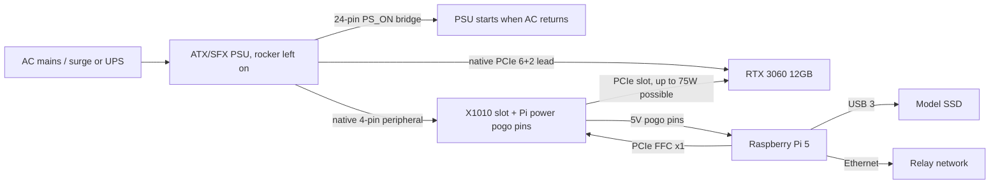
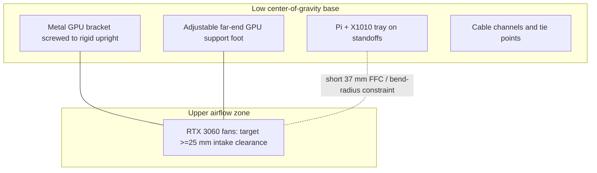

# Raspberry Pi 5 + RTX 3060 headless compute-node design

Last updated: 2026-07-12.

## 1. Status and scope

This document is a **design proposal** for an optional token.place API v1 compute node built from a Raspberry Pi 5 8GB and an NVIDIA GeForce RTX 3060 12GB. It is **unimplemented**, **experimental**, and not production-qualified. It is intended as a low-power or overflow API v1 compute node, not as a relay host.

Non-goals:

- Do not run `relay.py` on the GPU node.
- Do not change API v1 behavior; API v1 remains non-streaming.
- Do not change relay-blind E2EE, model defaults, API v2, DSPACE, or the Tauri UI.
- Do not implement runtime, Docker, CI, systemd, CAD/OpenSCAD/STL, API, model-default, or dependency changes in this PR.

Required invariants:

- The project name is always lowercase `token.place`.
- Relay-owned state remains relay-blind E2EE: ciphertext plus safe routing metadata only.
- Logs and diagnostics must never contain plaintext prompts, responses, tool arguments, decrypted envelopes, model output, or private keys.
- The node must advertise only model and context capabilities that it has validated on the actual hardware.

## 2. Executive recommendation

**Verdict:** viable as a proof-of-concept or experimental overflow node for one Qwen3 8B Q4_K_M API v1 slot, but not yet a primary production node. Community measurements show that a BCM2712 host can drive desktop GPUs with surprisingly small decode-speed loss once model weights and KV cache are resident in VRAM. The main blocker is not decode throughput; it is Linux ARM64 NVIDIA driver maturity, out-of-tree patching, power sequencing, and mechanical/electrical robustness.

The Pi + RTX 3060 design can save roughly 25-35 W at inference compared with a reused desktop in the cited comparison, but it adds hardware complexity and a fragile host software stack. A conventional x86 motherboard remains better when the node must be unattended for long periods, tolerate kernel updates, build CUDA dependencies easily, support 64K context with margin, or be maintainable by non-specialists.

| Dimension | Raspberry Pi 5 + RTX 3060 12GB | Reused x86 desktop + RTX 3060 12GB |
| --- | --- | --- |
| Decode speed | Expected near desktop when fully offloaded; estimate 45-50 tok/s for Qwen3 short/moderate context until measured. | Community Qwen3 8B Q4_K_M result around 49 tok/s; direct Llama 2 7B comparison was 61.53 tok/s. |
| Prompt processing | Single-lane PCIe and ARM host likely slower; direct comparison showed roughly 10-12% prompt-processing loss. | Better CPU, memory, and PCIe bandwidth. |
| Idle/load power | Lower host overhead; cited inference draw about 195.4 W for Pi-class configuration. | Cited inference draw about 224 W for desktop configuration. |
| Setup cost | Low if Pi and GPU are owned; adapters and safety hardware still add cost. | Low if an old desktop is owned; otherwise motherboard/CPU/RAM/case cost. |
| Driver maturity | Experimental: out-of-tree ARM SoC NVIDIA patches and stack pinning. | Mature NVIDIA Linux/Windows CUDA path. |
| Maintainability | Fragile kernel/module/toolkit pinning; small community path. | Ordinary CUDA maintenance path. |
| Cold-boot reliability | Must be proven by 20-50 AC-loss cycles; sequencing risk. | Usually reliable with BIOS AC restore and mature PCIe power sequencing. |

## 3. Workload and capability target

### Current token.place runtime audit

- Repository-root `server.py` is the canonical compute-node entrypoint.
- `server/server_app.py` is compatibility-only and delegates to `server.py`.
- The root `Dockerfile` and `.github/workflows/ci-image.yml` build/publish the relay image, not a CUDA compute-node image.
- `docker/Dockerfile.server` currently appears stale for the canonical runtime because it installs `requirements.txt`, exposes port 5000, and invokes `python -m server.main` even though the canonical entrypoint is root `server.py`.
- `config/requirements_server.txt` pins `llama_cpp_python==0.3.32`.
- The desktop GPU install planner handles Windows CUDA and macOS Metal, but Linux returns a generic CPU plan rather than a Linux ARM64 CUDA plan.
- The Tauri app is not needed on a headless Pi. The preferred design reuses the shared Python compute runtime in a container.

### Target model and runtime profile

Target model: `Qwen3-8B-Q4_K_M.gguf` from `Qwen/Qwen3-8B-GGUF`. The current token.place model profile identifies Qwen3 8B as the canonical API v1 model with `8k-fast` and `64k-full` tiers, native context 32,768, and Q4_K_M quantization.

Hardware target: **RTX 3060 12GB**, not the less desirable 8GB variants. The 12GB card provides enough VRAM for Qwen3 8B Q4_K_M plus an 8K KV cache with headroom; the 8GB card is much more likely to force reduced context, quantized KV, or CPU spill.

Initial capability recommendation:

- Full model-layer GPU offload (`n_gpu_layers=-1` / all supported layers).
- KV cache on GPU when full offload succeeds.
- One active inference slot initially.
- `mmap` enabled for model loading.
- No `mlock` on the 8GB host unless measurements prove it safe.
- USB 3 SSD for model storage because the Pi's exposed PCIe lane is occupied by the GPU.
- Advertise `8k-fast` only until Qwen3 64K is measured on the actual node.

### Memory estimates

Qwen3-8B uses grouped-query attention with 36 layers, 32 query heads, 8 KV heads, and 128-dimensional heads in public architecture summaries. KV bytes per token for f16 K and f16 V are approximately `36 layers * 2 tensors * 8 KV heads * 128 head_dim * 2 bytes = 147,456 bytes/token`, or about 144 KiB/token. However, the current token.place Qwen 64K memory-estimate helper uses a more conservative runtime-default estimate of 524,288 bytes/token for f16 K/V, 262,144 bytes/token for q8, and 131,072 bytes/token for q4. This proposal uses the conservative runtime estimate for acceptance gating.

| Item | Estimate | Notes |
| --- | ---: | --- |
| GGUF weights | ~4.7-5.0 GiB | Q4_K_M file size must be verified from the downloaded artifact. |
| Runtime buffers | ~1-2 GiB | Backend-dependent; must be measured with `nvidia-smi`. |
| 8K KV, architecture f16 estimate | ~1.13 GiB | Based on Qwen3 GQA formula above. |
| 8K KV, token.place conservative f16 estimate | 4.0 GiB | `8192 * 524,288` bytes. |
| 64K KV, token.place conservative f16 estimate | 32.0 GiB | Does not fit in 12GB VRAM. |
| 64K KV, token.place q8 estimate | 16.0 GiB | Still too large before weights/buffers. |
| 64K KV, token.place q4 estimate | 8.0 GiB | Might fit only if runtime supports q4 K/V, buffers are small, and real measurements leave margin. |

Therefore this node must not advertise `64k-full` initially. Capability registration must keep an `8k-fast` Pi node from satisfying `64k-full` requests; relay scheduling should only see model/context tiers that passed warm-load, backend, KV placement, and benchmark checks.

## 4. Performance and power evidence

The following evidence is from external sources, not token.place hardware testing.

| Evidence | Host/GPU/backend | Result | Classification | Source |
| --- | --- | --- | --- | --- |
| Llama 2 7B Q4_K_M decode | 16GB CM5 + RTX 3060, Vulkan | 60.21 tok/s | Direct community measurement | [Pi benchmark](https://github.com/geerlingguy/ai-benchmarks/issues/40#issuecomment-3619397060) |
| Llama 2 7B Q4_K_M decode | x86 desktop + RTX 3060, Vulkan | 61.53 tok/s | Direct comparison | [x86 benchmark](https://github.com/geerlingguy/ai-benchmarks/issues/40#issuecomment-3619399420) |
| Pi penalty | Same comparison | ~2.1% slower decode; prompt processing roughly 10-12% slower | Derived | Same two benchmark comments |
| Whole-system inference draw | Pi-class setup vs desktop | ~195.4 W vs ~224 W | Community power discussion | [big GPUs don't need big PCs](https://www.jeffgeerling.com/blog/2025/big-gpus-dont-need-big-pcs/) |
| CUDA Pi-vs-x86 | RTX 2080 Ti | Pi 59.45 tok/s; x86 60.51 tok/s | Direct CUDA comparison, different GPU | [CUDA comparison](https://github.com/geerlingguy/ai-benchmarks/issues/46#issuecomment-3672239842) |
| Qwen3 8B Q4_K_M | Desktop RTX 3060 | Around 49 tok/s | Separate community benchmark | [Qiita result](https://qiita.com/devgamesan/items/9b774786f653b2b911cc) |
| Proposed Pi Qwen3 short/moderate context | Pi 5 8GB + RTX 3060 12GB CUDA | ~45-50 tok/s | Estimate until measured | Extrapolation |
| Proposed Pi Qwen3 near filled 8K | Pi 5 8GB + RTX 3060 12GB CUDA | ~38-45 tok/s | Estimate until measured | Extrapolation |

Important caveats:

- The direct RTX 3060 test used a 16GB Compute Module 5 and Vulkan, not an 8GB Raspberry Pi 5 and CUDA.
- CUDA-on-Pi was demonstrated separately with another NVIDIA GPU.
- CM5 and Pi 5 share BCM2712 and a similar single-lane PCIe root complex, but they are not literally the same tested host.
- PCIe x1 mostly affects model loading and prompt processing once weights and KV cache remain resident in VRAM.
- Partial CPU offload would substantially change the performance conclusion and should fail closed for a CUDA-required profile.

## 5. Hardware topology alternatives

### Option A: direct X1010 topology

Topology:

- Raspberry Pi 5 PCIe FFC to Geekworm/SupTronics X1010 v1.1.
- X1010 open-ended physical x4 slot accepting an x16 GPU, electrical PCIe x1.
- RTX 3060 mounted and supported independently.
- X1010 powered from a native PSU four-pin peripheral/Molex lead.
- Pi powered through X1010 pogo pins.
- GPU powered through its native PCIe 6+2-pin lead.
- Permanent ATX PS_ON bridge for AC-restoration behavior.

Advantages: fewest parts; roughly $30 adapter; included short FFC cables; one PSU can power Pi and GPU; deterministic simultaneous power restoration.

Risks: the GPU must not hang mechanically from the X1010 PCB; X1010 documentation markets GPU support but does not publish a formal 75 W PCIe-slot current certification; connector and board temperatures require stress testing; the Pi must not also receive USB-C, PoE, or other 5 V power.

### Option B: powered OCuLink dock

Topology:

- Pi PCIe-to-M.2 HAT.
- M.2 M-key-to-OCuLink adapter.
- Short high-quality OCuLink cable.
- Powered eGPU dock such as JMT or Minisforum DEG1.
- ATX/SFX PSU supplying slot and supplemental GPU power.
- Separate supported Pi power source.

Advantages: better mechanical GPU support; conventional powered x16 slot; less reliance on X1010 slot-power path.

Tradeoffs: about $145-170 of adapter/dock hardware before PSU; more signal connections; more complicated power sequencing; usually two Pi/GPU power paths.

Recommendation: use Option A for a bench prototype if the GPU is mechanically supported and thermal probes are used on slot/lead/PCB areas. For unattended operation, prefer Option B unless X1010 slot-power temperatures and cold-cycle reliability are proven with the exact GPU.

Additional hardware rules:

- The RTX 3060 consumes the Pi's only exposed PCIe lane.
- The AI HAT+ 2 is not part of this design and should not be proposed on the same lane.
- PoE+ must not double-power a Pi already powered by X1010 pogo pins.
- PCIe Gen 2 is the bring-up default.
- Raspberry Pi documents that Pi 5 is not certified for Gen 3; `dtparam=pciex1_gen=3` is optional only after stability testing.

## 6. Bill of materials

Price check date: 2026-07-12. Street prices are volatile; used GPU and marketplace prices must be rechecked before purchase.

| Category | Part or example | Required/optional | Qty | Interface/connectors | Power requirement | Approx current price | Price-check date | Source | Notes and compatibility risks |
| --- | --- | --- | ---: | --- | --- | ---: | --- | --- | --- |
| Host SBC | Raspberry Pi 5 8GB | Required | 1 | PCIe FFC, USB 3, GbE | 5 V; up to 5 A recommended | $80 | 2026-07-12 | Typical authorized-reseller street price; recheck | 8GB host RAM limits native builds and `mlock`. |
| GPU | Used GeForce RTX 3060 12GB | Required | 1 | PCIe x16 physical; 1x 8-pin or variant-specific | ~170 W reference board power | $180-240 | 2026-07-12 | Used marketplace estimate | Must be 12GB; exact AIB connector and length vary. |
| Direct PCIe adapter | Geekworm/SupTronics X1010 v1.1 | Required for Option A | 1 | Pi PCIe FFC to open-ended x4 slot | Native 4-pin peripheral input | $29.99 | 2026-07-12 | [Central Computer](https://www.centralcomputer.com/geekworm-x1010-pcie-ffc-to-standard-pcie-x4-slot-expansion-board-for-raspberry-pi-5.html), [Geekworm wiki](https://wiki.geekworm.com/X1010) | Slot-current certification uncertainty; support GPU independently. |
| OCuLink chain | Pi PCIe-to-M.2 HAT + M.2 OCuLink adapter + cable + powered dock | Required for Option B | 1 set | M.2 M-key/OCuLink/x16 dock | Dock/PSU dependent | $145-170 | 2026-07-12 | TBD — recheck before purchase | Safer mechanics, more sequencing complexity. |
| PSU | Quality 450-550 W ATX/SFX, recommend 550 W | Required | 1 | 24-pin ATX, CPU optional, PCIe 6+2, peripheral lead | AC mains; 12 V GPU rails | $55-90 | 2026-07-12 | Current street estimate | Choose enough native connectors; no adapter chains. |
| GPU power cable | Native PSU PCIe cable matching exact PSU/card | Required | 1+ | 6+2-pin PCIe, sometimes 8+8 | Carries supplemental GPU power | Included/TBD | 2026-07-12 | PSU vendor | Never mix modular PSU cables between PSU models. |
| X1010 power lead | Native PSU four-pin peripheral/Molex lead | Required for Option A | 1 | Peripheral 4-pin | Slot/Pi adapter power | Included/TBD | 2026-07-12 | PSU vendor | No SATA-to-Molex. |
| ATX power control | Proper 24-pin PS_ON bridge | Required | 1 | 24-pin ATX jumper/bridge | Low-voltage signal | $5-10 | 2026-07-12 | Street estimate | Use a proper bridge, not a paperclip. |
| Cooling | Raspberry Pi Active Cooler | Required | 1 | Pi fan header | 5 V fan | $5-8 | 2026-07-12 | Street estimate | Preserve airflow in stand. |
| Storage | USB 3 SSD, 256GB+ | Required | 1 | USB 3 | USB-powered | $25-45 | 2026-07-12 | Street estimate | Preferred for model storage; PCIe lane is occupied. |
| Boot fallback | High-endurance microSD | Optional | 1 | microSD | N/A | $8-15 | 2026-07-12 | Street estimate | Useful recovery image. |
| Network | Ethernet cable | Required | 1 | RJ45 | N/A | $3-8 | 2026-07-12 | Street estimate | Prefer wired networking. |
| Surge/UPS | Surge protector or UPS | Optional | 1 | AC | AC | $15-100+ | 2026-07-12 | Street estimate | UPS improves cold-loss behavior. |
| GPU support | Metal bracket, printed support, or commercial GPU support | Required | 1 | Mechanical | N/A | $10-25 | 2026-07-12 | Street estimate | No load on X1010 slot or Pi PCB. |
| Fasteners | M2.5/M3 screws, standoffs, heat-set inserts, vibration feet | Required | set | Mechanical | N/A | $10-20 | 2026-07-12 | Street estimate | Needed for stand/prototype fixtures. |
| PCIe FFC | Short FFC supplied with adapter, around 37 mm on X1010 kit | Required | 1 | Pi PCIe FFC | N/A | Included | 2026-07-12 | X1010 listing/wiki | Respect bend radius and length constraints. |
| Instrumentation | Thermal probes / wall-power meter | Optional but recommended | 1 | Probe/AC meter | Battery/AC | $15-40 | 2026-07-12 | Street estimate | Required for credible validation. |

Estimated required subtotal excluding already-owned Pi/GPU, Option A: **$153-252**. Estimated total including representative used RTX 3060 and Pi: **$413-572**. OCuLink alternative subtotal adds approximately **$115-140** over X1010. Volatile/TBD items: used GPU condition, exact PSU cables, OCuLink dock availability, X1010 availability, and any card-specific bracket dimensions.

## 7. Electrical and safety design



Electrical assumptions and rules:

- NVIDIA lists GeForce RTX 3060 graphics card power at about 170 W; up to 75 W may be drawn through the PCIe slot and the rest through native PCIe leads.
- Exact AIB connector requirements must be checked before buying the PSU.
- Provide PSU headroom for the GPU, Pi/X1010, fans, transient spikes, and cable margin; 550 W is recommended for connector availability and margin.
- No SATA-to-Molex, SATA-to-GPU, or Molex-to-GPU adapters.
- Never mix modular PSU cables between PSU models.
- Do not connect USB-C or PoE while X1010 pogo pins power the Pi.
- Do not expose or improvise mains wiring.
- A 3D-printed structure is not electrical insulation and is not a certified PSU enclosure.
- Use strain relief and keep all cables out of GPU fans.
- Test slot connector, PCB, PSU lead, and GPU power-connector temperatures under sustained inference.

AC-loss recovery design:

1. PSU rocker remains on.
2. A proper permanent PS_ON bridge starts the PSU when AC returns.
3. Pi firmware boots automatically.
4. Evaluate X1010 `POWER_OFF_ON_HALT=1` and `PSU_MAX_CURRENT=5000` against current Geekworm documentation before relying on them.
5. For a two-supply OCuLink topology, GPU-before-Pi sequencing must be tested rather than assumed.

## 8. Potential 3D-printed stand

No CAD files are created in this PR. A future stand should be an open-air modular frame that secures the GPU by its metal PCIe bracket and a secondary adjustable far-end support, with a separate Pi/X1010 tray. The X1010 slot and Pi PCB must carry no structural GPU load.

Conceptual side/front layout:



Design requirements:

- Keep the Pi Active Cooler intake/exhaust unobstructed.
- Provide cable-routing channels and tie points for GPU power, peripheral power, Ethernet, USB SSD, and FFC.
- Preserve access to Ethernet, USB, microSD, power switch, GPU power sockets, and display ports.
- Optional PSU mounting plate is allowed only while keeping the PSU's certified enclosure intact.
- Use a low center of gravity and anti-tip feet.
- Prefer PETG, ASA, or another temperature-tolerant material over low-temperature PLA near the GPU/PSU.
- Use heat-set inserts for repeatedly serviced joints.
- Split components to fit a 256 x 256 mm printer bed when needed.

| Dimension | Status | Value / instruction |
| --- | --- | --- |
| Raspberry Pi 5 mounting holes | Verified by Pi mechanical drawings before CAD | Use official drawing, not this prose. |
| X1010 standoff positions | Must verify | MEASURE BEFORE PRINTING. |
| FFC length | Adapter-supplied short cable; X1010 listing includes short FFCs | Treat 37 mm length and bend radius as hard constraints unless exact kit differs. |
| GPU length/height/thickness | Card-specific | MEASURE BEFORE PRINTING. |
| GPU bracket position | PCIe bracket standard but card shroud varies | MEASURE BEFORE PRINTING. |
| GPU fan intake clearance | Target | At least 25 mm below intake fans; increase if thermals require. |
| Far-end support foot | Card-specific | Adjustable slot; MEASURE BEFORE PRINTING. |

Suggested future OpenSCAD parameters: `gpu_length_mm`, `gpu_height_mm`, `gpu_thickness_slots`, `gpu_bracket_offset_mm`, `pi_tray_x_mm`, `pi_tray_y_mm`, `fan_clearance_mm`, `support_foot_x_mm`, `support_foot_height_mm`, `ffc_path_clearance_mm`, `psu_mount_enabled`, `bed_size_mm=256`.

Proposed future CAD layout, not created now:

```text
docs/design/cad/raspberry-pi-5-rtx-3060-stand/
  README.md
  parameters.scad
  base_plate.scad
  gpu_bracket_upright.scad
  gpu_support_foot.scad
  pi_x1010_tray.scad
  cable_tie_points.scad
  exports/README.md
```

Unknown dimensions must be explicitly marked `MEASURE BEFORE PRINTING`; do not guess.

## 9. Host operating system and NVIDIA ARM64 compatibility

Known working but experimental path, last verified from upstream/community sources on 2026-07-12:

- Raspberry Pi OS 13 Trixie Lite or currently verified equivalent.
- 64-bit ARM userspace.
- 4K-page kernel selected with `kernel=kernel8.img`; the default 16K-page kernel is incompatible with the known driver recipe.
- NVIDIA ARM64 userspace around driver 580.95.05.
- Community `non-coherent-arm-fixes` open-kernel-module branch.
- CUDA ARM64/SBSA toolkit around the known-good CUDA 13.0 stack.
- NVIDIA Container Toolkit on ARM64 where the distribution is supported or works as an unlisted distribution.
- Optional PCIe Gen 3 only after Gen 2 stability.

As of 2026-07-12, NVIDIA/open-gpu-kernel-modules PR #972 is still **open**, targeting non-standard Arm SoC PCIe integrations from `mariobalanica:non-coherent-arm-fixes` into NVIDIA `main`. The PR text identifies lack of I/O cache coherency and write-combined MMIO mappings as target issues, and notes 580.95.05 as the userspace version to use in that recipe. NVIDIA Container Toolkit documentation lists arm64/aarch64 support for selected Linux distributions, but Raspberry Pi OS on BCM2712 remains outside an ordinary production-supported CUDA host path.

Why upstream support is problematic on BCM2712:

- BCM2712 lacks normal I/O cache coherency expected by typical discrete GPU platforms.
- Write-combined MMIO/VRAM BAR behavior needs non-standard handling.
- The fix depends on a still-unmerged non-standard ARM SoC PCIe patch.
- Kernel modules must be rebuilt against the exact running kernel.
- Kernel or driver updates may break the node.
- The complete host stack should be pinned for validation.
- This is not currently a normal vendor-qualified production CUDA host.

## 10. Container and token.place software design

The target is a headless compute-node container, not Tauri GUI packaging.

### Host responsibilities

- Patched kernel and NVIDIA kernel modules.
- GPU enumeration through `lspci` and `nvidia-smi`.
- NVIDIA Container Toolkit and Docker daemon.
- Storage mounts for GGUF models and persistent node configuration/keys.
- Power-loss recovery and host preflight.

### Container responsibilities

- ARM64 CUDA userspace.
- token.place canonical/shared compute runtime.
- Source-built CUDA-enabled `llama-cpp-python` at the pinned version.
- Model configuration and read-only bind-mounted GGUF.
- Relay registration/polling.
- Health and readiness checks.
- Privacy-safe logs.

Official NVIDIA CUDA container images are published for multiple architectures, and Docker Hub should be checked for the exact CUDA 13 ARM64 tag before implementation. An official prebuilt ARM64 CUDA wheel for the repository's pinned `llama_cpp_python==0.3.32` should not be assumed: as of 2026-07-12, abetlen/llama-cpp-python PR #2039 for ARM CUDA/SBSA wheel work is still **open**. The likely path is a source build of the pinned package with verified flags such as `CMAKE_ARGS=-DGGML_CUDA=on` and `FORCE_CMAKE=1`; implementation must prove the produced wheel actually reports CUDA support.

| Repository path | Current behavior | Proposed change | Why needed | Tests/validation required |
| --- | --- | --- | --- | --- |
| `docker/Dockerfile.server` | Stale-looking server image invokes `python -m server.main`. | Either repair for canonical `server.py` or leave untouched and create a dedicated compute image. | Avoid conflating old server image with canonical runtime. | Container smoke invokes `python server.py --use_mock_llm`; real hardware CUDA smoke later. |
| `docker/Dockerfile.compute-node-cuda-arm64` | Does not exist. | Add future dedicated ARM64 CUDA compute image. | Separate relay image from CUDA compute node. | Build on native ARM64/self-hosted runner; `nvidia-smi`; llama backend probe. |
| `docker-compose.yml` | Builds server and relay local dev containers. | Add a dedicated compute-node Compose file or profile later. | Avoid disrupting local relay dev. | `docker compose config`; hardware run with `--gpus all`. |
| `config/requirements_server.txt` | Pins `llama_cpp_python==0.3.32`. | Keep pin; build from source with CUDA in image. | Reproducible runtime. | Import version and backend diagnostics. |
| `server.py` | Canonical compute-node entrypoint. | Reuse unchanged if possible; add env/config knobs only in future. | Headless Pi should share canonical behavior. | Existing server tests plus container smoke. |
| `utils/compute_node_runtime.py` | Shared runtime used by `server.py` and future desktop bridge code. | Add readiness/backend fail-closed hooks if missing. | Registration must wait for CUDA/model readiness. | Unit tests for no CPU fallback registration. |
| `utils/llm/model_manager.py` | Selects CPU/CUDA/Metal, supports Qwen 8K/64K profiles and safe diagnostics. | Add Linux ARM64 CUDA probing/capability diagnostics only after design. | Must detect CUDA and fail closed if requested but unavailable. | Mock probes and hardware smoke. |
| `desktop-tauri/src-tauri/python/desktop_gpu_packaging.py` | Windows CUDA, macOS Metal, Linux CPU plan. | Optionally share backend-selection/install-plan logic, not GUI code. | Avoid duplicate CUDA plan semantics. | Unit tests for Linux ARM64 CUDA plan if introduced. |
| `desktop-tauri/src-tauri/python/desktop_runtime_setup.py` | Desktop bootstrap/probe helper. | Share probing ideas only if appropriate for headless. | Headless container needs similar backend proof. | Probe tests with sanitized output. |
| GPU/backend diagnostics | Existing safe diagnostic allowlists. | Include CUDA device, VRAM total, backend used, KV placement without secrets. | Operator observability. | Secret-safe log tests. |
| Capability registration | Existing context-tier registration/admission behavior. | Register only validated `8k-fast` initially. | Prevent relay scheduling unsupported 64K. | Unit and integration tests. |
| `tests/` | No Pi CUDA hardware tests. | Add mocks plus optional hardware-marked smoke tests later. | CI cannot run discrete GPU Pi tests. | Hardware tests skipped unless marker/env present. |
| Future compute-image CI | Relay image workflow only. | Add compute-image workflow later, likely self-hosted ARM64/GPU for publish qualification. | QEMU CUDA builds are slow/impractical. | Native ARM64 build, SBOM, smoke. |

Implementation concerns:

- Publish a `linux/arm64` compute image manifest distinct from `tokenplace-relay`.
- Target Ampere/RTX 3060 CUDA capability while avoiding unsupported CMake precision.
- Use `docker run --gpus all` or Compose GPU device reservation.
- Bind-mount the GGUF read-only and store node config/keys in persistent host storage.
- Run non-root where practical while preserving NVIDIA device access.
- Cache source-built wheels on native ARM64 or self-hosted builders; QEMU builds may be too slow.
- Verify driver/toolkit compatibility with `nvidia-smi`, CUDA `deviceQuery`, and llama.cpp backend probes.
- If CUDA was requested but runtime falls back to CPU, fail closed and do not register.

## 11. Automatic startup and recovery

Zero-interaction boot sequence:

1. AC power returns.
2. PSU and GPU power up.
3. Pi firmware boots.
4. Docker and NVIDIA runtime initialize.
5. Host preflight verifies `lspci` and `nvidia-smi`.
6. Compute container starts.
7. Qwen3 warm-load completes.
8. Node registers only after CUDA and model readiness are confirmed.
9. Docker/systemd restarts the process after application failure.
10. A bounded watchdog handles missing GPU enumeration, with reboot as an explicitly controlled last resort.

Comparison:

| Layer | Benefit | Risk | Recommendation |
| --- | --- | --- | --- |
| Docker `restart: unless-stopped` | Simple process restart. | Can loop before GPU is ready. | Use inside systemd, but gate with health/readiness. |
| systemd unit wrapping Docker Compose | Dependency ordering, timeouts, logs, backoff. | More host configuration. | Preferred supervisor layer. |
| Separate host health watchdog | Can inspect `lspci`, `nvidia-smi`, thermals. | Can cause reboot loops if unbounded. | Use with exponential backoff and reboot budget. |

Recommended layering: systemd starts a host preflight service after network, docker, and local mounts. Preflight waits for GPU enumeration with a bounded timeout and exponential backoff. Only then start Compose. Container health means process alive; readiness means CUDA backend verified, model warm-loaded, API v1 smoke passed, and registration current. Registration cleanup should run on graceful shutdown. Kernel/driver updates are manual maintenance events followed by full validation. Keep a known-good boot image for corrupted media recovery.

## 12. Validation and acceptance plan

### Hardware bring-up

- Start at PCIe Gen 2.
- Confirm `lspci` sees the RTX 3060.
- Confirm all 12GB through `nvidia-smi`.
- Run CUDA `deviceQuery`.
- Inspect `dmesg` for PCIe AER and NVRM errors.
- Validate PSU lead, slot connector, PCB, and GPU connector temperatures.

### Native inference

- Build and run llama.cpp/llama-cpp-python with CUDA.
- Confirm all model layers and KV cache are GPU-offloaded.
- Run Qwen3 8B Q4_K_M benchmarks.
- Record prompt-processing and token-generation rates at 1K, 4K, and near-8K context.
- Ensure the node does not silently use CPU fallback.

### Container validation

- Run with NVIDIA Container Toolkit.
- Verify model mount, runtime backend, API v1 behavior, and safe diagnostics.
- Confirm only supported model/context capabilities are registered.

### Resilience

- Run at least 20-50 cold AC-loss recovery cycles.
- Repeat Docker restarts and host reboots.
- Test Gen 3 only after Gen 2 is stable.
- Run sustained inference/thermal soak.
- Test network loss and relay reconnection.
- Verify driver/module presence after reboot.
- Test recovery from failed model warm-load.

Go/no-go criteria:

- Qwen3 8B Q4_K_M decode at short/moderate context is at least 35 tok/s, with target 45 tok/s or better.
- No CPU fallback when CUDA is required.
- No recurring PCIe AER or NVRM errors.
- Component temperatures remain within vendor-safe limits and connectors are not hot to touch; use probe data for acceptance.
- Automatic registration is reliable only after readiness.
- Zero plaintext leakage in logs, diagnostics, relay state, or health output.
- 64K context remains disabled unless real measurements prove it fits with margin.

## 13. Risks, unresolved questions, and recommendation

| Risk | Likelihood | Impact | Mitigation | Residual risk |
| --- | --- | --- | --- | --- |
| Unmerged/out-of-tree NVIDIA driver patch | High | High | Pin branch/driver/kernel; track PR #972. | High |
| Kernel update breakage | High | High | Disable unattended kernel/driver updates; image rollback. | Medium-high |
| ARM64 CUDA dependency builds | Medium | High | Native ARM64 build cache; source-build docs. | Medium |
| PCIe Gen 3 signal integrity | Medium | Medium | Bring up Gen 2; promote only after soak. | Medium |
| X1010 slot-power uncertainty | Medium | High | Thermal probes; independent GPU support; consider OCuLink. | Medium-high |
| Mechanical GPU support | High if unaddressed | High | Bracket/upright/far-end support; no PCB load. | Low-medium |
| Power sequencing | Medium | High | AC-cycle tests; avoid double power. | Medium |
| 8GB host RAM during build/startup | Medium | Medium | Build wheels elsewhere; swap; no `mlock`. | Medium |
| 64K-context VRAM feasibility | High | Medium | Advertise `8k-fast` only; test q4/q8 KV later. | Medium |
| Container publishing/testing | Medium | Medium | Separate compute image and self-hosted hardware smoke. | Medium |
| Long-term maintenance burden | High | Medium | Treat as experiment; document pinned stack. | High |
| Used-GPU condition/availability | Medium | Medium | Buy returnable card; validate VRAM/thermals. | Medium |

Recommended prototype topology: Option A X1010 on an open bench with independent GPU support, thermal probes, Gen 2 PCIe, and no unattended use until validated.

Recommended unattended topology: Option B powered OCuLink dock, or a conventional x86 host, unless X1010 slot-power and cold-cycle data on the exact card are excellent.

Why x86 is still safer: mature CUDA drivers, conventional PCIe slot power, BIOS AC recovery, easier Docker/CUDA builds, better kernel-update behavior, more RAM, and lower maintenance risk.

Staged future implementation sequence:

1. Hardware bring-up.
2. Patched NVIDIA/CUDA host proof.
3. Native Qwen3 benchmark.
4. ARM64 CUDA compute image.
5. token.place integration.
6. Boot/watchdog hardening.
7. Cold-cycle qualification.
8. Optional OpenSCAD stand.

Facts intentionally left `TBD` pending physical testing: exact AIB dimensions, exact GPU connector count, measured model file size, measured runtime buffers, X1010 slot/lead temperatures, Gen 3 stability, cold-cycle success rate, and whether q4/q8 KV enables any safe context above 8K on this card.
