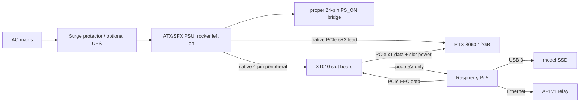
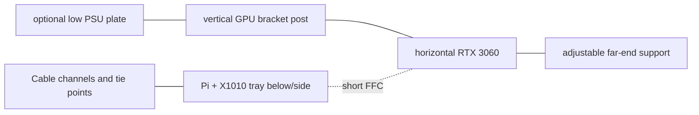

# Raspberry Pi 5 + RTX 3060 compute-node design

Status: design proposal, unimplemented, experimental, and not production-qualified.
Last evidence/pricing/status verification: **2026-07-12**.

This document proposes an optional low-power or overflow **API v1 compute node** for token.place built from a Raspberry Pi 5 8GB and an NVIDIA GeForce RTX 3060 **12GB**. It is not a proposal to run the relay on the GPU node and does not change API v1 behavior, E2EE, model defaults, API v2, DSPACE, or the Tauri UI.

## 1. Status and scope

### In scope

- A docs-only hardware/software design for a headless Linux ARM64 Docker compute node.
- Two hardware topologies: direct Geekworm/SupTronics X1010 and a powered OCuLink dock.
- Future software changes needed to make the canonical token.place compute runtime use CUDA on Raspberry Pi OS/Linux ARM64.
- A future 3D-printed open-air stand concept, without CAD, OpenSCAD, STL, or implementation files.

### Non-goals and invariants

- **Unimplemented:** no runtime, Docker, CI, systemd, CAD, API, model-default, dependency, or test code is changed by this proposal.
- **Experimental only:** the NVIDIA-on-BCM2712 path currently depends on out-of-tree/open-kernel-module work and should not be treated as ordinary production CUDA support.
- **API v1 remains non-streaming.** Responses return only after full model generation.
- **Relay-blind E2EE remains mandatory.** Relay-owned state, logs, diagnostics, and payloads may contain ciphertext plus safe routing metadata only. They must never contain plaintext prompts, responses, tool arguments, decrypted envelopes, model output, or private keys.
- **Fail closed on capability uncertainty.** The node must advertise only model/context/backend capabilities it has validated on that exact host, GPU, driver, container, model, and runtime build.
- **No legacy-route revival.** Deprecated relay endpoints remain historical compatibility and must not be extended as fallbacks.

## 2. Executive recommendation

**Verdict:** build this first as a proof of concept, then as an experimental overflow node if hardware validation succeeds. Token-generation speed is likely viable because community measurements show single-lane BCM2712 hosts are close to x86 once model weights and KV cache live in GPU VRAM. The power benefit is real but modest under inference because the RTX 3060 dominates load power; the larger benefit is lower idle/host power and a smaller always-on footprint. Hardware, driver, and unattended-recovery risk are much higher than a reused x86 desktop.

Use a conventional x86 motherboard when the priority is production reliability, standard NVIDIA drivers, easier Docker CUDA support, easier builds, full PCIe bandwidth, mature power sequencing, remote management, or low operator maintenance.

| Attribute | Raspberry Pi 5 + RTX 3060 12GB | Reused x86 desktop + RTX 3060 12GB |
|---|---:|---:|
| Decode speed | Estimated Qwen3 8B Q4_K_M ~45-50 tok/s at short/moderate context; community Llama 2 7B RTX 3060 Vulkan result was 60.21 tok/s on CM5 | Community Qwen3 8B Q4_K_M desktop result around 49 tok/s; matching Llama 2 7B RTX 3060 Vulkan result was 61.53 tok/s |
| Prompt processing | Expected lower; direct CM5 comparison was roughly 10-12% behind x86 | Better CPU and PCIe bandwidth |
| Whole-system load power | Community RTX 3060 comparison reported ~195.4 W | Same comparison reported ~224 W |
| Idle power | Likely lower, but must measure with selected PSU/GPU | Often higher; depends strongly on desktop platform |
| Incremental setup cost | Lower if Pi/GPU already owned; adapters/PSU/cooling/mounting still add up | Lowest if a complete desktop already exists |
| Driver maturity | Experimental BCM2712 ARM64 CUDA path | Normal supported Linux x86_64 NVIDIA path |
| Maintainability | Kernel/driver pinning and rebuild burden | Standard packages and community knowledge |
| Cold-boot reliability | Must be qualified with 20-50 AC-loss cycles | Usually better, especially with BIOS AC restore |
| Recommended role | Proof of concept, then experimental overflow | Production candidate if operationally acceptable |

## 3. Workload and capability target

### Repository current state audit

Verified against repository HEAD on 2026-07-12:

- The repository-root `server.py` is the canonical compute-node entrypoint; it constructs `ComputeNodeRuntime`, ensures the model is ready, starts relay polling, and serves health/resource endpoints.
- `server/server_app.py` is a compatibility shim that lazily delegates legacy imports to root `server.py`.
- The root `Dockerfile` is relay-specific and the GHCR image workflow builds/smokes/publishes a relay image, including a multi-architecture `linux/amd64,linux/arm64` relay manifest. It is not a CUDA compute-node image.
- `docker/Dockerfile.server` appears stale for the canonical runtime: it installs `requirements.txt`, exposes 5000, and invokes `python -m server.main`, while the canonical entrypoint is root `server.py`.
- `config/requirements_server.txt` pins `llama_cpp_python==0.3.32`.
- The default API v1 model profile is Qwen3 8B Q4_K_M: `Qwen3-8B-Q4_K_M.gguf`, native context 32,768 tokens, default context 8,192 tokens, supported tiers `8k-fast` and `64k-full`, and YaRN for 64K.
- The runtime defaults to full GPU offload where supported (`model.n_gpu_layers` default `-1`) and creates a single lazy `Llama` runtime.
- The desktop GPU planner has Windows CUDA and macOS Metal plans, but Linux falls through the generic CPU plan; there is no Linux ARM64 CUDA plan.
- The Tauri GUI is not needed on the Pi. The design should reuse the canonical/shared Python compute runtime in a headless container.

### Intended node capability

- Model: `Qwen3-8B-Q4_K_M.gguf` from `Qwen/Qwen3-8B-GGUF`.
- GPU: RTX 3060 **12GB**, not the less desirable 8GB variants. The 12GB card provides the VRAM margin needed for full model offload plus KV cache experimentation.
- Inference concurrency: **one active inference slot initially**.
- Offload: require full model-layer GPU offload and K/V offload for advertised GPU capability; fail closed if CUDA was requested but the runtime falls back to CPU or partial CPU offload unexpectedly.
- Storage: USB 3 SSD for GGUF models because the Pi's exposed PCIe lane is occupied by the GPU path.
- Memory mapping: keep `mmap` enabled. Do **not** use `mlock` on an 8GB host unless measurements show host RAM and startup/build behavior are safe.
- Capability registration: initially advertise `8k-fast` only. Do not advertise `64k-full` unless real hardware validation proves 64K fits with sufficient VRAM/headroom and stable readiness checks.

### Approximate memory calculations

Qwen3-8B has 36 layers, 32 attention heads, 8 key/value heads, and head dimension 128 in the upstream model configuration. KV cache bytes per token with default f16 K/V are:

```text
2 tensors * 36 layers * 8 KV heads * 128 head_dim * 2 bytes = 147,456 bytes/token
```

| Item | Approximate size | Basis | Design implication |
|---|---:|---|---|
| GGUF weights | ~4.7-5.0 GiB | Q4_K_M 8B-class GGUF size; verify exact file on download | Fits in 12GB VRAM with room for cache and buffers |
| Runtime buffers/scratch | ~0.7-1.5+ GiB | Backend-, batch-, flash-attn-, and graph-dependent estimate | Must be measured with llama.cpp diagnostics |
| 8K f16 KV cache | ~1.13 GiB | 147,456 bytes/token * 8,192 | Reasonable target for first registration |
| 64K f16 KV cache | ~9.0 GiB | 147,456 bytes/token * 65,536 | Likely too tight with weights/buffers on 12GB |
| 64K q8 K/V | ~4.5 GiB | q8 roughly half f16 bytes | Potentially possible only if pinned runtime supports `type_k/type_v` and validation passes |
| 64K q4 K/V | ~2.25 GiB | q4 roughly quarter f16 bytes | More plausible, but quality/performance/support must be validated |

The pinned runtime (`llama_cpp_python==0.3.32`) includes token.place probing for `type_k`, `type_v`, `flash_attn`, `offload_kqv`, q8/q4 enum values, and YaRN support. Those are runtime capabilities to probe, not assumptions to advertise.

## 4. Performance and power evidence

| Evidence | Measurement | Applies directly? | Notes |
|---|---:|---|---|
| RTX 3060 Llama 2 7B Q4_K_M on CM5 | 60.21 tok/s | No | Community Pi-side test used a 16GB CM5 and Vulkan, not an 8GB Pi 5 CUDA node. Source: [Pi benchmark](https://github.com/geerlingguy/ai-benchmarks/issues/40#issuecomment-3619397060). |
| Matching x86 RTX 3060 Llama 2 7B Q4_K_M | 61.53 tok/s | No | Same benchmark class on desktop x86. Source: [x86 benchmark](https://github.com/geerlingguy/ai-benchmarks/issues/40#issuecomment-3619399420). |
| Pi decode delta vs x86 | ~2.1% slower | Extrapolation | `(61.53 - 60.21) / 61.53`. Prompt processing was roughly 10-12% behind in that comparison. |
| Whole-system inference draw | Pi ~195.4 W; desktop ~224 W | Extrapolation | Community power discussion. Source: [big GPUs do not need big PCs](https://www.jeffgeerling.com/blog/2025/big-gpus-dont-need-big-pcs/). |
| Direct CUDA comparison with RTX 2080 Ti | Pi 59.45 tok/s; x86 60.51 tok/s | Partially | Demonstrates CUDA-on-Arm path with a different GPU. Source: [CUDA comparison](https://github.com/geerlingguy/ai-benchmarks/issues/46#issuecomment-3672239842). |
| Desktop RTX 3060 Qwen3 8B Q4_K_M | ~49 tok/s | No | Separate community benchmark, not token.place and not Pi. Source: [Qiita result](https://qiita.com/devgamesan/items/9b774786f653b2b911cc). |
| Proposed Pi Qwen3 short/moderate context | ~45-50 tok/s | Estimate | Must measure on exact Pi 5 8GB + RTX 3060 12GB CUDA container. |
| Proposed Pi Qwen3 near filled 8K | ~38-45 tok/s | Estimate | Context pressure and prompt processing may reduce effective throughput. |

Disclosures: CM5 and Pi 5 share BCM2712 and a similar single-lane PCIe root complex, but they are not literally the same tested host. PCIe x1 mostly affects model loading and prompt processing once weights and KV cache remain resident in VRAM. Partial CPU offload would substantially change the conclusion and should be treated as a failed GPU-capability validation for this node.

## 5. Hardware topology alternatives

### Option A: direct X1010 topology

- Raspberry Pi 5 PCIe FFC to Geekworm/SupTronics X1010 v1.1.
- Open-ended physical x4 slot accepting an x16 GPU; electrical PCIe x1.
- RTX 3060 mounted and supported independently.
- X1010 powered from a native PSU four-pin peripheral/Molex lead.
- Pi powered through X1010 pogo pins; do not also power via USB-C or PoE.
- GPU powered through its native PCIe 6+2-pin lead.
- Permanent ATX PS_ON bridge for deterministic AC-restoration behavior.

Advantages: fewest parts, approximately $30 adapter, included short FFC cables, one PSU for Pi/GPU, and simultaneous power restoration. Risks: the GPU must not hang mechanically from the X1010 PCB; X1010 documentation markets GPU support but does not publish a formal 75W PCIe-slot current certification; connector/board temperatures require stress testing; double-powering the Pi is forbidden.

**Prototype recommendation:** Option A is the fastest and cheapest proof-of-concept path if the GPU is mechanically supported by a stand before power-on.

### Option B: powered OCuLink dock

- Pi PCIe-to-M.2 HAT, M.2 M-key-to-OCuLink adapter, short quality OCuLink cable, powered eGPU dock such as JMT or Minisforum DEG1.
- ATX/SFX PSU supplies slot and supplemental GPU power.
- Pi uses a separate supported power source unless the dock design explicitly and safely powers it.

Advantages: better mechanical GPU support, conventional powered x16 slot, and less reliance on X1010 slot-power path. Tradeoffs: about $145-170 of adapter/dock hardware before PSU, more signal connections, more complicated power sequencing, and usually two Pi/GPU power paths.

**Unattended recommendation:** prefer Option B unless X1010 slot/lead/PCB temperatures remain safe after sustained inference and repeated cold-cycle testing. Option B still needs sequencing tests; GPU-before-Pi behavior must be verified rather than assumed.

Additional topology constraints:

- The RTX 3060 consumes the Pi's only exposed PCIe lane. The AI HAT+ 2 is not part of this design and should not be proposed on the same lane.
- PoE+ must not double-power a Pi already powered by X1010 pogo pins.
- Bring up at PCIe Gen 2. Raspberry Pi documents `dtparam=pciex1_gen=3` as an optional Gen 3 setting but does not certify Gen 3 operation; enable only after Gen 2 stability testing. Source: [Raspberry Pi PCIe docs](https://www.raspberrypi.com/documentation/computers/raspberry-pi.html#pcie-gen-30).

## 6. Bill of materials

Prices are volatile street-price checks on 2026-07-12. Recheck before purchase.

| Category | Part or example | Req/opt | Qty | Interface/connectors | Power requirement | Approx. current price | Price-check date | Source | Notes and compatibility risks |
|---|---|---:|---:|---|---|---:|---|---|---|
| Host SBC | Raspberry Pi 5 8GB | Required | 1 | 40-pin GPIO, PCIe FFC, USB 3, GbE | 5V up to 5A class | $95 | 2026-07-12 | [Raspberry Pi price-rise post](https://www.raspberrypi.com/news/1gb-raspberry-pi-5-now-available-at-45-and-memory-driven-price-rises/) | Board-only price; use 64-bit OS |
| GPU | Used RTX 3060 12GB | Required | 1 | PCIe x16 physical, 6/8-pin varies | ~170W reference | ~$245-300 used | 2026-07-12 | [BestValueGPU](https://bestvaluegpu.com/history/new-and-used-rtx-3060-price-history-and-specs/), [eBay search](https://www.ebay.com/shop/rtx-3060-12gb?_nkw=rtx+3060+12gb) | Verify 12GB, not 8GB; exact AIB connector/length varies |
| Direct adapter | Geekworm/SupTronics X1010 v1.1 | Option A required | 1 | Pi PCIe FFC to open-ended x4 slot | PSU 4-pin peripheral; powers Pi via pogo pins | $29.99 | 2026-07-12 | [Central Computer](https://www.centralcomputer.com/geekworm-x1010-pcie-ffc-to-standard-pcie-x4-slot-expansion-board-for-raspberry-pi-5.html), [Geekworm wiki](https://wiki.geekworm.com/X1010) | No formal 75W slot-current certification found |
| OCuLink HAT | Pi PCIe-to-M.2 M-key HAT | Option B required | 1 | Pi FFC to M.2 M-key | Usually Pi power separate | TBD — recheck before purchase | 2026-07-12 | Vendor-specific | Compatibility depends on HAT/cable stack |
| OCuLink adapter/cable | M.2 M-key to OCuLink + short cable | Option B required | 1 | M.2 to OCuLink | Passive/signal | ~$20-40 | 2026-07-12 | Vendor listings vary | Keep cable short/high quality |
| Powered dock | Minisforum DEG1 or JMT OCuLink dock | Option B required | 1 | OCuLink to x16 slot, ATX/SFX PSU | Slot power from PSU | $109 for DEG1 | 2026-07-12 | [Minisforum DEG1](https://store.minisforum.com/products/minisforum-deg1-egpu-dock) | Better mechanics; still test sequencing |
| PSU | Quality 450-550W ATX/SFX; recommend 550W | Required | 1 | 24-pin ATX, PCIe 6+2, peripheral lead | 120/240VAC input | ~$70 | 2026-07-12 | [Corsair CX550](https://www.corsair.com/us/en/p/psu/cp-9020277-na/cx-series-cx550-550-watt-80-plus-bronze-atx-power-supply-cp-9020277-na) | 550W gives connector/margin; exact AIB may need 2 PCIe leads |
| GPU power cable | Native PSU PCIe cable for exact PSU/card | Required | 1+ | PCIe 6+2-pin | Up to card requirement | Included/TBD | 2026-07-12 | PSU vendor | Never mix modular PSU cables between models |
| Peripheral power | Native four-pin peripheral/Molex lead | Option A required | 1 | PSU peripheral to X1010 | X1010/Pi/slot support | Included/TBD | 2026-07-12 | PSU vendor | No SATA-to-Molex adapters |
| PS_ON bridge | Proper 24-pin ATX starter/bridge | Required | 1 | ATX 24-pin | Signal only | ~$5-10 | 2026-07-12 | Common retail | Do not use a paperclip |
| Cooling | Raspberry Pi Active Cooler | Required | 1 | Pi fan header | Pi 5 fan power | ~$5 | 2026-07-12 | Raspberry Pi resellers | Ensure airflow not blocked |
| Storage | USB 3 SSD or high-endurance microSD | Required | 1 | USB 3 or microSD | USB bus/card | ~$25-60 | 2026-07-12 | Retail | USB SSD preferred for models because PCIe lane is GPU |
| Network | Ethernet cable | Required | 1 | RJ45 | n/a | ~$5 | 2026-07-12 | Retail | Prefer wired network for relay polling |
| Protection | Surge protector; optional UPS | Recommended | 1 | AC | Load-rated | ~$15-80 | 2026-07-12 | Retail | UPS improves unattended recovery |
| Mechanics | GPU bracket/support, standoffs, M2.5/M3 fasteners, heat-set inserts, vibration feet | Required | set | Mechanical | n/a | ~$20-40 | 2026-07-12 | Retail | No GPU load on X1010 or Pi PCB |
| FFC | Short PCIe FFC supplied with adapter | Required | 1 | Pi PCIe FFC | Signal | Included | 2026-07-12 | X1010 listing/wiki | X1010 commonly ships short 37mm-class cables; bend radius matters |
| Validation | Thermal probes or wall-power meter | Optional | 1 | Probe/AC | Battery/AC | ~$15-40 | 2026-07-12 | Retail | Needed to qualify connector and PCB temperatures |

Subtotals:

- Required Option A subtotal excluding already-owned Pi/GPU: approximately **$175-265** depending on PSU/storage/stand parts.
- Estimated Option A total including Pi and representative used RTX 3060: approximately **$515-660**.
- OCuLink alternative subtotal excluding Pi/GPU: approximately **$290-430**.
- Volatile/TBD items: used GPU condition/price, exact AIB power cable, OCuLink HAT/adapter compatibility, storage choice, UPS, and any printed/metal support hardware.

## 7. Electrical and safety design



- NVIDIA lists RTX 3060 graphics card power around 170W. Source: [NVIDIA RTX 3060 specifications](https://www.nvidia.com/en-us/geforce/graphics-cards/30-series/rtx-3060-3060ti/).
- Up to 75W may be supplied through the PCIe slot; remaining GPU power comes through native PCIe leads. Exact AIB connector requirements must be checked before buying a PSU.
- No SATA-to-Molex, SATA-to-GPU, or Molex-to-GPU adapters. Never mix modular PSU cables between PSU models.
- Do not connect USB-C or PoE while X1010 pogo pins power the Pi.
- Do not expose or improvise mains wiring. A 3D-printed structure is not electrical insulation and is not a certified PSU enclosure.
- Add strain relief and keep all cables out of GPU fans.
- Test slot connector, PCB, PSU lead, and GPU power-connector temperatures under sustained inference.

AC-loss recovery design: leave PSU rocker on, use a proper permanent PS_ON bridge so the PSU starts when AC returns, rely on Pi firmware auto-boot, then let Docker/systemd start the compute stack. X1010 `POWER_OFF_ON_HALT=1` and `PSU_MAX_CURRENT=5000` settings should be evaluated against current X1010 documentation before use. For two-supply OCuLink, test GPU-before-Pi sequencing and failure modes rather than assuming them.

## 8. Potential 3D-printed stand

This PR creates no CAD. A future stand should be an open-air modular frame with:

- Rigid GPU bracket interface using the card's metal PCIe bracket.
- Adjustable secondary support under the far end of the GPU.
- Separate Pi/X1010 tray with standoffs and no structural load on the X1010 slot or Pi PCB.
- Clear Active Cooler airflow and **at least 20mm target clearance beneath GPU intake fans** until measured otherwise.
- Cable-routing channels/tie points, FFC bend-radius protection, and accommodation for the short 37mm-class X1010 FFC constraint.
- Access to Ethernet, USB, microSD, power switch/bridge, GPU power sockets, and display ports.
- Optional PSU mounting plate while keeping the PSU's certified enclosure intact.
- Low center of gravity, anti-tip feet, and PETG/ASA or another temperature-tolerant material rather than low-temperature PLA near GPU/PSU heat.
- Heat-set inserts for repeatedly serviced joints and split parts for a 256x256mm printer bed.

Conceptual side layout:



| Dimension | Status | Notes |
|---|---|---|
| Raspberry Pi 5 board mounting pattern | Verified from Pi mechanical docs before CAD | Use standoffs; leave Active Cooler clearance |
| X1010 mounting holes and FFC position | Must measure selected X1010 | `MEASURE BEFORE PRINTING` |
| GPU length/height/thickness | Must measure exact AIB card | `MEASURE BEFORE PRINTING`; varies widely |
| GPU bracket screw locations | Must measure exact card/bracket | Use metal bracket as primary hard point |
| GPU fan intake clearance | Target 20mm minimum; validate thermally | Increase if fans starve |
| FFC free length/bend radius | Must measure installed cable | Avoid tight folds; route before fixing tray |
| PSU dimensions/mount holes | Must measure selected PSU | Do not replace PSU enclosure |

Future OpenSCAD parameters: `gpu_length_mm`, `gpu_height_mm`, `gpu_slot_thickness_mm`, `gpu_bracket_offset_mm`, `pi_tray_x/y/z`, `x1010_slot_centerline_mm`, `fan_clearance_mm`, `support_foot_x_mm`, `psu_plate_enabled`, `bed_split_length_mm`, `insert_diameter_mm`. Proposed future directory layout only: `cad/raspberry-pi-5-rtx-3060-stand/openscad/`, `cad/.../README.md`, `cad/.../exports/`.

## 9. Host operating system and NVIDIA ARM64 compatibility

Known working but experimental path from community reports:

- Raspberry Pi OS 13 Trixie Lite or currently verified equivalent.
- 64-bit ARM userspace with the 4K-page kernel selected by `kernel=kernel8.img`; the default 16K-page kernel is incompatible with the known recipe.
- NVIDIA ARM64 userspace around driver `580.95.05`.
- Community `non-coherent-arm-fixes` branch from NVIDIA open-gpu-kernel-modules PR #972.
- CUDA ARM64/SBSA toolkit around the known-good CUDA 13.0 stack.
- NVIDIA Container Toolkit on ARM64.
- PCIe Gen 3 only after Gen 2 stability.

Upstream status last verified 2026-07-12: NVIDIA/open-gpu-kernel-modules PR #972 is **open** and targets non-standard Arm SoC PCIe integrations from `mariobalanica:non-coherent-arm-fixes`; its description calls out lack of I/O cache coherency and write-combined MMIO/VRAM BAR issues, and notes 580.95.05 aarch64 userspace availability. Source: [NVIDIA PR #972](https://github.com/NVIDIA/open-gpu-kernel-modules/pull/972). Jeff Geerling's walkthrough documents Raspberry Pi OS Trixie, the 4K kernel selection, driver/module build steps, and CUDA demonstrations. Source: [NVIDIA graphics cards work on Pi 5](https://www.jeffgeerling.com/blog/2025/nvidia-graphics-cards-work-on-pi-5-and-rockchip/).

Why this is not an ordinary production CUDA host: BCM2712 lacks normal I/O cache coherency for this use, has problematic write-combined MMIO/VRAM BAR behavior, needs a still-unmerged non-standard ARM SoC PCIe patch, requires kernel-module rebuilds, can break after kernel/driver updates, and needs the whole host stack pinned.

## 10. Container and token.place software design

Use a headless compute-node container, not the Tauri GUI.

### Host responsibilities

- Patched kernel and NVIDIA kernel modules.
- GPU enumeration through `lspci` and `nvidia-smi`.
- NVIDIA Container Toolkit and Docker daemon.
- Storage mounts for models/config/keys.
- Power-loss recovery and host watchdog.

### Container responsibilities

- ARM64 CUDA userspace.
- token.place canonical/shared compute runtime.
- Source-built CUDA-enabled `llama-cpp-python` at the repository-pinned version.
- Model configuration and read-only bind-mounted GGUF.
- Relay registration/polling, health/readiness checks, and privacy-safe logs.

Official NVIDIA CUDA container images are published for ARM64/SBSA and the NVIDIA Container Toolkit lists supported Linux distributions/architectures, but the pinned `llama_cpp_python==0.3.32` may not have an official prebuilt ARM64 CUDA wheel. Upstream status last verified 2026-07-12: abetlen/llama-cpp-python PR #2039 for ARM runners/CUDA SBSA is **open**. Source: [llama-cpp-python PR #2039](https://github.com/abetlen/llama-cpp-python/pull/2039). The likely implementation path is source build with the pinned version and verified flags such as `CMAKE_ARGS=-DGGML_CUDA=on` and Ampere/RTX 3060 CUDA targeting, but CMake flags must be tested on the final image and not treated as guaranteed.

| Repository path | Current behavior | Proposed change | Why needed | Tests/validation required |
|---|---|---|---|---|
| `docker/Dockerfile.server` | Stale-looking server image invoking `python -m server.main` | Either retire/fix separately or leave untouched and add dedicated compute Dockerfile | Avoid conflating historical server image with canonical runtime | Build/smoke root `server.py` entrypoint |
| `docker/Dockerfile.compute-node-cuda-arm64` | Does not exist | New ARM64 CUDA compute image | Needs CUDA userspace and source-built `llama-cpp-python` | Native ARM64/self-hosted build; `nvidia-smi`; llama backend probe |
| `docker-compose.yml` or dedicated compose | Local server+relay compose, no GPU devices | Prefer dedicated compute-node compose | Avoid changing relay dev behavior | `docker compose config`; `--gpus all`/device reservation test |
| `config/requirements_server.txt` | Pins `llama_cpp_python==0.3.32` | Keep pin; source-build that exact version with CUDA | Reproducibility | Import/version/backend probe |
| `server.py` | Canonical compute entrypoint | Reuse unchanged if possible | Headless container should not fork behavior | API v1 readiness and relay polling smoke |
| `utils/compute_node_runtime.py` | Shared runtime and safe diagnostics | Add CUDA-required fail-closed checks if absent | Prevent silent CPU fallback | Unit/integration diagnostics tests |
| `utils/llm/model_manager.py` | Probes CUDA/Metal markers, context tiers, q8/q4 K/V | Add ARM64 CUDA validation/capability gating if needed | Accurate registration | Tests for backend/capability registration |
| `desktop-tauri/src-tauri/python/desktop_gpu_packaging.py` | Windows CUDA/macOS Metal; Linux generic CPU | Share backend-selection concepts only if appropriate | Avoid duplicating GPU policy | Unit tests for Linux ARM64 plan if shared |
| `desktop-tauri/src-tauri/python/desktop_runtime_setup.py` | Desktop runtime probing/setup | Share probing ideas only if appropriate | Common backend diagnostics | Probe tests, no Tauri dependency on Pi |
| Tests under `tests/` | Desktop/server coverage | Add compute-image and fail-closed coverage | Prevent regressions | Unit/integration plus hardware-only smoke labels |
| Future compute-image CI | Relay image CI only | Separate CUDA compute image workflow | Multi-arch relay image is not compute image | Self-hosted ARM64 GPU runner or documented manual smoke |

Design requirements: publish `linux/arm64` image manifests only after native/self-hosted validation; prefer native ARM64 builds over slow QEMU for CUDA wheels; run with `docker run --gpus all` or Compose device reservations; mount the model read-only; persist config/keys outside the image; run non-root where practical; use build caching; verify driver/toolkit compatibility with `nvidia-smi`, CUDA `deviceQuery`, and llama.cpp backend probes; fail closed if CUDA was requested but CPU fallback occurs.

## 11. Automatic startup and recovery

Zero-interaction boot sequence:

1. AC power returns.
2. PSU and GPU power up.
3. Pi firmware boots.
4. Docker and NVIDIA runtime initialize.
5. Host preflight verifies `lspci` and `nvidia-smi`.
6. Compute container starts.
7. Qwen3 warm-load completes.
8. Node registers only after CUDA and model readiness are confirmed.
9. Docker/systemd restarts after application failure.
10. A bounded watchdog handles missing GPU enumeration; reboot is an explicitly controlled last resort.

Recommended layering: a systemd unit wraps Docker Compose and depends on Docker, network-online, model mount, and a host GPU preflight. Compose may use `restart: unless-stopped` for the container, but systemd owns startup ordering and timeouts. A separate host watchdog should run with exponential backoff and a reboot budget so missing GPU enumeration does not cause infinite reboot loops.

Health vs readiness: health means the process is alive; readiness means CUDA backend verified, model warm-loaded, one safe smoke completion passed, and registration is active. Logs must contain safe metadata only. Registration cleanup should run on clean shutdown, and stale relay registrations must expire server-side. Kernel/driver updates should be pinned and rolled only through a known-good image with recovery media available.

## 12. Validation and acceptance plan

### Hardware bring-up

- Start at PCIe Gen 2.
- Confirm `lspci` sees the RTX 3060.
- Confirm all 12GB VRAM through `nvidia-smi`.
- Run CUDA `deviceQuery`.
- Inspect `dmesg` for PCIe Advanced Error Reporting and NVIDIA kernel-driver errors.
- Validate PSU, slot, connector, lead, and PCB temperatures.

### Native inference

- Build/run llama.cpp and llama-cpp-python with CUDA.
- Confirm all model layers and KV cache are GPU-offloaded.
- Run Qwen3 8B Q4_K_M benchmarks at short, moderate, and near-8K context.
- Record prompt-processing and decode rates.
- Ensure no CPU fallback.

### Container validation

- Run with NVIDIA Container Toolkit.
- Verify model mount, runtime backend, API v1 behavior, safe diagnostics, and capability registration.
- Confirm only supported model/context tiers are registered.

### Resilience

- 20-50 cold AC-loss recovery cycles.
- Repeated Docker restarts and host reboots.
- Gen 3 testing only after stable Gen 2 baseline.
- Sustained inference/thermal soak.
- Network loss and relay reconnection.
- Driver/module presence after reboot.
- Recovery from failed model warm-load.

Go/no-go criteria: Qwen3 decode at 8K should meet a proposed minimum **35 tok/s** after warm-load; no CPU fallback; no recurring PCIe Advanced Error Reporting or NVIDIA kernel-driver errors; safe connector/PCB/GPU/PSU temperatures; reliable automatic registration after cold boot; and zero plaintext leakage in relay or host/container diagnostics.

## 13. Risks, unresolved questions, and recommendation

| Risk | Likelihood | Impact | Mitigation | Residual risk |
|---|---|---|---|---|
| Unmerged/out-of-tree NVIDIA patch | High | High | Pin branch/driver; track PR #972 | High |
| Kernel update breakage | High | High | Disable unattended kernel updates; known-good image | Medium-high |
| ARM64 CUDA dependency builds | Medium | High | Native ARM64 build cache; source build pinned version | Medium |
| PCIe Gen 3 signal integrity | Medium | Medium | Gen 2 baseline; Gen 3 only after soak | Low-medium |
| X1010 slot-power uncertainty | Medium | High | Temperature tests; prefer OCuLink for unattended | Medium |
| Mechanical GPU support | High | High | Independent bracket/far-end support | Low after stand validation |
| Power sequencing | Medium | High | PS_ON bridge; test OCuLink sequence | Medium |
| 8GB host RAM during build/startup | Medium | Medium | Build off-device or with swap; avoid mlock | Medium |
| 64K-context VRAM feasibility | High | Medium | Register `8k-fast` only until measured | Low for 8K, high for 64K |
| Container publishing/testing | Medium | Medium | Separate CI and hardware smoke | Medium |
| Long-term maintenance burden | High | Medium | Document pinned stack and updates | Medium-high |
| Used-GPU condition/availability | Medium | Medium | Buy returnable, validate thermals/VRAM | Medium |

Recommendations:

- **Prototype topology:** Option A X1010, but only with independent GPU support and temperature instrumentation.
- **Unattended topology:** Option B powered OCuLink dock unless Option A passes sustained thermal, slot-power, and cold-cycle qualification.
- **Why x86 remains safer:** normal NVIDIA support, less kernel pinning, mature Docker CUDA, better PCIe bandwidth, easier builds, fewer power-sequencing hazards, and simpler recovery.

Staged future implementation prompts:

1. Hardware bring-up.
2. Patched NVIDIA/CUDA host proof.
3. Native Qwen3 benchmark.
4. ARM64 CUDA compute image.
5. token.place integration.
6. Boot/watchdog hardening.
7. Cold-cycle qualification.
8. Optional OpenSCAD stand.

Facts intentionally left `TBD`: exact GPU AIB dimensions, exact AIB power connectors, exact X1010 connector/PCB temperatures, exact 64K q8/q4 runtime behavior, exact ARM64 CUDA wheel availability for future releases, and final OCuLink HAT/cable SKU compatibility.
